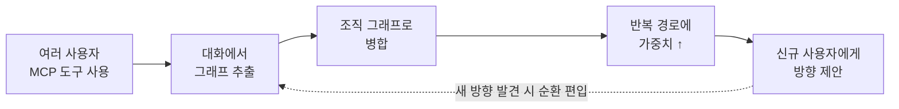

# graph-search-chat

조직 구성원들의 LLM 대화 로그에서 지식그래프를 자동 추출·병합해, 신규 사용자에게 검증된 문제 해결 경로를 제안하는 시스템.

> **현재 상태: 설계·조사 단계** (코드 없음). 이 리포는 설계 문서와 조사 결과를 담고 있다.

## 무엇을 하려는가

여러 사용자가 MCP 도구(DataHub MCP, 문서검색 MCP, 검색 툴)로 각자의 문제를 해결한다. 이때:

1. 각 사용자의 **대화 로그에서 개념·목표·접근법 그래프를 자동 추출**
2. 사용자별 그래프를 **하나의 조직 그래프로 병합** (출처 보존)
3. 여러 사람이 반복해서 성공한 경로에 **가중치 부여**
4. 비슷한 문제를 만난 **신규 사용자에게 그 경로를 제안** (강제 아님)
5. 새로운 해결 방향이 나오면 **그래프에 자동 편입** — 조직의 문제 해결 경험이 스스로 자라는 구조



## 문서

| 문서 | 내용 |
|---|---|
| [docs/design.md](docs/design.md) | 확정된 설계 결정 — 전체 흐름, 그래프 4계층 스키마, 세션 판정 3갈래 분기, 실패 경로 노출 정책 (Mermaid 다이어그램 포함) |
| [docs/research.md](docs/research.md) | 조사 보고 — 기존 오픈소스(Graphiti·cognee·GraphRAG 등) 커버리지, 관련 논문 20여 편, 알려진 문제점 6가지 (전부 출처 링크 포함) |
| [system-overview.drawio](system-overview.drawio) | 시각 자료 3페이지 — [draw.io](https://app.diagrams.net)에서 열기 |
| [CLAUDE.md](CLAUDE.md) | Claude Code용 프로젝트 컨텍스트 |

## 조사 핵심 결론

- 이 설계 전체를 구현한 완성품 오픈소스·논문은 **없다**. 각 단계의 검증된 조각(Graphiti, GraphRAG, AWM, Collaborative Memory)은 존재하며, **"사용자별 그래프의 가중 병합 + 경로 기반 방향 제안"이 공백** = 이 프로젝트의 차별점.
- 최대 구조적 위험은 **인기 가중 피드백 루프** (많이 보여준 길이 좋은 길처럼 보이는 왜곡) — 노출 대비 채택률 보정과 탐색 예산이 필수.
- 대화는 곧 쓰기 채널이므로 **메모리 오염 방어**(세션 게이트, provenance 롤백)가 전제 조건.

## 시작하기

```bash
git clone https://github.com/catinbox276/graph-search-chat.git
cd graph-search-chat
claude   # CLAUDE.md가 자동 로드되어 동일한 설계 컨텍스트에서 시작
```
