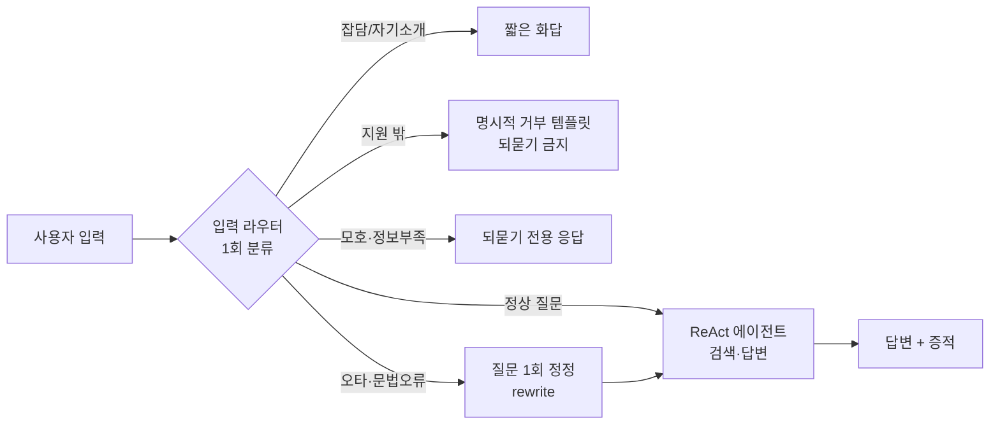

# 챗봇 응답 품질 개선 — 탐색 노트

이전 챗봇 ↔ 현재 챗봇(graph-search-chat) 응답 비교에서 나온 9개 항목을,
"간단한 땜질"이 아니라 **정식(공식 문서/업계 표준) 방법**으로 어떻게 처리할지 탐색한 결과.

## 전제: 지금 구조가 문제의 뿌리

현재 챗봇은 **DeepAgents ReAct 에이전트 1개 + 시스템 프롬프트 1개**가 전부다
(`src/agent/agent.py`). 라우터·가드레일·전처리 노드가 없다. 그래서 언어·거부·되묻기·문법
같은 "행동 규칙"을 전부 한 프롬프트 안에 욱여넣고 있고, 규칙끼리 충돌한다.

예) 프롬프트 규칙 3 "지원 범위 밖이면 거부" vs 규칙 8 "근거 못 찾으면 되묻는다"
→ 지원 밖 질문인데 거부 대신 **되묻기**가 나가는 게 바로 아래 3·6번 증상이다.

**정식 처리 방향은 두 단계로 나눈다:**
- **Tier 1 (즉시, 프롬프트/프론트만)** — 재배포로 끝나는 것. 1·2·3·4·8.
- **Tier 2 (구조, 노드 추가)** — 입력 라우터/가드레일 1개를 앞단에 둔다. 5·6·7의 정식 해법.

라우터는 무거운 게 아니다. 값싼 LLM 1콜 또는 규칙+임베딩으로 `{intent, lang, needs_clarify}`
구조화 출력 1개만 뽑으면 된다(LangGraph 라우터 패턴). 지금은 이 한 단계가 통째로 없다.

---

## 항목별 처리안

### 1. 언어 필터링 미작동  — Tier 1 (+ 확인 필요)
- **현재 코드**: 언어 "설정/필터"는 **코드에 없다**. 프롬프트에 `항상 한국어로 답한다`
  한 줄뿐. 범용 서빙 모델이라 입력 언어를 따라가며 새는 것으로 보임.
- **정식 방법**: 출력 언어는 프롬프트만으론 안 잡힌다. 표준 2단계 =
  ① 프롬프트에 강한 지시 + 소수 예시, ② **출력 언어 가드** — 생성 결과를 언어감지
  (`lingua`/`fastText langid`)해 목표 언어가 아니면 재생성/번역.
- **권장**: 라우터에서 뽑은 `lang`을 상태로 넘겨 답변 언어를 고정. 라우터 도입 전이면
  프롬프트 강화(Tier 1)로 임시 처리.
- **❓확인**: "언어 설정"이 (a) 항상 한국어 강제인지, (b) 관리에서 답변 언어를 고르는
  기능이 있어야 하는지. 후자면 신규 기능이다.

### 2. 마크다운 `**` 파싱 실패  — Tier 1 (프론트)
- **현재 코드**: `src/web/index.html`이 CDN `marked.min.js`로 렌더. 스트리밍 중
  **토큰마다 부분 텍스트를 통째로 재파싱**한다 (`index.html:390` `marked.parse(부분)`).
- **원인 (정식 규격 확인함)**: marked는 CommonMark를 **엄격히** 따른다. `** 굵게 **`
  처럼 마커 안쪽에 공백이 있으면 flanking 규칙상 **일부러** 굵게 처리하지 않는다.
  여기에 스트리밍 부분 재파싱이 겹쳐 `**`가 토막난 채 파싱된다. marked에는 emphasis를
  느슨하게 푸는 옵션이 없다(스펙 준수가 설계 목표).
- **정식 방법**:
  1. **파싱 전 정규화** — `** x **` → `**x**`처럼 마커 안쪽 stray 공백 제거(전처리).
  2. **부분 재파싱 중단** — 스트리밍 중엔 평문/`textContent`로 흘리고, `answer`
     최종 이벤트에서 **딱 한 번** `marked.parse`. (부분 마크다운을 매 토큰 재파싱하지
     않는 게 스트리밍 렌더 정석.)
  3. 모델에도 "굵게는 `**단어**`로, 마커에 공백 금지" 지시(보조).
- **권장**: 1+2 병행. 프론트 20~30줄.

### 3. 지원 불가 영역에 되묻기  — Tier 1
- **현재 코드**: 프롬프트 규칙 3(거부) ↔ 규칙 8(되묻기) 충돌. 우선순위가 없어 되묻기가 샌다.
- **정식 방법**: 스코프 가드레일. 최소 = 프롬프트에서 **거부가 되묻기보다 우선**임을
  명문화하고 "지원 밖일 땐 되묻기 금지, 즉시 '지원하지 않습니다' + 사유 + 지원 범위 안내".
  정식 = 라우터의 `intent=out_of_scope`면 에이전트 진입 자체를 막고 거부 템플릿 반환.
- **권장**: 프롬프트로 즉시, 라우터로 확정.

### 4. 답변 불가 → 기본 응답 템플릿  — Tier 1
- **현재 코드**: 근거 없을 때 빈 응답이 나가는 경우가 있음(규칙 8이 되묻기로만 되어 있음).
- **정식 방법**: **명시적 fallback 템플릿** 정의. "답변할 수 없습니다" + 사유(근거 없음/
  지원 밖/데이터 없음) + 다음 행동 제안. 빈 응답 절대 금지.
- **권장**: 프롬프트에 고정 문구 + 사유 분기.

### 5. 문법/오타 1회 정정 프로세스  — Tier 2
- **정식 방법**: RAG의 **query rewriting(질의 재작성)** 표준 기법. 검색·답변 **전에**
  질문을 1회 정규화(오타/문법 교정)한 뒤 그 해석으로 진행. LangGraph에선 에이전트 앞에
  rewrite 노드 1개, 또는 라우터에서 `rewritten_query` 필드로 같이 뽑기.
- **권장**: 라우터 구조화 출력에 `normalized_query` 하나 추가하면 노드 증설 없이 해결.

### 6. 되묻기 전용 프로세스  — Tier 2
- **정식 방법**: 응답을 `{type: answer|clarify|refuse}`로 **구조화**해, clarify면 UI가
  되묻기 카드로 렌더(입력 힌트 제공). 더 강한 정식 = LangGraph **`interrupt()`**로
  실행을 멈추고 사용자 입력을 받아 `Command(resume=...)`로 재개(공식 human-in-the-loop).
  단 SSE·체크포인터 재개 왕복이 필요 → 프론트 변경 동반.
- **권장**: 채팅 UI에선 1차로 구조화 플래그(가벼움)로 충분. 승인 게이트가 필요한
  7번과 묶어 `interrupt()`는 그때 도입.

### 7. 행동 지침 설명 시 1회 확인  — Tier 2 (리스크)
- **정식 방법**: **approval gate (사람 승인)**. LangGraph 공식 패턴은 위험 동작 전
  `interrupt()`로 멈추고 승인/수정/거부(`accept|edit|response`)를 받는 것.
  단 현재 툴은 전부 **읽기 전용**(search/read/DataHub read)이라 "툴 승인"은 대상이 없다.
  여기서 리스크는 **사용자가 안내대로 실제 조작하는 것** → 툴 인터럽트가 아니라
  "위험 절차 안내 시 '진행할까요?' 1회 확인 후 상세 제공" 프롬프트/UX 설계가 맞다.
- **권장**: 신중 설계. 우선 프롬프트로 "위험 조작 안내는 확인 먼저". 쓰기 툴이 생기면
  그때 `interrupt()` 승인 게이트.

### 8. 증적 없음 → 2단계 분리  — Tier 1
- **현재 코드**: 규칙 8·9가 "되묻기/유사 제안"을 뭉뚱그림.
- **정식 방법**: 응답 순서 강제 — ① "근거를 찾지 못했습니다" 명시 → ② 그 다음에만
  유사 맥락/문서 제안. 프롬프트에서 두 스텝을 분리 서술.
- **권장**: 프롬프트 문구 정리.

### 9. GPMS 질문 실패 — 원인 분석  — 조사 필요
- **현재 상태**: 코드·문서에 `GPMS` 참조 **0건**. 적재/등록된 소스가 아님 → 검색이
  빈손 → (라우터 없으니) 되묻기로 샌 것으로 추정.
- **정식 방법**: 추정 말고 **활동 로그로 실측**. 해당 턴의 `events`(tool 호출/결과)와
  `sessions`를 조회해 어떤 툴이 무엇을 반환했는지 확인. → 원인이 (a) 미적재 소스,
  (b) 라우팅 실패, (c) DataHub urn 부재 중 무엇인지 확정 후 대책.
- **다음 액션**: 실패 세션 id/질문을 주면 Oracle 로그에서 그 턴을 뽑아 분석.

---

## 우선순위 제안

| 순위 | 항목 | 유형 | 비용 |
|---|---|---|---|
| 1 | 2 마크다운 | 프론트 | 낮음 |
| 2 | 3·4·8 거부/폴백/증적 | 프롬프트 | 낮음 |
| 3 | 9 GPMS 로그 분석 | 조사 | 낮음(데이터 필요) |
| 4 | **입력 라우터 1개** (1·5·6 동시 해결) | 구조 | 중간 |
| 5 | 7 승인 게이트 | 구조 | 중간(쓰기 툴 생길 때) |

Tier 1(1~2순위)은 재배포로 오늘 끝난다. 라우터(4순위)가 1·3·5·6을 한꺼번에 정식으로
잡는 핵심 투자다. 7은 쓰기 툴이 없으니 급하지 않다.
