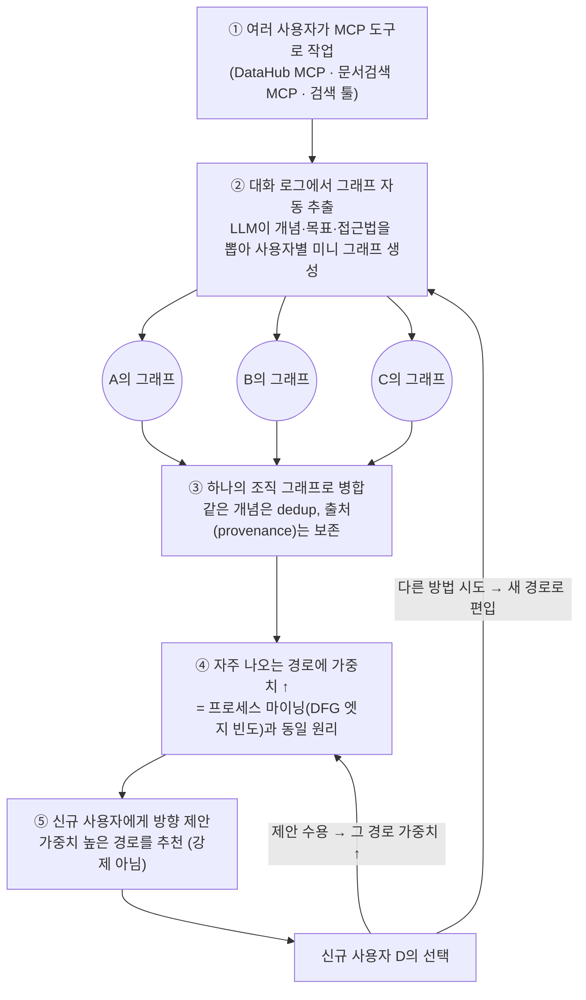
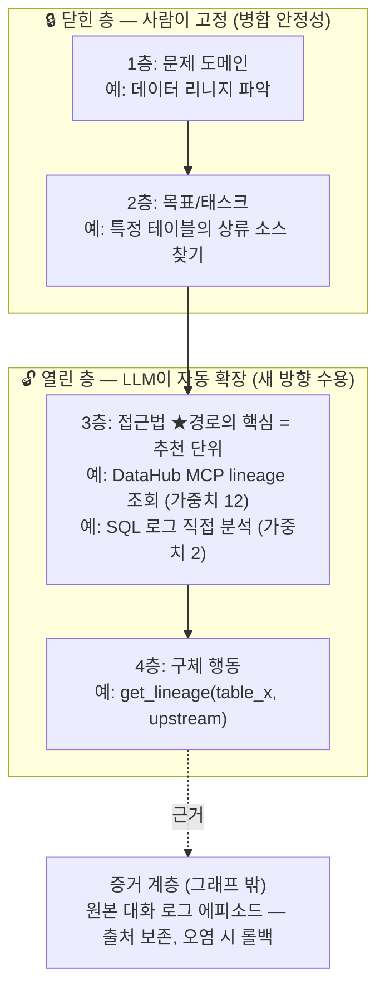
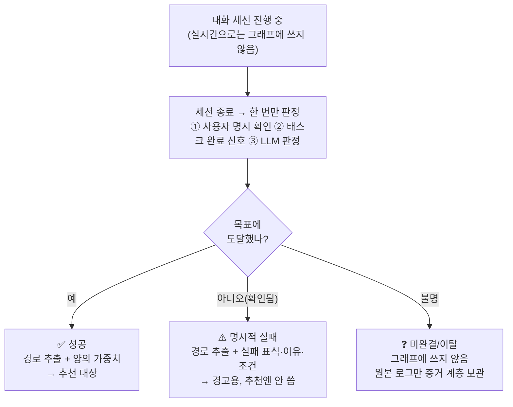
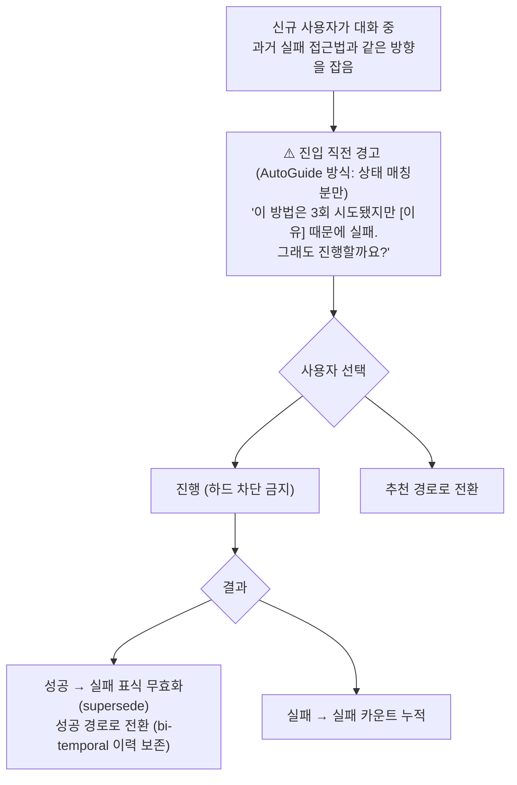
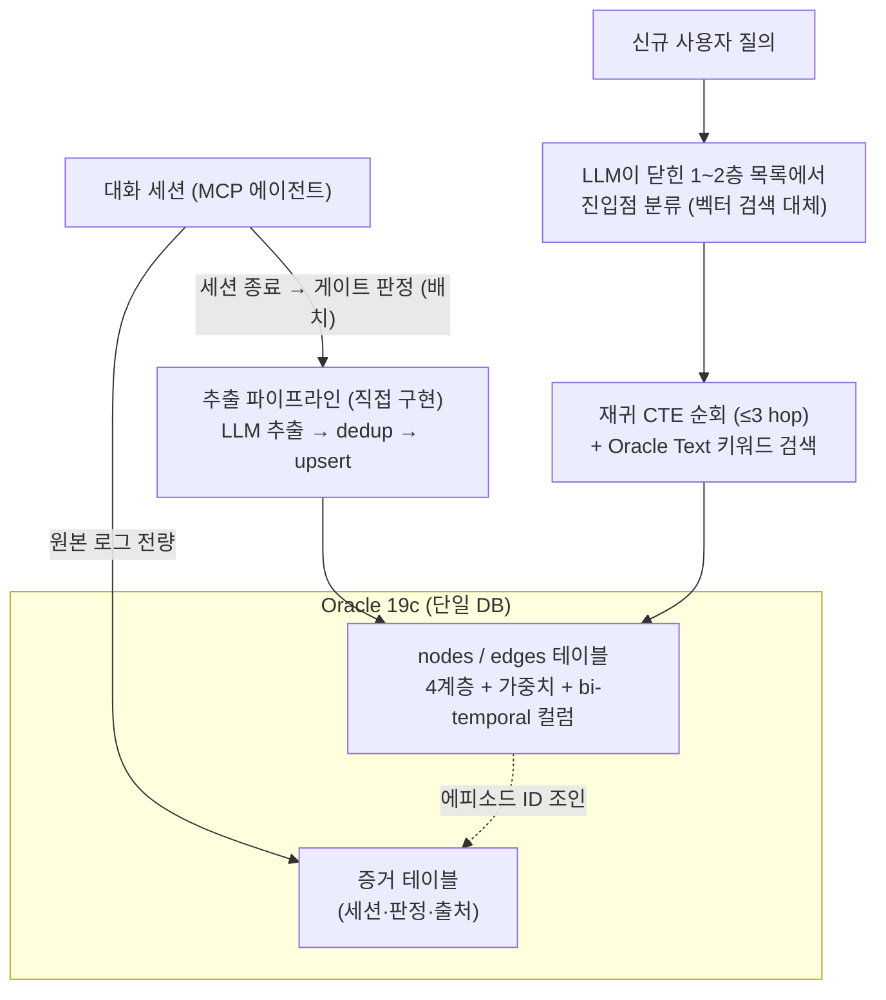
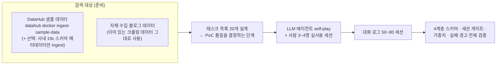

# 설계 문서: 대화 기반 조직 지식그래프 시스템

> 대화 문답으로 확정된 설계 결정 모음. 배경 조사는 [research.md](research.md) 참조.
> draw.io 버전: 프로젝트 루트의 `system-overview.drawio` (3페이지).
> 2026-08 보강: 노션 "달고 x Claude 브레인스토밍 아카이브" 5건(텍스트 구조화 방법론 조사 / 트러블슈팅 문서 구조화 / 궤적 마이닝 / AWM 논문 정독 / 전진·후퇴 신호 설계)의 결론을 §2·§3·§4·§7에 반영. 각 항목의 논문 출처는 해당 노션 문서의 근거출처 참조.

## 0. 에이전트와 도구 역할

에이전트 하나가 사용자(주로 데이터 분석가)의 질문을 받아 두 도구로 답한다:

| 도구 | 역할 | 다루는 질문 |
|---|---|---|
| **DataHub MCP** | 실제 데이터 작업 — 복잡한 조회, 테이블 조인·조립 | "고객 이탈 분석하려면 어떤 테이블을 조인해야 해?" |
| **사내 블로그 검색** | 사내 노하우 조회 — 문제해결 글 검색 | "pip install이 안 되는데?" (→ ini 프록시 설정 글) |

이 구분의 설계 함의:
- 1층(도메인)이 "데이터 질문 vs 사내 노하우"로 자연 분기 → **진입점 분류가 곧 도구 선택 안내**가 된다.
- DataHub 쪽 경로(어떤 분석에 어떤 테이블 조인)가 가장 값진 그래프 자산 — 블로그 글로는 안 남던 지식이 세션에서 자동으로 쌓이는 부분.
- 성공 판정 신호가 도구별로 다름: DataHub는 객관적(쿼리 결과 반환+확인), 블로그는 사용자 확인 의존.

## 1. 전체 흐름 (5단계 + 순환)

여러 사용자가 위 두 도구로 작업하면, 대화 로그에서 그래프를 추출·병합·가중치 부여하고 신규 사용자에게 방향을 제안한다. 새로운 해결 방향은 다시 그래프로 순환 편입된다.



### 역할 분담 (자동 vs 사용자 선택)
- **②~④는 시스템이 백그라운드에서 자동** 수행. 사용자는 존재를 몰라도 된다.
- **⑤에서만 사람이 선택**: 제안 수용(경로 가중치↑) 또는 다른 방법 시도(새 경로 편입). 강제가 아닌 "추천 + 자유 이탈" 구조.
- **피드백 루프 보정 필수**: "제안을 보고 따라간 통행"과 "자발적으로 택한 통행"을 구분 기록하고, 유도된 통행은 가중치 기여를 할인한다. 안 하면 "많이 보여준 길"이 "좋은 길"처럼 보이는 왜곡이 생긴다.

## 2. 그래프 4계층 스키마 — 위는 닫고, 아래는 연다

깊이는 숫자가 아니라 **추상화 계층**으로 정의한다. 4계층 고정으로 시작.



### 왜 얕게 유지하는가
- dedup 오류는 hop마다 **누적·증폭 전파** (KG 오류 전파 문헌 지지 — Guu 2015 계열, DTKG 등). 여기서 쓰는 "곱셈" 함수형(정확도 85% × 5-hop = 신뢰도 44%)은 자체 보수적 가정이다 — 그 함수형 자체의 정량 문헌은 없음 (2026-08 팩트체크).
- 깊을수록 사용자마다 granularity가 갈려 같은 지식이 저빈도 경로로 파편화 → 가중치 희석.

### 운영 규칙
1. **분화는 빈도가 증명할 때만** — 자주 나오는 노드의 내용이 갈리기 시작하면 그때 자식으로 분리. 미리 세분화하지 않는다.
2. **저빈도 잎은 부모로 흡수** — 통행 1~2회 말단은 합쳐서 비대화 방지.
3. **검색(제안)은 2~3 hop 제한** — 그 이상은 오류 전파로 제안 품질 급락.
4. 상위 1~2층은 닫힌 목록(시드 스키마)이라 사용자 간 병합이 안정적이고, 하위층은 열려 있어 새 방향 확장이 자연스럽다. (온톨로지 병합 난제의 해법 = 시드 스키마 grounding) — 1층 도메인의 닫힌 목록은 `domain_registry` 테이블에 있고 **확장 통로는 사람 전용 관리자 API 하나뿐**(LLM 쓰기 경로 없음). 그래프 자체는 도메인 수와 무관하게 단일 nodes/edges 테이블.
5. **낡은 건 지우지 말고 가라앉힌다 (시간 감쇠)** — 오래 통행이 없는 접근법은 가중치를 감쇠시켜 추천 순위에서 내리되 삭제하지 않는다. 신선도는 원인(문제)이 아니라 **조치(접근법)**에 붙는다 — 문제는 안 변하고 해법이 낡는다. 직접 증거: AWM 표11 — 분포가 다른 오래된 워크플로우를 새 것과 합치자 성공률이 4.8→1.6으로 급락 (아카이브 "AWM 논문 정독"). **구현 완료** — 유지보수 패스3(반감기 곡선, 감쇠 하한 `MAINT_DECAY_FLOOR`로 삭제 금지). Mem0가 2026-07 같은 사상의 "Memory Decay"(감쇠하되 삭제 안 함)를 출시 — 방향 재확인.

### 왜 추출을 스키마로 제약하는가 — 환각 방어 (2026-08 보강)

GraphRAG류처럼 관계를 자유 추출하지 않는 것은 비용 문제만이 아니다. **LLM이 텍스트의 근거가 아니라 사전지식으로 그럴듯한 관계·인과 링크를 지어내는 위험**이 반복 확인된 결과이고(Text2KGBench, OG-RAG 계열), 스키마/온톨로지로 추출을 제약하는 쪽이 안전하다. 이 설계에서 그 제약은 세 겹이다:

| 제약 | 구현 |
|---|---|
| 닫힌 시드 스키마 | 1~2층은 사람이 고정한 목록에서 분류만 |
| 결정적 생성 | 4층(행동)은 LLM이 아니라 tool_calls에서 기계적으로 생성 — 실재하는 도구 호출에 앵커링 |
| 미분류 유지 | dedup 애매 구간(0.70~)은 LLM이 후보 형제들 중 같은 의도 하나를 고르고(select — 쌍별 이지선다보다 정확, ComEM COLING'25), 없으면 병합하지 않고 남긴다 — 억지로 가르지 않음. 고신뢰(≥0.92) 자동 병합에도 문자 가드(짧은 이름 제외 + difflib ratio) AND — 임베딩 단독 즉시 병합은 업계 관행에 없음(Graphiti Jaccard·Neo4j 편집거리, 2026-08 팩트체크) |

AWM(arXiv 2409.07429, ICML 2025)에서 가져올 것: **서브태스크 단위 유도**(전체 작업이 아니라 재등장하는 부분 절차 = 우리의 3층 접근법 단위와 동형), **변수 추상화**(예시별 값을 변수로 치환해 일반화), **스노볼 구조**(작은 접근법이 큰 것의 부품), **40건 수준에서 학습 곡선 안정**(파일럿 규모 근거). 버릴 것: 성공만 쓰기(우리는 실패 보존 — §4), LM 이진 평가기(우리는 코드 신호 — §3), 무한 누적(운영 규칙 5).

## 3. 세션 판정 3갈래 분기 — 어떤 대화를 그래프에 쓰는가

모든 대화 ✕ (비용·노이즈), 성공만 ✕ (실패도 귀한 신호). **완결된 대화를 결과에 따라 다르게.**
세션 종료 시점에 한 번만 판정한다(트리거 기반 추출). 실시간으로는 그래프에 쓰지 않는다.



이 관문 하나가 세 문제를 동시에 해결: **비용**(전량 추출 회피 — GraphRAG $33K 사례), **노이즈**(잡담·헤맨 대화 차단), **보안**(MINJA식 메모리 오염의 1차 방어선).

### 실서비스 판정 신호 — 판정기 없는 환경 (2026-08 보강)

PoC의 게이트 판정은 self-play 태스크의 `expect` 기준 LLM 판정이지만, 실서비스 UI 세션에는 정답 기준이 없다. AWM 같은 선행 연구는 실행 기반 판정기(WebArena)를 전제하는데 우리 환경엔 없다 — 대신 **지연 판정기가 있다: 재발이 곧 판정이다.** 같은 사용자가 같은 증상으로 N일 안에 다시 오면 그때의 "성공" 판정은 소급 취소된다. 즉시 알 수 없지만 야간 배치 구조와 정확히 맞물린다(실시간 판정 불필요).

즉시 신호는 **감정·말투가 아니라 코드로 세는 행동 신호**를 조합한다 (아카이브 "전진/후퇴 신호 설계", 근거: arXiv 2010.12251 등):

| 방향 | 신호 | 세는 법 |
|---|---|---|
| 즉시 fail | 명시적 실패 인정 | 에이전트 최종 답변의 결정적 표지("찾지 못했습니다"·"존재하지 않음"·"조회 불가능") — §3 NG 분기 그대로. 조용한 종료의 오탐(포기·막힘=성공) 차단 |
| 후퇴 | 재질문 | 직전 질문과 임베딩 유사도 높고 시간 근접 |
| 후퇴 | 정정 언어 | "아니", "그게 아니라" 등 어휘 매칭 (사용자 턴만) |
| 후퇴 | 문서 재방문 / 조급함 / 이탈 | 같은 글 재열람 / 턴 간격 급감 / 답변 후 무응답 종료 |
| 전진 | 구체화 | 질문 속 고유명사·식별자 증가 (증상→컴포넌트명→로그ID) |
| 전진 | 화제 전진 | 임베딩이 멀어지고 **되돌아오지 않음** |
| 전진 | 조용한 종료 | 정정 없이 끝나고 N일 내 재발 없음 |

판정 규칙: 후퇴 2개 이상 → fail 후보, 전진 있고 후퇴 없음 → success 후보, **나머지 전부 미판정(unknown)** — 억지로 가르지 않는다. 재발 정보가 며칠 뒤 들어오면 미판정 일부가 자동으로 풀린다. 검증은 수십 건 수동 라벨링으로 정밀도만 확인(AWM 40건 안정 근거).

**금지 2개** (상용 시스템 실증 근거):
1. **대화 전체 감정 분석 금지** — 시스템의 사과 어투("죄송합니다, 다시 확인해보겠습니다")가 감정 인식을 지배해 사용자 불만을 가린다(arXiv 2411.17437). 사용자 턴만 본다.
2. **"사용자가 그만 물음 = 성공" 금지** — 프록시를 목표로 삼으면 시스템이 사용자를 포기하게 만드는 법을 배운다(arXiv 2307.14117). 해결과 포기는 로그에서 똑같이 생겼고, 재발 확인만이 둘을 가른다.

## 4. 실패 경로 노출 정책 — 평소엔 숨기고, 진입 직전에 경고

원칙: **기본 숨김 → 진입 직전 경고 → 그래도 가면 허용 → 성공하면 표식 자동 갱신.**



### 노출 시점 (딱 두 순간)
1. **실패 경로로 진입하려 할 때** — 가장 가치 있는 순간에 끼어들어 경고.
2. **경로 추천 시 각주로** — "시도됐으나 실패한 접근 2건 있음 (펼쳐보기)". 순위엔 안 넣되 존재는 알림.

### 저장 형태 — 표식이 아니라 "이유"를 저장 (ExpeL 방식)
| 항목 | 예시 |
|---|---|
| 실패 표식 | ⚠️ 3회 실패 |
| 실패 이유 | "로그 보존 7일 제한" |
| 실패 조건 | "과거 30일 이상 리니지가 필요할 때" |
| 증거 링크 | 당시 세션 에피소드 |

실패는 대부분 상황 의존적(권한·버전·데이터 부재)이라 **조건**이 핵심이다.

### 하드 차단 금지 이유
1. 실패 정보는 낡는다 — 도구가 바뀌면 어제의 막힌 길이 오늘 뚫림. 재시도 성공 시 Zep bi-temporal 방식으로 표식을 무효화(삭제 아닌 "그때는 막혔었음" 이력).
2. 차단하면 자정 능력 상실 — 재시도가 없으면 낡은 표식이 영원히 살아남고 새 경로 발견 순환이 끊긴다.

### supersession의 역방향 — 재발에 의한 성공 소급 취소 (2026-08 보강)

bi-temporal supersession은 양방향으로 쓴다. 재시도 성공이 실패 표식을 무효화하듯, **같은 사용자의 같은 증상 재발은 과거의 성공 판정을 소급 취소**한다(§3 지연 판정기). 성공 카운트를 지우는 게 아니라 "그때는 해결된 줄 알았음" 이력으로 남기고 가중치 기여만 회수한다 — 성공/실패를 불리언이 아닌 판정 카운트로 관리하는 기존 결정과 정합.

미해결로 남는 사각: **밖에서 풀어온 경우** — 동료에게 묻거나 직접 검색해 해결하면 재발이 없어서 시스템이 풀어준 것으로 오인된다(없는 공을 시스템이 가져감). 신호 설계로도 안 잡혔고, 별도 주제로 다뤄야 한다(§7).

## 5. 저장소 구성 — Oracle 19c 단독

제약: **사내 표준 DB가 Oracle 19c 고정.** 19c는 Oracle Text(한국어 형태소 분석 포함) 전문 검색은 되지만 네이티브 벡터 검색은 없다(23ai부터). 검토 결과 **19c 단독으로 설계를 굽히지 않고 구현 가능** — 근거는 이 그래프가 작다는 것(조직 접근법 노드는 수백~수천 개, 벡터 인덱스가 필요한 규모가 아님).



### 스키마 골격

```sql
CREATE TABLE nodes (
  id          VARCHAR2(64) PRIMARY KEY,
  layer       NUMBER(1) NOT NULL,          -- 1~4 (4계층 스키마)
  name        VARCHAR2(400),
  embedding   BLOB,                        -- dedup용. 검색 인덱스 아님
  fail_flag   CHAR(1) DEFAULT 'N',
  fail_reason VARCHAR2(1000),
  fail_cond   VARCHAR2(1000),
  valid_from  TIMESTAMP, valid_to TIMESTAMP  -- bi-temporal supersession
);
CREATE TABLE edges (
  src VARCHAR2(64), dst VARCHAR2(64),
  weight    NUMBER DEFAULT 0,              -- 채택률 보정 가중치
  raw_count NUMBER DEFAULT 0,
  PRIMARY KEY (src, dst)
);
-- 노드 이름·설명 키워드 검색: Oracle Text CONTEXT 인덱스 + KOREAN_MORPH_LEXER
```

### 벡터 검색을 불필요하게 만드는 두 가지 장치
1. **진입점 = LLM 분류** — 1~2층이 닫힌 목록이므로, 에이전트에게 목록을 주고 "이 문제는 어디 속하나"를 분류시키면 임베딩 검색 없이 진입점이 나온다. 진입점부터는 그래프 순회.
2. **dedup = 애플리케이션 브루트포스** — 추출 시 "기존 노드와 같은가" 비교는 같은 부모 밑 후보 수십 개뿐. 임베딩을 BLOB에 저장하고 Python에서 전수 코사인 계산(밀리초). 판정은 3단: 코사인 ≥0.92이고 문자 가드(이름 12자 미만 제외 + difflib ratio ≥0.4) 통과 시 즉시 병합 → 그 외 후보(≥0.70)는 LLM 후보 선택 1회(`llm_select`) → 아니면 신규. 임계값은 임베딩 모델의 함수이므로 **모델 교체(재백필) 시 재캘리브레이션 필수**. 이 구조는 2026-08 팩트체크에서 업계 수렴점("결정적 필터 → LLM 폴백")과 일치 확인 — Graphiti는 LLM-only dedup에서 같은 구조로 후퇴(2025-11), 애매하면 신규 생성이 정보 손실이 적다는 것은 LangGraph 공식 문서도 명시.

### 트레이드오프 (정직하게)
| 잃는 것 | 대응 |
|---|---|
| **Graphiti 사용 불가** (Oracle 백엔드 미지원) — 최대 비용 | 추출 파이프라인 직접 구현. 어차피 세션 게이트·4계층 스키마가 커스텀이라 Graphiti도 대폭 수정이 필요했음 |
| 대규모 시맨틱 검색 | 수천 노드 규모엔 불필요. 수십만 노드가 되면 23ai 이관 또는 외부 벡터 스토어 재검토 |
| bi-temporal 자동 처리 | `valid_from/valid_to` + upsert 로직 직접 구현 |

### 단독 구성의 이점
- 원본 로그(증거 계층)와 그래프가 같은 DB → 조인 하나로 근거 참조, 오염 롤백 용이
- 백업·권한·감사가 사내 표준 그대로
- 평범한 관계형 스키마라 **23ai 이관 시 VECTOR 컬럼 + SQL/PGQ만 얹으면 됨** (이관 부담 낮음)

> 참고 — 19c 고정이 아니었다면: Graphiti + Neo4j 하나 추가(임베딩·키워드·그래프 하이브리드를 Neo4j 안에서 처리)가 최단 경로였다. 그래프는 19c 원본에서 재생성 가능한 파생 데이터로 취급(단방향 참조, 양방향 동기화 금지)한다는 원칙은 두 구성 모두 동일.
>
> 주의 — 아카이브 "트러블슈팅 문서 구조화"는 저장소로 Postgres pgvector를 채택했는데, 그건 사내 Confluence 문서를 다루는 **별개 시스템의 설계**다. 이 리포는 Oracle 19c 단독 원칙(위)을 유지한다. 두 시스템을 같은 저장소로 합칠지는 열린 검토 지점(§7).

## 6. PoC 데이터 계획

검색 소스는 2개: **DataHub 공식 MCP** + **자체 수집 데이터(블로그) 검색 MCP**. 테스트 데이터는 세 종류가 필요하다 — 검색 대상 2개보다 **대화 로그(그래프의 원료)가 핵심**이며, 이것은 외부에서 받아올 수 없고 생성해야 한다.



### 태스크 목록 설계 규칙 (가중치·병합 테스트를 위한 반복 구조)

| 유형 | 개수 | 목적 |
|---|---|---|
| 반복 태스크 — 같은 문제를 3~5회, 다른 표현·다른 "사용자"로 | 10개 | 인기 경로 형성 → 가중치·dedup 검증 |
| 단발 태스크 — 1회만 | 5개 | 저빈도 경로 → 잎 흡수 규칙 검증 |
| 실패 유도 태스크 — 권한 없는 테이블 조회 등 | 5개 | 실패 표식·진입 경고 검증 |

태스크 예시: "customer 테이블의 상류 소스가 어디야?" (DataHub), "결제 지연 관련 문서 찾아줘" (블로그 검색).

### 준비 명령
```bash
datahub docker quickstart          # 로컬 DataHub 기동
datahub docker ingest-sample-data  # Kafka/Hive/HDFS 샘플 + 리니지 주입
```

### 사내 데이터를 못 쓸 때 — 공개 데이터셋 대체
[poc-datasets.md](poc-datasets.md) 참조. 요약: Role A(블로그)는 StackExchange 덤프(Ask Ubuntu/Super User) + 지식인 공개본 1.7K, Role B(DataHub)는 BIRD-SQL dev + TPC-DS→Postgres→DataHub ingest.

요점: 검색 대상은 크롤링·샘플로 채울 수 있지만, **대화 로그만은 크롤링 불가**(4층 도구 호출·세션 단위가 외부에 존재하지 않음) — self-play나 실사용으로 생성해야 한다. 외부 Q&A 데이터(스택오버플로우 등)는 추출 프롬프트 단독 검증용 보조 재료로는 유용하다.

### 블로그 데이터의 3중 역할 — 콜드 스타트 해결

자체 수집 블로그는 사내 문제해결 글 모음이다(예: "pip install 실패 → 특정 경로 ini에 프록시 주소 수정", "AI 챗 서비스 신청 방법", 데이터 분석가들의 조회 문제 해법). 즉 단순 검색 코퍼스가 아니라 **이미 검증된 문제→해결 지식**이므로 역할이 3개다:

| 역할 | 내용 |
|---|---|
| ① 검색 대상 | 블로그 검색 MCP의 코퍼스 (원래 계획) |
| ② **그래프 부트스트랩** | 글 1건 = 성공 경로 1개(1~3층 + 기본 가중치 1)로 추출해 그래프를 미리 채움 → **"초기 그래프가 비어 첫 사용자가 제안을 못 받는" 콜드 스타트 문제 해결.** 출처=해당 글이라 증거 계층 자동 생성("근거: 이 글" 링크 제공 가능). 이후 실제 세션이 가중치를 진짜 사용 빈도로 보정 |
| ③ 시드 스키마 초안 | 글 주제 분류로 1~2층 닫힌 목록(데이터 조회·개발환경·사내 서비스 신청 등)을 실제 회사 문제 기반으로 도출 |

부트스트랩 주의점:
- 4층(도구 호출)은 블로그에 없음 → 세션에서만 축적
- 블로그 글은 낡을 수 있음 → `blog-seeded` 출처 표시, 세션으로 검증되면 격상, 낡으면 bi-temporal 대체
- 블로그엔 성공담만 있음 → 실패 표식은 세션에서만 발생

## 7. 미해결 / 다음 단계
- 성공 판정 LLM 프롬프트·정확도 검증 → 실서비스는 §3 행동 신호 + 재발 판정기로 보강. 남은 것: 재발 판정의 **N일 값**, "같은 증상" 판단 기준(증상 임베딩 vs 표준 원인 일치), 신호 조합의 수동 라벨링 검증(수십 건)
- 노출 대비 채택률 가중치의 구체 수식과 탐색 예산 비율
- **시간 감쇠 구현** (§2 운영 규칙 5) — 유지보수 배치에 감쇠 패스 추가, 감쇠 함수·반감기 결정
- **밖에서 풀어온 경우** (§4) — 재발 부재가 시스템 공로로 오인되는 사각. 신호 설계로 못 잡았고 별도 주제로 다뤄야 함
- **분기점 관점 전환 검토** — 아카이브 "궤적 마이닝"의 결정: 세션을 결과 라벨(성공/실패/미완결)로만 나누지 않고 **분기점(방향이 갈리는 순간)의 연속**으로 보고 분기마다 전진/후퇴를 판정. 실패 세션의 "여기서 잘못 틀었다" 분기가 다음 사람에게 귀한 경고가 됨. 현행 세션 단위 3갈래 판정(§3)의 다음 진화 방향 — 도입 시 §3 신호 설계가 분기 단위 판정기로 재사용됨
- 두 시스템(이 리포의 대화 그래프 / Confluence 트러블슈팅 구조화)의 저장소 통합 여부 (§5 주의)
- 비식별화 파이프라인 위치(추출 전 vs 후)
- PoC: nodes/edges 테이블 + 세션 게이트 배치(일 1회) + 진입점 분류 프롬프트 — 이 세 조각이 전부 ✅ 완료 (poc-results.md)
