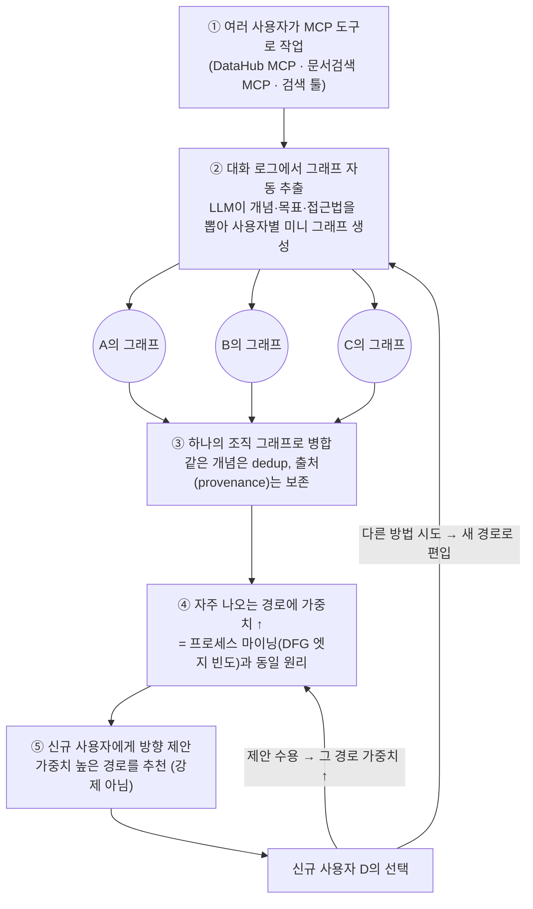
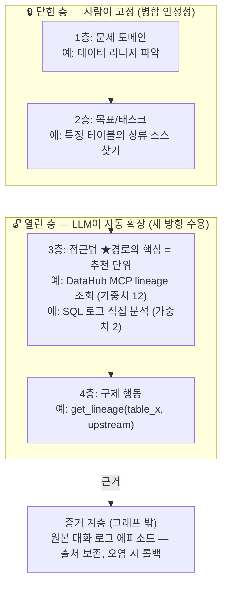
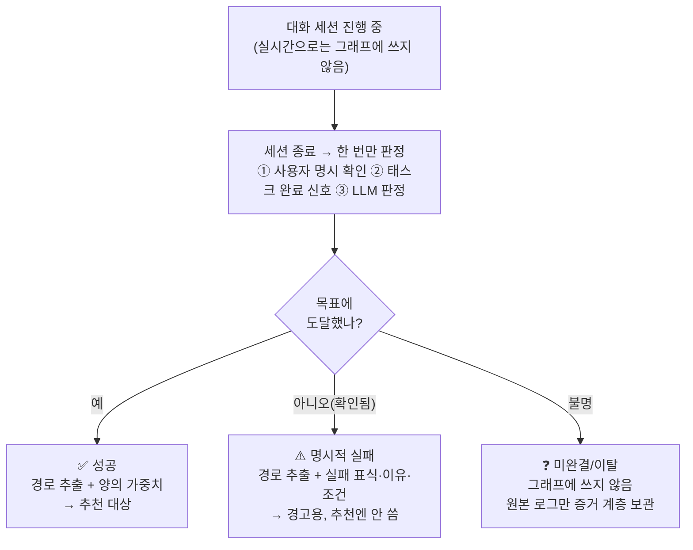
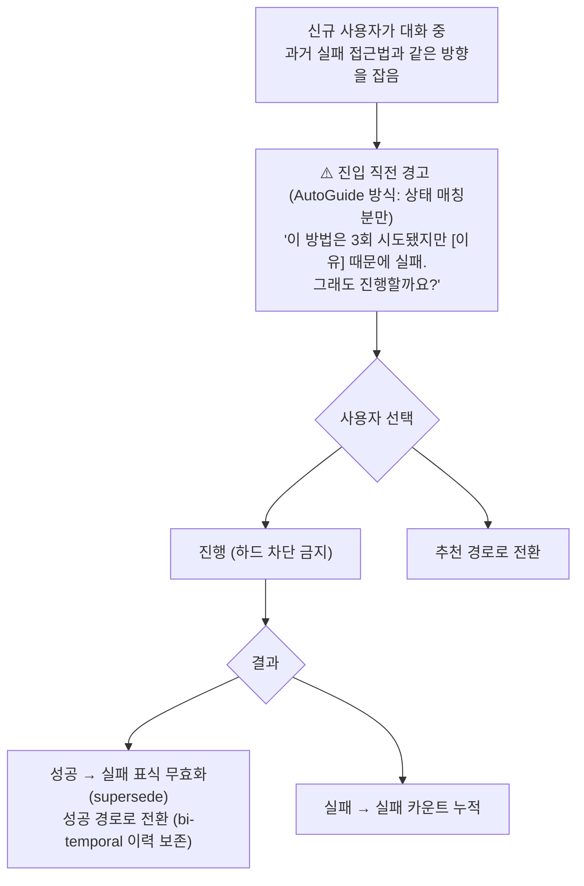
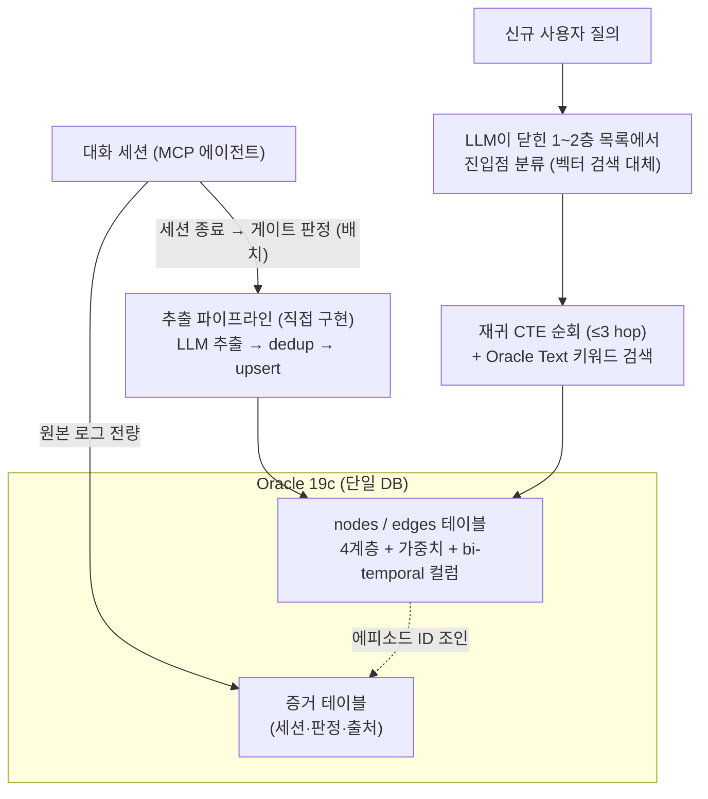

# 설계 문서: 대화 기반 조직 지식그래프 시스템

> 대화 문답으로 확정된 설계 결정 모음. 배경 조사는 [research.md](research.md) 참조.
> draw.io 버전: 프로젝트 루트의 `system-overview.drawio` (3페이지).

## 1. 전체 흐름 (5단계 + 순환)

여러 사용자가 MCP 도구(DataHub MCP, 문서검색 MCP, 검색 툴)로 작업하면, 대화 로그에서 그래프를 추출·병합·가중치 부여하고 신규 사용자에게 방향을 제안한다. 새로운 해결 방향은 다시 그래프로 순환 편입된다.



### 역할 분담 (자동 vs 사용자 선택)
- **②~④는 시스템이 백그라운드에서 자동** 수행. 사용자는 존재를 몰라도 된다.
- **⑤에서만 사람이 선택**: 제안 수용(경로 가중치↑) 또는 다른 방법 시도(새 경로 편입). 강제가 아닌 "추천 + 자유 이탈" 구조.
- **피드백 루프 보정 필수**: "제안을 보고 따라간 통행"과 "자발적으로 택한 통행"을 구분 기록하고, 유도된 통행은 가중치 기여를 할인한다. 안 하면 "많이 보여준 길"이 "좋은 길"처럼 보이는 왜곡이 생긴다.

## 2. 그래프 4계층 스키마 — 위는 닫고, 아래는 연다

깊이는 숫자가 아니라 **추상화 계층**으로 정의한다. 4계층 고정으로 시작.



### 왜 얕게 유지하는가
- dedup 오류는 hop마다 **곱셈으로 전파**: 정확도 85% × 5-hop = 신뢰도 44%.
- 깊을수록 사용자마다 granularity가 갈려 같은 지식이 저빈도 경로로 파편화 → 가중치 희석.

### 운영 규칙
1. **분화는 빈도가 증명할 때만** — 자주 나오는 노드의 내용이 갈리기 시작하면 그때 자식으로 분리. 미리 세분화하지 않는다.
2. **저빈도 잎은 부모로 흡수** — 통행 1~2회 말단은 합쳐서 비대화 방지.
3. **검색(제안)은 2~3 hop 제한** — 그 이상은 오류 전파로 제안 품질 급락.
4. 상위 1~2층은 닫힌 목록(시드 스키마)이라 사용자 간 병합이 안정적이고, 하위층은 열려 있어 새 방향 확장이 자연스럽다. (온톨로지 병합 난제의 해법 = 시드 스키마 grounding)

## 3. 세션 판정 3갈래 분기 — 어떤 대화를 그래프에 쓰는가

모든 대화 ✕ (비용·노이즈), 성공만 ✕ (실패도 귀한 신호). **완결된 대화를 결과에 따라 다르게.**
세션 종료 시점에 한 번만 판정한다(트리거 기반 추출). 실시간으로는 그래프에 쓰지 않는다.



이 관문 하나가 세 문제를 동시에 해결: **비용**(전량 추출 회피 — GraphRAG $33K 사례), **노이즈**(잡담·헤맨 대화 차단), **보안**(MINJA식 메모리 오염의 1차 방어선).

## 4. 실패 경로 노출 정책 — 평소엔 숨기고, 진입 직전에 경고

원칙: **기본 숨김 → 진입 직전 경고 → 그래도 가면 허용 → 성공하면 표식 자동 갱신.**



### 노출 시점 (딱 두 순간)
1. **실패 경로로 진입하려 할 때** — 가장 가치 있는 순간에 끼어들어 경고.
2. **경로 추천 시 각주로** — "시도됐으나 실패한 접근 2건 있음 (펼쳐보기)". 순위엔 안 넣되 존재는 알림.

### 저장 형태 — 표식이 아니라 "이유"를 저장 (ExpeL 방식)
| 항목 | 예시 |
|---|---|
| 실패 표식 | ⚠️ 3회 실패 |
| 실패 이유 | "로그 보존 7일 제한" |
| 실패 조건 | "과거 30일 이상 리니지가 필요할 때" |
| 증거 링크 | 당시 세션 에피소드 |

실패는 대부분 상황 의존적(권한·버전·데이터 부재)이라 **조건**이 핵심이다.

### 하드 차단 금지 이유
1. 실패 정보는 낡는다 — 도구가 바뀌면 어제의 막힌 길이 오늘 뚫림. 재시도 성공 시 Zep bi-temporal 방식으로 표식을 무효화(삭제 아닌 "그때는 막혔었음" 이력).
2. 차단하면 자정 능력 상실 — 재시도가 없으면 낡은 표식이 영원히 살아남고 새 경로 발견 순환이 끊긴다.

## 5. 저장소 구성 — Oracle 19c 단독

제약: **사내 표준 DB가 Oracle 19c 고정.** 19c는 Oracle Text(한국어 형태소 분석 포함) 전문 검색은 되지만 네이티브 벡터 검색은 없다(23ai부터). 검토 결과 **19c 단독으로 설계를 굽히지 않고 구현 가능** — 근거는 이 그래프가 작다는 것(조직 접근법 노드는 수백~수천 개, 벡터 인덱스가 필요한 규모가 아님).



### 스키마 골격

```sql
CREATE TABLE nodes (
  id          VARCHAR2(64) PRIMARY KEY,
  layer       NUMBER(1) NOT NULL,          -- 1~4 (4계층 스키마)
  name        VARCHAR2(400),
  embedding   BLOB,                        -- dedup용. 검색 인덱스 아님
  fail_flag   CHAR(1) DEFAULT 'N',
  fail_reason VARCHAR2(1000),
  fail_cond   VARCHAR2(1000),
  valid_from  TIMESTAMP, valid_to TIMESTAMP  -- bi-temporal supersession
);
CREATE TABLE edges (
  src VARCHAR2(64), dst VARCHAR2(64),
  weight    NUMBER DEFAULT 0,              -- 채택률 보정 가중치
  raw_count NUMBER DEFAULT 0,
  PRIMARY KEY (src, dst)
);
-- 노드 이름·설명 키워드 검색: Oracle Text CONTEXT 인덱스 + KOREAN_MORPH_LEXER
```

### 벡터 검색을 불필요하게 만드는 두 가지 장치
1. **진입점 = LLM 분류** — 1~2층이 닫힌 목록이므로, 에이전트에게 목록을 주고 "이 문제는 어디 속하나"를 분류시키면 임베딩 검색 없이 진입점이 나온다. 진입점부터는 그래프 순회.
2. **dedup = 애플리케이션 브루트포스** — 추출 시 "기존 노드와 같은가" 비교는 같은 부모 밑 후보 수십 개뿐. 임베딩을 BLOB에 저장하고 Python에서 전수 코사인 계산(밀리초).

### 트레이드오프 (정직하게)
| 잃는 것 | 대응 |
|---|---|
| **Graphiti 사용 불가** (Oracle 백엔드 미지원) — 최대 비용 | 추출 파이프라인 직접 구현. 어차피 세션 게이트·4계층 스키마가 커스텀이라 Graphiti도 대폭 수정이 필요했음 |
| 대규모 시맨틱 검색 | 수천 노드 규모엔 불필요. 수십만 노드가 되면 23ai 이관 또는 외부 벡터 스토어 재검토 |
| bi-temporal 자동 처리 | `valid_from/valid_to` + upsert 로직 직접 구현 |

### 단독 구성의 이점
- 원본 로그(증거 계층)와 그래프가 같은 DB → 조인 하나로 근거 참조, 오염 롤백 용이
- 백업·권한·감사가 사내 표준 그대로
- 평범한 관계형 스키마라 **23ai 이관 시 VECTOR 컬럼 + SQL/PGQ만 얹으면 됨** (이관 부담 낮음)

> 참고 — 19c 고정이 아니었다면: Graphiti + Neo4j 하나 추가(임베딩·키워드·그래프 하이브리드를 Neo4j 안에서 처리)가 최단 경로였다. 그래프는 19c 원본에서 재생성 가능한 파생 데이터로 취급(단방향 참조, 양방향 동기화 금지)한다는 원칙은 두 구성 모두 동일.

## 6. 미해결 / 다음 단계
- 성공 판정 LLM 프롬프트·정확도 검증
- 노출 대비 채택률 가중치의 구체 수식과 탐색 예산 비율
- 비식별화 파이프라인 위치(추출 전 vs 후)
- PoC: nodes/edges 테이블 + 세션 게이트 배치(일 1회) + 진입점 분류 프롬프트 — 이 세 조각이 전부
