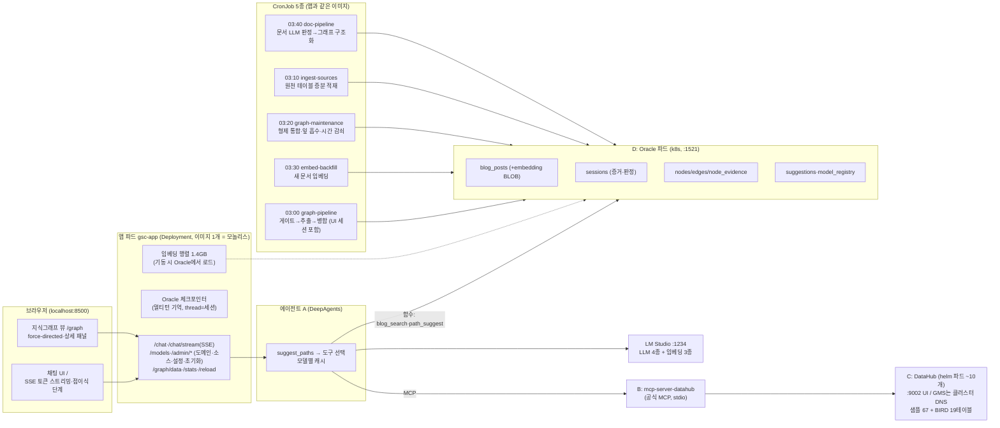

# 구현 아키텍처 (PoC 실물)

> 설계 근거는 [design.md](design.md), 실증 수치는 [poc-results.md](poc-results.md).
> 컴포넌트별 상세 다이어그램: [component-architecture.drawio](component-architecture.drawio) (8페이지 — draw.io에서 열기).
> 이 문서는 **현재 리포에서 실제로 돌아가는 것**의 지도다. (2026-08-05 기준)
> **배치 형태: 모델 서빙(로컬 LM Studio / 사내 vLLM)을 제외한 전부가 k8s 파드** — 앱(Deployment), Oracle(StatefulSet), DataHub(helm), 배치(CronJob).

## 전체 구성



## 저장소 (Oracle 단일 DB — design §5 원칙 유지)

| 테이블 | 내용 | 만든 곳 |
|---|---|---|
| `corpus_docs` | 통합 검색 코퍼스 (등록 소스 조립본 + `embedding` BLOB). 문서 id=`소스명:원천id` | ingest_sources.py |
| `source_registry` | 구조화 원천 테이블 등록 (테이블·id·시간·필드 역할 매핑 — 사람 전용) | source_registry.py |
| `blog_posts` | 구 노하우 코퍼스 — corpus_docs에 '소스 1호'로 흡수(임베딩 SQL 복사) | load_oracle.py / embed_corpus.py |
| `sessions` | 대화 증거 계층: 질문·툴호출·답변·게이트 판정(verdict)·user_id(SSO) | server.py / selfplay.py |
| `nodes` / `edges` / `node_evidence` | 4계층 지식그래프 + 가중치 + 출처 | graph_pipeline.py |
| `suggestions` | 경로 제안 노출 기록 (채택률 보정용 데이터) | path_suggest.py |
| `domain_registry` | 1층 도메인 닫힌 목록 + 추출 지침 + 용도(scope: both/chat/doc) (사람 전용) | graph_pipeline.py |
| `model_registry` | 모델 등록·기본값 (LLM=사용자, 임베딩·리랭커=관리자) | model_registry.py |
| `app_settings` | 운영 설정 KV (전처리 건수·동시성·모델 등 — 관리 UI에서 재배포 없이 변경) | settings.py |
| `lg_checkpoints` / `lg_writes` | LangGraph 체크포인터 외부화 (멀티턴 기억 — 복제본 공유·재시작 생존) | oracle_checkpointer.py |

## 주요 컴포넌트와 파일

| 파일 | 역할 | 핵심 결정 |
|---|---|---|
| `agent/agent.py` | DeepAgents 에이전트. 툴 = suggest_paths + 블로그 검색 2종 + DataHub MCP | 새 문제 → suggest_paths 먼저 (시스템 프롬프트) |
| `tools/blog_search.py` | 하이브리드 검색: Oracle Text(lexical) + 인메모리 행렬 코사인(semantic) → RRF | 검색당 임베딩 계산은 질의 1건뿐 |
| `tools/path_suggest.py` | 그래프 방향 제안 + 실패 이력 경고. 3단 서열: ✅검증(세션 성공) > 📄문서 근거(미검증 명시) > ⚠실패 우세 | 성공/실패는 판정 카운트 (불리언 금지 — 실증됨). 문서 유래 경로를 "검증"으로 표시 금지 |
| `tools/model_registry.py` | 모델 등록/기본값. 서빙 동기화 | 임베딩 교체 시 재백필 경고 |
| `tools/source_registry.py` `settings.py` | 원천 테이블 등록(역할 매핑)·조립 / 운영 설정 KV | 원천 테이블은 SELECT만 |
| `app/server.py` | FastAPI: SSE 스트리밍, 세션 기록, 관리자 API(도메인·소스·설정·초기화·현황), 그래프 데이터 | HTML no-store (캐시 사고 방지) |
| `app/auth.py` | SSO: header(전단 헤더 2개 소비) / keycloak(직접 OIDC) | 로그인 UI 없음 — integration.md 접점 1 |
| `app/index.html` `graph.html` `shell.css` | 통합 UI 셸, 관리 페이지 /admin (admin.html — 도메인·소스·전처리 설정·처리 현황 프로그래스), force-directed 그래프+패널(문서/대화 출처 분리 표기) | 색=의미: 파랑 경로·초록 검증·빨강 실패우세 |
| `poc/selfplay.py` `graph_pipeline.py` | 47세션 생성 / 게이트→4계층 추출→병합→가중치 | dedup 3단: ≥0.92+문자 가드 즉시 병합 / ≥0.70 LLM 후보 선택 / 신규 (캘리브레이션 실측 기반, 모델 교체 시 재캘리브레이션) |
| `poc/doc_pipeline.py` | 도메인 지정 소스의 corpus_docs를 LLM 판정→같은 그래프에 병합, 미달은 excluded | 판정 동시(기본 16)·병합 직렬(정합성). 생각 끄기로 ~15,000건/h |
| `poc/graph_maintenance.py` | 형제 통합·잎 흡수·시간 감쇠(패스3, 반감기+하한) — 멱등 | |
| `scripts/` | 코퍼스 빌드·Oracle 적재·임베딩 백필(병렬 4)·BIRD ingest·원천 증분 적재 | |
| `k8s/oracle.yaml` | Oracle StatefulSet+PVC+probe (사내 19c로 이미지만 교체) | |

## API 요약 (localhost:8500)

- `POST /chat/stream` — SSE: token(생각·답변 실시간) / tool / tool_end(정리된 응답) / answer
- `POST /chat` — 비스트리밍 (스크립트용). 둘 다 `model` 필드로 LLM 선택, 멀티턴 기억
- `GET /models` — 사용자용 LLM 목록 · `POST /admin/models/{sync,select}` — 관리자(X-Admin-Token)
- `GET/POST /admin/domains` — 1층 도메인 닫힌 목록 조회/추가 (`domain_registry` 시드 테이블, 관리자 전용. 삭제 API는 의도적으로 없음)
- `GET/POST /admin/sources` · `GET /admin/sources/tables[/{t}]` — 구조화 원천 테이블 등록 + 접속 DB 테이블·컬럼 브라우저 (관리자 전용, docs/integration.md 접점 2)
- `POST /admin/sources/{s}/dryrun` — 미처리 문서 판정만(그래프 반영 없음, 지침 튜닝용) · `POST /admin/sources/{s}/reprocess` — mode=errors(실패 재시도)/reset(기여 회수 후 재구조화)
- `POST /admin/domains/{d}/reset` · `POST /admin/reset-all-docs` — 도메인 단위/전역 문서 초기화 (문서 유래 기여만 회수, 대화 세션 기여 불변)
- `GET/POST /admin/pipeline-settings` — 전처리 운영 설정(건수·동시성 기본 16 최대 256·본문 길이·전용 모델·생각 끄기) — app_settings, 재배포 불필요
- `GET /admin/doc-status` — 소스별 done/excluded/error/pending 카운트 (UI 처리 현황 프로그래스가 5초 폴링)
- `GET/POST /admin/agent-settings` — 에이전트 전역 제어: 시스템 프롬프트 덮어쓰기·MCP on/off·도구별 활성 (저장 시 에이전트 캐시 무효화 — 다음 질문부터)
- `GET /sessions` · `GET /sessions/{id}` — 내 대화 목록·복원 (본인 것만 — SSO user_id 기준, 이어하기는 같은 session_id로 /chat)
- `GET /oidc/login·callback·logout` · `GET /me` — SSO (AUTH_MODE에 따라 활성, app/auth.py)
- `GET /graph/data` — 노드(사용 카운트를 문서/대화로 분리 + 성공·실패)·엣지 · `GET /stats` · `GET /reload`(임베딩 행렬 갱신)

## 실행 방법 (전부 파드)

```bash
# 전제: Docker Desktop(k8s 활성) + LM Studio(:1234, 모델 로드) — 모델 서빙만 호스트
kubectl create secret generic mysql-secrets --from-literal=mysql-root-password=datahub
helm repo add datahub https://helm.datahubproject.io/
helm install prerequisites datahub/datahub-prerequisites
helm install datahub datahub/datahub \
  --set global.datahub.metadata_service_authentication.enabled=false  # PoC 한정
kubectl apply -f k8s/oracle.yaml   # Oracle StatefulSet
docker build -t graph-search-chat:latest .
kubectl apply -k k8s/base          # 앱 Deployment + 야간 CronJob 5종 (env는 k8s/base/gsc.env → ConfigMap)
# 데이터 준비(1회, 호스트): build_corpus.py → load_oracle.py → embed_corpus.py → ingest_bird.py
# 접속: 채팅 :8500 / 그래프 :8500/graph / DataHub :9002 (datahub/datahub)
# 사내 전환: 이미지를 레지스트리로 push, MODEL_URL을 vLLM 서비스로, 인증·Secret 활성화
```

## 알려진 한계 (사내 전환 시 체크리스트)

1. 로컬은 대형 LLM 1개만 동시 로드(LM Studio, 유일한 비파드 구성요소) — GPU 서빙(vLLM 파드)에서 드롭다운 선택 그대로 동작
2. ~~멀티턴 기억은 서버 메모리~~ → **Oracle 체크포인터로 외부화 완료** (lg_checkpoints/lg_writes) — 복제본 공유·재시작 생존
3. ~~관리자 인증은 단일 토큰~~ → **SSO 구현 완료** (AUTH_MODE: header=전단 SSO 헤더 소비/keycloak=직접 OIDC — docs/integration.md 접점 1. X-Admin-Token은 스크립트용 병행)
4. 리랭커는 레지스트리 슬롯만 존재(검색 파이프라인에 리랭크 단계 미구현)
5. 야간 CronJob 5종이 미판정 세션·신규 문서를 자동 처리 (03:00 파이프라인 / 03:10 원천 증분 / 03:20 유지보수 / 03:30 임베딩 / 03:40 문서 구조화). 로컬은 야간에 모델 서빙이 켜져 있어야 동작
6. 나머지는 poc-results.md "남은 것" 참조 (채택률 보정, supersession 자동화 등)

## 배포 모드 전환 (standalone ↔ cluster)

Milvus·OpenSearch가 설치 모드를 나누는 방식처럼, 오라클·모델 서빙을 제외한 컴포넌트를 두 모드로 운용한다. 전환은 kustomize 적용 한 줄 — 데이터·설정 마이그레이션 없음.

### 스탠다드 → 클러스터

```bash
kubectl apply -k k8s/cluster        # 앱 2복제본 + 세션 고정(ClientIP)
kubectl rollout status deploy/gsc-app
kubectl get pods -l app=gsc-app     # 2/2 Ready 확인

# DataHub도 클러스터로 (선택, 사내 규모에서):
helm upgrade datahub datahub/datahub --reuse-values -f k8s/datahub-values-cluster.yaml
```

### 클러스터 → 스탠다드 (롤백)

```bash
kubectl apply -k k8s/base           # 복제본 1로 축소, 세션 고정 해제
```

### 전환 시 주의사항

1. **멀티턴 기억**: Oracle 체크포인터로 외부화되어 **세션 고정 불필요 — 복제본 간 자유 라우팅** (요청이 어느 파드로 가든 기억 공유, 재시작에도 생존). 전환 시 기억 관련 주의사항 없음
2. **리소스**: 앱 복제본당 메모리 요청 3Gi(임베딩 행렬 1.4GB 포함) — 복제본 수 × 3Gi 여유 확인. 로컬 검증 때 두 번째 복제본이 노드 disk-pressure로 Pending된 사례 있음 → `docker system prune`으로 해소
3. **CronJob은 모드 무관** — concurrencyPolicy: Forbid라 복제본 수와 무관하게 단일 실행
4. **Oracle·모델 서빙은 모드 대상 아님** — Oracle은 StatefulSet 단일(사내 HA는 DB 팀 영역), 모델 서빙은 호스트 LM Studio(사내는 vLLM 파드로 별도 구성)
