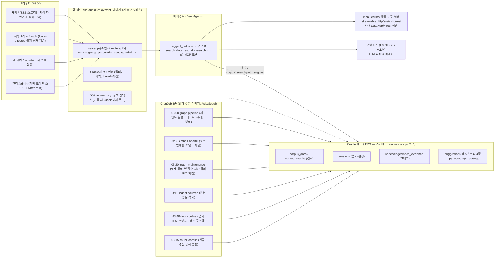

# 구현 아키텍처 (PoC 실물)

> 설계 근거는 [design.md](design.md), 실증 수치는 [poc-results.md](poc-results.md).
> 컴포넌트별 상세 다이어그램: [component-architecture.drawio](component-architecture.drawio) (8페이지 — draw.io에서 열기).
> 이 문서는 **현재 리포에서 실제로 돌아가는 것**의 지도다. (2026-08-10 기준)
> **배치 형태: 모델 서빙(로컬 LM Studio / 사내 vLLM)을 제외한 전부가 k8s 파드** — 앱(Deployment), Oracle(StatefulSet), DataHub(helm), 배치(CronJob).

## 전체 구성



## 저장소 (Oracle 단일 DB — design §5 원칙 유지)

**전 테이블은 `core/models.py`(SQLAlchemy)에 선언**되고 `core/db.py`의 `init_schema()`가
서버 기동 시 생성한다(create_all + 시드, 멱등). 규약: 단순 CRUD는
ORM(`db.session()`), MERGE·대량 배치·PL/SQL·체크포인터는 raw SQL.

| 테이블 | 내용 | 주 사용처 |
|---|---|---|
| `corpus_docs` | 통합 검색 코퍼스 (등록 소스 조립본). 문서 id=`소스명:원천id`, graph_status(구조화 상태) | ingest_sources / corpus_search / doc_pipeline |
| `corpus_chunks` | 문서 청크 + 임베딩(BLOB) + embed_model(모델 버저닝 — 교체 시 자동 재백필) | chunk_corpus / embed_corpus / corpus_search |
| `source_registry` | 구조화 원천 테이블 등록 (테이블·id·시간·필드 역할 매핑·url_enabled — 사람 전용) | source_registry.py |
| `domain_registry` | 1층 도메인 닫힌 목록 + 추출 지침 + 용도(scope: both/chat/doc) (사람 전용) | graph_pipeline / doc_pipeline |
| `sessions` | 대화 증거 계층: 질문·툴호출·답변·게이트 판정(verdict)·user_id | routers/chat (deps.log_turn) / graph_pipeline |
| `nodes` / `edges` / `node_evidence` | 4계층 지식그래프 + 가중치 + 출처(session/doc 구분) | graph_pipeline / doc_pipeline / path_suggest |
| `suggestions` | 경로 제안 노출 기록 (채택률 보정 + "이후 N회 제안됨") | path_suggest / contrib |
| `model_registry` | 모델 등록·기본값·base_url (LLM=사용자 선택, 임베딩·리랭커=관리자) | model_registry.py |
| `mcp_registry` | 도구 서버 등록 (transport: streamable_http/sse/stdio/rest) — 등록 = 도구 자동 조립 | mcp_registry.py / agent |
| `app_settings` | 운영 설정 KV (전처리 건수·동시성·에이전트 프롬프트/도구 등 — 재배포 없이 변경) | settings.py |
| `app_users` | 자체 계정 (가입·승인·is_admin) — 관리자는 env 계정 1개 별도 | auth.py / routers/accounts |
| `app_events` | 활동 로그(요청·도구·배치·오류 전부, level=lvl) — 180일 회전 | events.py / routers/admin_events / graph_maintenance(purge) |
| `blog_posts` | 구 노하우 코퍼스 — corpus_docs에 '소스 1호'로 흡수됨 | (읽기 원천으로만) |
| `lg_checkpoints` / `lg_writes` | LangGraph 체크포인터 외부화 (모델 선언 없음 — 체크포인터 소유) | oracle_checkpointer.py |

## 주요 컴포넌트와 파일

**앱 계층 규약**: Router(web/routers/ — HTTP 입출력·권한 검사) → Service/Repository(core/·search/·ingestion/) →
DB(core/db.py·models.py). 새 엔드포인트는 server.py가 아니라 해당 라우터에.

| 파일 | 역할 | 핵심 결정 |
|---|---|---|
| `web/server.py` | 앱 조립·기동 + **활동 로그 미들웨어**(전 요청)·전역 예외 핸들러·/stats | 엔드포인트 추가 금지 (라우터로) |
| `web/deps.py` | 공용: raw DB 풀·check_admin·에이전트 캐시·log_turn·sse | |
| `web/routers/chat.py` | SSE 스트리밍·세션 목록/복원·화제 분기 확인(topic-check)·문서 뷰·모델 목록 | 화제 확인은 fail-open (판정 실패가 답변을 막지 않음) |
| `web/routers/admin_sources.py` | 도메인·소스 등록·전처리 설정·드라이런/재시도/초기화·처리 현황 | 원천 테이블은 SELECT만 |
| `web/routers/admin_models.py` | 모델·MCP 레지스트리·에이전트 설정(프롬프트·도구 on/off) | 저장 시 에이전트 캐시 무효화 |
| `web/routers/contrib.py` | 내 기여 조회·문구 수정(단독 기여만)·철회·실패 표식 해제 | 사용자 제어=증폭기 (plan.md §6) |
| `web/routers/graph.py` `accounts.py` `pages.py` | 그래프 데이터·출처 증거 / 계정 승인·권한 / 페이지 서빙 | HTML no-store |
| `web/routers/admin_events.py` `core/events.py` | 활동 로그 조회(kind/level·검색·페이지) / log()·purge_old() | log()은 예외를 삼킴 — 로깅이 앱을 못 죽임 |
| `web/auth.py` | 자체 계정: env 관리자 + 가입·승인 + 서명 토큰(쿠키·Bearer) | 로그인 UI = login.html — integration.md |
| `app/index.html` `graph.html` `contrib.html` `admin.html` `login.html` `shell.css` | 채팅(궤적 타임라인·[n] 각주·화제 확인 바)·그래프(증거 패널)·내 기여(트리·분기점 ⑂)·관리 콘솔·로그인 | 색=의미: 파랑 경로·초록 검증·빨강 실패우세 |
| `core/models.py` `db.py` | 전 테이블 ORM 선언 / 엔진·세션·init_schema | 23ai 전환 시 VECTOR 컬럼만 여기 추가 |
| `search/corpus_search.py` `inmemory_index.py` | 하이브리드 검색: SQLite `:memory:` FTS5(lexical, Kiwi 형태소) + sqlite-vec(semantic) → best-chunk 집계 → RRF. 인덱스는 기동 시 Oracle에서 빌드(파생물) | Oracle Text 권한 불필요 · 검색당 임베딩 1건 |
| `search/path_suggest.py` | 경로 제안 + 실패 경고 + 탐색 노출(🔍 컷 바깥 1건 라벨 명시). 서열: ✅검증 > 📄문서 근거 > ⚠실패 우세 | 성공/실패는 판정 카운트 (불리언 금지) |
| `core/rest_tools.py` | 사내 REST 도구 서버(GET /tools + POST /call) 어댑터 — MCP와 무손실 1:1 | 오류는 예외 아닌 문자열 (턴 보호) |
| `core/model_registry.py` `mcp_registry.py` `settings.py` `source_registry.py` | 레지스트리·설정 (ORM CRUD) | 임베딩 기본값 교체 → 자동 재백필 |
| `agent/agent.py` | DeepAgents 조립: suggest_paths + search_docs/read_doc + search_{소스} + MCP/REST 도구 | 새 문제 → suggest_paths 먼저 (시스템 프롬프트) |
| `graph/graph_pipeline.py` | 세그먼트 분할→게이트(행동 신호)→fits·grounded 판정→추출→병합→재발 소급 취소 | dedup 3단: ≥0.92+문자 가드 / ≥0.70 LLM 선택 / 신규 |
| `graph/doc_pipeline.py` | 도메인 지정 소스 문서를 LLM 판정(fits)→같은 그래프에 병합, 미달 excluded | 판정 동시(연속 파이프라인)·병합 직렬. 생각 끄기로 ~15,000건/h |
| `graph/graph_maintenance.py` | 형제 통합·잎 흡수·시간 감쇠 — 멱등 | |
| `ingestion/` | 코퍼스 빌드·적재·청킹(executemany)·임베딩 백필(64건×동시4)·원천 증분 적재·토큰화 | |
| `deploy/k8s/` | 앱 Deployment·CronJob 6종(timeZone Asia/Seoul)·Oracle StatefulSet·ingress | env는 deploy/k8s/base/gsc.env → ConfigMap |

## API 요약 (:8500)

- `POST /chat/stream` — SSE: token / tool / tool_end / sources(각주·참고 문서) / answer
- `POST /chat` — 비스트리밍. 둘 다 `model` 필드로 LLM 선택, 멀티턴 기억
- `POST /session/topic-check` — 화제 단절 확인 (확인 바용 — 본인 세션만, fail-open)
- `GET /sessions` · `GET /sessions/{id}` — 내 대화 목록·복원 (본인 것만)
- `GET /doc/{pid}` — 문서 뷰 (에이전트가 읽은 본문 — url_enabled 소스만 원문 링크)
- `GET /graph/data` — 노드(문서/대화 사용 분리 + 성공·실패)·엣지 · `GET /graph/node/{id}/evidence` — 출처 증거
- `GET /me/contributions` · `POST /me/contributions/act` — 내 기여 조회 / rename·retract·clear_fail
- `POST /auth/{login,signup}` · `GET /auth/logout` · `GET /me` — 자체 계정
- `GET /admin/users` · `POST /admin/users/act` — 계정 관리 (승인/관리자 부여·해제/삭제)
- `GET/POST /admin/domains` · `POST /admin/domains/{d}/reset` — 도메인 시드 (삭제 API는 의도적으로 없음)
- `GET/POST /admin/sources` · `GET /admin/sources/tables[/{t}]` — 소스 등록 + 테이블 브라우저 (SOURCE_TABLE_ALLOWLIST 적용)
- `POST /admin/sources/{s}/dryrun` · `POST /admin/sources/{s}/reprocess` — 판정 미리보기 / errors·reset
- `POST /admin/reset-all-docs` — 전역 문서 초기화 (문서 유래 기여만 회수)
- `GET/POST /admin/pipeline-settings` — 전처리 설정 (app_settings, 재배포 불필요) · `GET /admin/doc-status` — 처리 현황
- `GET/POST /admin/agent-settings` — 프롬프트 덮어쓰기·MCP on/off·도구별 활성 (저장 시 캐시 무효화)
- `GET /models` · `GET /admin/models/all` · `POST /admin/models/{add,sync,select}` — 모델 레지스트리
- `GET/POST /admin/mcp` — 도구 서버 등록 (transport: streamable_http/sse/stdio/**rest**)
- `GET /admin/events[/{id}]` — 활동 로그 조회 (kind/level 필터·검색·페이지·상세)
- `GET /stats` · `GET /reload`(임베딩 행렬 갱신)

## 실행 방법 (전부 파드)

```bash
# 전제: k8s + 모델 서빙(LM Studio :1234 또는 vLLM) — 모델 서빙만 비파드
kubectl create secret generic mysql-secrets --from-literal=mysql-root-password=datahub
helm repo add datahub https://helm.datahubproject.io/
helm install prerequisites datahub/datahub-prerequisites
helm install datahub datahub/datahub \
  --set global.datahub.metadata_service_authentication.enabled=false  # PoC 한정
kubectl apply -f deploy/k8s/oracle.yaml   # Oracle StatefulSet
docker build -t graph-search-chat:latest .
kubectl apply -k deploy/k8s/base          # 앱 Deployment + CronJob 6종 (env는 deploy/k8s/base/gsc.env → ConfigMap)
# 데이터 준비(1회, 호스트): build_corpus.py → load_oracle.py → embed_corpus.py → ingest_bird.py
# 접속: 채팅 :8500 (자체 계정 — .env의 ADMIN_ID/ADMIN_PASSWORD) / 그래프 :8500/graph / DataHub :9002
# 사내 전환 체크리스트: docs/integration.md (검색은 SQLite 인메모리 — Oracle Text 권한 불필요)
```

## 알려진 한계 (사내 전환 시 체크리스트)

1. 로컬은 대형 LLM 1개만 동시 로드(LM Studio) — GPU 서빙(vLLM 파드)에서 드롭다운 선택 그대로 동작
2. ~~멀티턴 기억은 서버 메모리~~ → **Oracle 체크포인터로 외부화 완료** — 복제본 공유·재시작 생존
3. ~~관리자 인증은 단일 토큰~~ → **자체 계정 인증** (env 관리자 + 가입·승인·is_admin — docs/integration.md. SSO/게이트웨이 모드는 기획 변경으로 폐기)
4. 리랭커는 레지스트리 슬롯만 존재(검색 파이프라인에 리랭크 단계 미구현)
5. 야간 CronJob 6종(03:00~03:40, Asia/Seoul)이 미판정 세션·신규 문서를 자동 처리. 로컬은 야간에 모델 서빙이 켜져 있어야 동작
6. 임베딩 검색은 인메모리 행렬 (기동 시 1.4GB 로드) — 23ai/23.6 전환 시 VECTOR 컬럼(models.py) + VECTOR_DISTANCE로 교체 예정 (schema.md §5.5)
7. 나머지는 poc-results.md "남은 것" 참조 (채택률 보정 고도화, supersession 자동화, 사용자 숙련 가중 등)

## 배포 모드 전환 (standalone ↔ cluster)

Milvus·OpenSearch가 설치 모드를 나누는 방식처럼, 오라클·모델 서빙을 제외한 컴포넌트를 두 모드로 운용한다. 전환은 kustomize 적용 한 줄 — 데이터·설정 마이그레이션 없음.

### 스탠다드 → 클러스터

```bash
kubectl apply -k deploy/k8s/cluster        # 앱 2복제본
kubectl rollout status deploy/gsc-app
kubectl get pods -l app=gsc-app     # 2/2 Ready 확인

# DataHub도 클러스터로 (선택, 사내 규모에서):
helm upgrade datahub datahub/datahub --reuse-values -f deploy/k8s/datahub-values-cluster.yaml
```

### 클러스터 → 스탠다드 (롤백)

```bash
kubectl apply -k deploy/k8s/base           # 복제본 1로 축소
```

### 전환 시 주의사항

1. **멀티턴 기억·로그인**: 둘 다 무상태(Oracle 체크포인터 / 서명 토큰)라 **세션 고정 불필요 — 복제본 간 자유 라우팅**
2. **리소스**: 앱 복제본당 메모리 요청 3Gi(SQLite :memory: 검색 인덱스 ~1GB 포함) — 복제본 수 × 3Gi 여유 확인. 로컬 검증 때 두 번째 복제본이 노드 disk-pressure로 Pending된 사례 있음 → `docker system prune`으로 해소
3. **CronJob은 모드 무관** — concurrencyPolicy: Forbid라 복제본 수와 무관하게 단일 실행
4. **Oracle·모델 서빙은 모드 대상 아님** — Oracle은 StatefulSet 단일(사내 HA는 DB 팀 영역), 모델 서빙은 호스트 LM Studio(사내는 vLLM 파드로 별도 구성)
