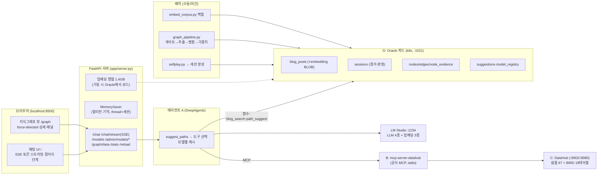

# 구현 아키텍처 (PoC 실물)

> 설계 근거는 [design.md](design.md), 실증 수치는 [poc-results.md](poc-results.md).
> 이 문서는 **현재 리포에서 실제로 돌아가는 것**의 지도다. (2026-08-02 기준)

## 전체 구성



## 저장소 (Oracle 단일 DB — design §5 원칙 유지)

| 테이블 | 내용 | 만든 곳 |
|---|---|---|
| `blog_posts` | 노하우 코퍼스 343,045건 + `embedding` BLOB(질의·dedup용 원본) | load_oracle.py / embed_corpus.py |
| `sessions` | 대화 증거 계층: 질문·툴호출·답변·게이트 판정(verdict) | server.py / selfplay.py |
| `nodes` / `edges` / `node_evidence` | 4계층 지식그래프 + 가중치 + 출처 | graph_pipeline.py |
| `suggestions` | 경로 제안 노출 기록 (채택률 보정용 데이터) | path_suggest.py |
| `model_registry` | 모델 등록·기본값 (LLM=사용자, 임베딩·리랭커=관리자) | model_registry.py |

## 주요 컴포넌트와 파일

| 파일 | 역할 | 핵심 결정 |
|---|---|---|
| `agent/agent.py` | DeepAgents 에이전트. 툴 = suggest_paths + 블로그 검색 2종 + DataHub MCP | 새 문제 → suggest_paths 먼저 (시스템 프롬프트) |
| `tools/blog_search.py` | 하이브리드 검색: Oracle Text(lexical) + 인메모리 행렬 코사인(semantic) → RRF | 검색당 임베딩 계산은 질의 1건뿐 |
| `tools/path_suggest.py` | 그래프 방향 제안 + 실패 이력 경고 | 성공/실패는 판정 카운트 (불리언 금지 — 실증됨) |
| `tools/model_registry.py` | 모델 등록/기본값. LM Studio 동기화 | 임베딩 교체 시 재백필 경고 |
| `app/server.py` | FastAPI: SSE 스트리밍, 세션 기록, 모델 API(관리자 토큰), 그래프 데이터 | HTML no-store (캐시 사고 방지) |
| `app/index.html` `graph.html` `shell.css` | 통합 UI 셸(노드-엣지 네비), 예시 칩, force-directed 그래프+패널 | 색=의미: 파랑 경로·초록 검증·빨강 실패우세 |
| `poc/selfplay.py` `graph_pipeline.py` | 47세션 생성 / 게이트→4계층 추출→병합(코사인 0.72)→가중치 | 캘리브레이션 실측 기반 |
| `scripts/` | 코퍼스 빌드·Oracle 적재·임베딩 백필(병렬 4)·BIRD ingest | |
| `k8s/oracle.yaml` | Oracle StatefulSet+PVC+probe (사내 19c로 이미지만 교체) | |

## API 요약 (localhost:8500)

- `POST /chat/stream` — SSE: token(생각·답변 실시간) / tool / tool_end(정리된 응답) / answer
- `POST /chat` — 비스트리밍 (스크립트용). 둘 다 `model` 필드로 LLM 선택, 멀티턴 기억
- `GET /models` — 사용자용 LLM 목록 · `POST /admin/models/{sync,select}` — 관리자(X-Admin-Token)
- `GET /graph/data` — 노드(사용·성공·실패 카운트)·엣지 · `GET /stats` · `GET /reload`(임베딩 행렬 갱신)

## 실행 방법

```bash
# 인프라: Docker Desktop(k8s 활성) + LM Studio(:1234, 모델 로드)
kubectl apply -f k8s/oracle.yaml          # Oracle 파드
datahub docker quickstart                  # DataHub 스택
# 데이터 준비(1회): build_corpus.py → load_oracle.py → embed_corpus.py → ingest_bird.py
.venv/bin/uvicorn app.server:app --port 8500
# 접속: 채팅 :8500 / 그래프 :8500/graph / DataHub :9002 (datahub/datahub)
```

## 알려진 한계 (사내 전환 시 체크리스트)

1. 로컬은 대형 LLM 1개만 동시 로드(LM Studio) — GPU 서빙(vLLM 등)에서 드롭다운 선택 그대로 동작
2. 멀티턴 기억은 서버 메모리(재시작 시 초기화) — 증거는 sessions에 영구 보존
3. 관리자 인증은 단일 토큰(PoC) — 사내는 SSO 연동
4. 리랭커는 레지스트리 슬롯만 존재(검색 파이프라인에 리랭크 단계 미구현)
5. 그래프 파이프라인·게이트는 배치 수동 실행 — 운영 시 세션 종료 트리거/야간 배치로
6. 나머지는 poc-results.md "남은 것" 참조 (채택률 보정, supersession 자동화 등)
