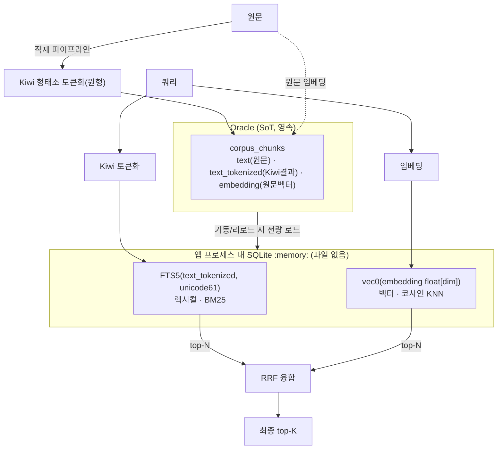

# 인메모리 하이브리드 검색 PoC 설계 (Oracle SoT + SQLite FTS5 + sqlite-vec)

> 작성일: 2026-08-11
> 목적: Oracle Text(권한 확보 어려움)와 Oracle 18c/19c의 벡터 검색 한계를 우회하기 위해,
> **Oracle을 원본 저장소(SoT)로 두고, 검색은 앱 프로세스 내 인메모리 SQLite(FTS5 + sqlite-vec)에서**
> 토크나이저·임베딩·하이브리드로 수행한다. 디스크에 파일을 남기지 않는다(보안).

## 1. 배경 / 결정 이유

| 문제 | 현재 | 이 PoC의 해법 |
|------|------|--------------|
| Oracle Text 권한(CTXAPP) 사내 확보 난망 | 렉시컬 검색을 Oracle Text에 의존 | **FTS5(BM25)** 로 대체 |
| Oracle 18c/19c 네이티브 벡터/ANN 없음 | numpy 행렬 인메모리 브루트포스(직접 관리) | **sqlite-vec** 에 위임 |
| 손수 관리하는 메모리 코드 → 누수·관리불가 위험 | `corpus_search.load_matrix` 직접 구현 | 검증된 라이브러리가 메모리·인덱스 관리 |
| 덤프/파일 잔존 보안 우려 | - | SQLite `:memory:` = 디스크 파일 0 |
| 한국어 형태소 | Oracle `KOREAN_MORPH_LEXER` | **앞단 Kiwi 토큰화 후 결과를 Oracle에 적재** |

> 설계원칙 재검토: CLAUDE.md 결정 #6("별도 검색엔진 금지, Oracle 하나")은 **Oracle Text 사용 가능**을 전제로 했다. 그 전제가 깨졌으므로 재검토가 정당하다. SQLite는 서비스형 엔진이 아니라 **앱 내 임베디드 라이브러리**라 "Oracle=저장 / 인메모리=계산" 구조에 부합한다(Chroma 같은 별도 서비스보다 원칙 충돌이 적다).
>
> 관련 조사: `../../research/starrocks-embedding-tokenizer-hybrid-search-research/` (외부 토큰화 주입·하이브리드 융합 원리 동일 패턴).

## 2. 아키텍처



**핵심 분리 원칙**: 렉시컬용은 **Kiwi로 쪼갠 텍스트**, 벡터용은 **원문 임베딩**. 둘을 섞지 않는다.

## 3. Oracle 스키마 추가 (원본은 그대로, 컬럼만 추가)

```sql
-- corpus_chunks (문서 청킹 단위 — 검색 대상)
ALTER TABLE corpus_chunks ADD (text_tokenized CLOB);   -- Kiwi 원형 토큰, 공백 조인
-- embedding 컬럼은 기존 유지 (원문 임베딩)

-- 문서 단위도 렉시컬 대상이면 동일하게
ALTER TABLE corpus_docs ADD (body_tokenized CLOB);
```

- `text_tokenized` 예: 원문 `"환불 규정을 알려줘"` → `"환불 규정 을 알리 어 주"` (원형 기준, 아래 §6 참고)
- **Oracle Text 인덱스/CTXAPP 권한 불필요** — 이 컬럼은 그냥 문자열 저장일 뿐.

## 4. 데이터 흐름

### (a) 적재 (야간 배치 / 청킹 시점)
```python
from kiwipiepy import Kiwi
kiwi = Kiwi()

def tokenize_for_search(text: str) -> str:
    # 원형(lemma) 기준, 공백 조인. 적재·쿼리 동일 함수 사용.
    return " ".join(t.lemma for t in kiwi.tokenize(text))

# corpus_chunks 저장 시:
#   text            = 원문
#   text_tokenized  = tokenize_for_search(원문)   ← FTS5용
#   embedding       = embed(원문)                 ← 벡터용(원문 임베딩)
```

### (b) 로드 (앱 기동 + 버전 변경 시)
```python
import sqlite3, sqlite_vec, struct

def build_index(rows, dim):
    con = sqlite3.connect(":memory:")           # 파일 없음
    con.enable_load_extension(True); sqlite_vec.load(con)
    con.execute(f"CREATE VIRTUAL TABLE vec_chunks USING vec0(chunk_id INTEGER PRIMARY KEY, embedding float[{dim}])")
    con.execute("CREATE VIRTUAL TABLE fts_chunks USING fts5(chunk_id UNINDEXED, body, tokenize='unicode61')")
    for r in rows:   # r = (chunk_id, text_tokenized, embedding_floats)
        con.execute("INSERT INTO vec_chunks(chunk_id, embedding) VALUES (?,?)",
                    (r.chunk_id, sqlite_vec.serialize_float32(r.embedding)))
        con.execute("INSERT INTO fts_chunks(chunk_id, body) VALUES (?,?)",
                    (r.chunk_id, r.text_tokenized))
    return con
```

### (c) 쿼리 (하이브리드)
```python
def search(con, query, embed_fn, k=10, rk=60):
    q_tok = tokenize_for_search(query)                 # 적재와 동일 Kiwi
    q_vec = sqlite_vec.serialize_float32(embed_fn(query))  # 원문 임베딩

    lex = con.execute(
        "SELECT chunk_id FROM fts_chunks WHERE fts_chunks MATCH ? ORDER BY bm25(fts_chunks) LIMIT 100",
        (q_tok,)).fetchall()
    vec = con.execute(
        "SELECT chunk_id FROM vec_chunks WHERE embedding MATCH ? ORDER BY distance LIMIT 100",
        (q_vec,)).fetchall()

    # RRF 융합 (순위 기반, 점수 스케일 무관)
    score = {}
    for rank, (cid,) in enumerate(lex, 1): score[cid] = score.get(cid,0) + 1/(rk+rank)
    for rank, (cid,) in enumerate(vec, 1): score[cid] = score.get(cid,0) + 1/(rk+rank)
    return sorted(score, key=score.get, reverse=True)[:k]
```

## 5. 동기화 전략 (Oracle 원본 ↔ 인메모리 복사본)

인메모리는 파생 인덱스이므로 원본 변경 시 갱신한다. 현재 규모에선 버전 기반 "통째 리로드".

- 조건: Oracle에 인덱스 버전 값 1개, 각 복제본이 주기 확인 후 변경 시 전체 재빌드
- 조건: 복제본별 인메모리 사본 독립 → 각자 리로드
- 조건: 쓰기는 항상 Oracle 먼저(SoT), 인메모리는 리로드로 반영
- 조건: 증분 동기화는 PoC 범위 밖

## 6. 준수 조건

- 조건: 토큰 컬럼(FTS5) ↔ 임베딩(벡터) 분리
- 조건: 적재 Kiwi = 쿼리 Kiwi (동일 버전·동일 함수)
- 조건: FTS5 토크나이저는 `unicode61`
- 조건: 표면형/원형 통일(원형 권장)

## 7. 도구 선택 근거

- **형태소기 = Kiwi(`kiwipiepy`)**: `pip install` 한 줄, **JVM·외부사전 불필요**(KoNLPy/Okt는 Java 필요, mecab-ko는 C사전 설치 부담), 정확·빠름. 컨테이너 친화적. (초경량 필요 시 soynlp, 성능 극한 필요+설치 감수면 mecab-ko.)
- **렉시컬 = SQLite FTS5**: BM25 내장, Oracle Text/CTXAPP 대체.
- **벡터 = sqlite-vec**: `:memory:`에서 코사인 KNN(현 규모 브루트포스 충분). Chroma는 렉시컬이 약해 "한 엔진에 토크나이저까지" 목표에 부적합.
- **저장소 = Oracle 유지(SoT)**: 영속·트랜잭션·기존 파이프라인 재사용. 검색만 인메모리로 분리.

## 8. 조건 / 열린 질문

- 조건: 임베딩 모델 미서빙 시 렉시컬(FTS5) 단독 폴백 동작
- 조건: 데이터는 RAM 수용 범위 내(파드 메모리·로드 시간 모니터링)
- 조건: 검색 진입점(`search_docs`/`read_doc`) 인터페이스 유지 → 에이전트/앱 상위 무변경
- 조건: 청크 best-hit → 문서 단위 집계 로직 유지
- 열린 질문: `nodes.embedding` dedup의 동일 벡터 경로 재사용 여부(별도 검토)

## 9. PoC 진행 순서(제안)

1. `corpus_chunks.text_tokenized` 컬럼 추가 + Kiwi 백필 스크립트(기존 `chunk_corpus`/`embed_corpus` 옆)
2. `tools/inmemory_index.py` 신규 — `build_index()` / `search()` / 버전 리로드
3. `tools/corpus_search.py`의 검색 진입점을 인메모리 경로로 스위치(설정 플래그로 A/B)
4. 검증: 동일 질의로 기존(Oracle Text+numpy) vs 신규(FTS5+sqlite-vec) 결과 비교
5. 임베딩 모델 서빙되면 벡터 경로 활성화, 렉시컬 단독 폴백 확인
