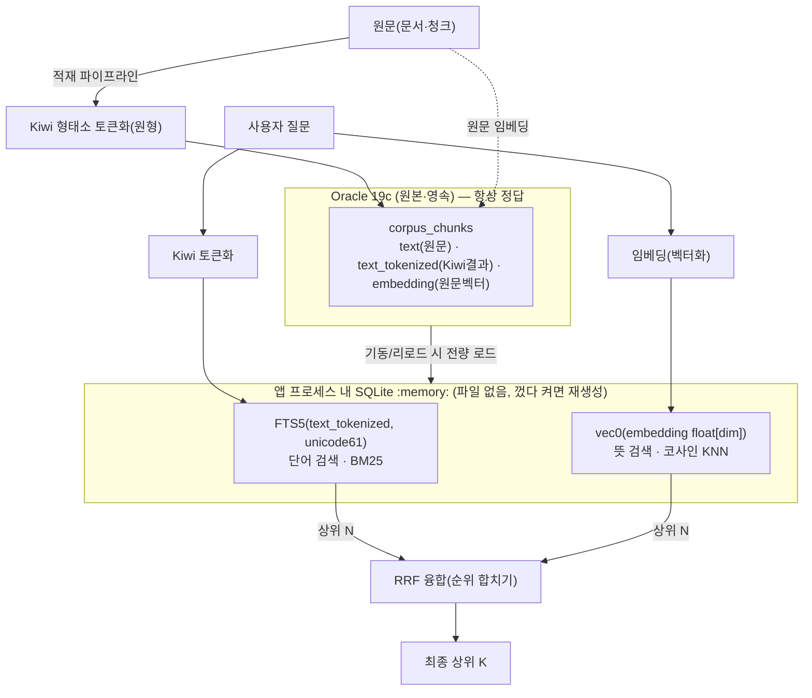

# 인메모리 하이브리드 검색 (Oracle 원본 + SQLite FTS5 + sqlite-vec)

> 작성일: 2026-08-11 (2026-08-12 쉬운 설명 추가)
> 한 줄 요약: **원본은 Oracle에 그대로 두고, 검색은 프로그램 메모리 안의 작은 SQLite 색인
> 두 개(단어용·뜻용)로 한다. 디스크에 파일을 안 남기고, Oracle에 특별한 권한도 필요 없다.**

---

## 0. 쉽게 이해하기 (중학생도 OK)

### 검색이 뭐냐 — 도서관에서 책 찾기
검색은 **도서관에서 원하는 책을 찾는 것**과 같습니다. 찾는 방법이 두 가지예요:

1. **단어로 찾기** — "환불"이라는 낱말이 들어간 책을 찾기. (정확한 단어가 있어야 함)
2. **뜻으로 찾기** — "돈 돌려받는 법" 이라고 물으면 "환불 규정" 책을 찾아주기. (낱말이 달라도 *의미*가 비슷하면 찾음)

둘 다 장단점이 있어서, **두 방법을 합치면 훨씬 잘 찾습니다.** 이걸 **하이브리드 검색**이라고 합니다.

- 단어로 찾기 = **렉시컬(lexical) 검색** — 우리는 `FTS5`라는 도구 사용
- 뜻으로 찾기 = **의미(semantic)·임베딩 검색** — 문장을 숫자 목록(**벡터**)으로 바꿔서 "숫자가 비슷하면 뜻도 비슷"으로 찾음. 우리는 `sqlite-vec` 사용

> **임베딩이란?** 문장을 컴퓨터가 비교할 수 있게 **숫자 목록(벡터)** 으로 바꾼 것. 뜻이 비슷한 문장은 숫자도 비슷해집니다. 이 변환은 별도의 "임베딩 모델"이 해줍니다.

### 왜 원래 하려던 방식(Oracle 하나로)이 막혔나 — 3개의 벽

우리 회사 표준 창고는 **Oracle 19c**입니다. 원래는 창고 하나로 저장도 하고 검색도 하려 했는데, 벽 3개에 막혔어요:

| # | 벽 | 쉬운 설명 |
|---|----|-----------|
| ① | **Oracle 19c는 "뜻으로 찾기"(임베딩 검색)를 못 함** | 이 버전엔 벡터 검색 기능이 아예 없음 |
| ② | **한글 단어 쪼개기 기능을 켜려면 위험한 권한이 필요** | Oracle의 한국어 형태소 기능을 켜려면 관리자 권한을 받아야 하는데, 그걸 켜면 **같은 Oracle을 쓰는 옆 프로젝트에 부작용(side effect)** 이 생길 수 있어서 못 받음 |
| ③ | **서비스(도커 컨테이너)에 파일을 남기면 안 됨** | 보안 규칙상 컨테이너 안에 검색용 파일(색인 파일 등)을 저장할 수 없음 |

> **형태소·토크나이저란?** 한국어는 "환불을"처럼 낱말이 붙어 나와서, 컴퓨터가 검색하려면 먼저 **"환불 / 을"** 처럼 쪼개야 합니다. 이 쪼개는 도구를 **토크나이저(형태소 분석기)** 라고 해요. 우리는 `Kiwi`를 씁니다.

### 그래서 어떻게 풀었나

**원본(Oracle)은 그대로 두고, 검색만 따로 뽑아냈습니다.**

- **원본 보관 = Oracle** (진짜 데이터는 여기, 항상 여기가 정답)
- **검색 = 프로그램 메모리 안의 작은 SQLite 색인 2개**
  - 단어용 색인(FTS5) — 한글은 미리 `Kiwi`로 쪼개 넣음
  - 뜻용 색인(sqlite-vec) — 임베딩(벡터) 넣음
- 두 색인의 결과를 합쳐서(**RRF**) 최종 순위를 냄 → **하이브리드**

이렇게 하니 3개의 벽이 다 풀립니다:
- ① 뜻 검색을 sqlite-vec가 해줌 (Oracle이 못 하던 것)
- ② 한글 쪼개기를 앞단의 Kiwi가 함 → Oracle의 위험한 권한 **필요 없음**
- ③ SQLite를 **메모리(`:memory:`)** 에만 만듦 → **디스크에 파일 0개**. 서비스 껐다 켜면 Oracle에서 다시 만듦

> **비유:** Oracle은 **책을 다 보관하는 창고**, SQLite 인메모리 색인은 **책상 위에 그때그때 만드는 색인 카드**입니다. 카드는 종이(파일)로 안 남기고 머릿속(메모리)에만 두고, 창고 내용이 바뀌면 카드를 다시 만듭니다. 창고는 절대 안 건드려요.

### 왜 "직접 파이썬 계산" 대신 SQLite를 쓰나 (관리가 쉬워서)

- **예전 방식:** 파이썬(numpy)으로 모든 벡터를 메모리에 들고 **직접 계산**했습니다. 그런데 문서를 **추가/수정/삭제**할 때마다 그 목록을 손으로 관리해야 해서 **복잡하고 실수·메모리 누수 위험**이 컸어요.
- **지금 방식:** SQLite(FTS5·sqlite-vec)가 **색인과 메모리 관리를 알아서** 해줍니다. 문서가 바뀌면 그냥 **다시 로드**하면 끝. 검증된 라이브러리가 관리하니 코드가 단순하고 안전합니다.

### 왜 Chroma가 아니라 SQLite인가

둘 다 후보였는데(문서·코드엔 "ChromaDB 또는 SQLite"로 검토), **SQLite로 정했습니다.**

- **Chroma**는 *뜻 검색*은 잘하지만 *단어 검색(한글 형태소)* 이 약합니다. 우리는 **한 곳에서 단어+뜻 둘 다** 하고 싶어서 안 맞음.
- **Chroma는 별도 서비스**라 "검색 서버를 하나 더 운영"하는 부담. **SQLite는 프로그램 안에 들어가는 라이브러리**라 가볍고, "Oracle=저장 / 메모리=검색" 구조에 딱 맞음.

---

## 1. 배경 / 결정 이유 (요약 표)

| 문제 / 제약 | 원래 방식 | 이 방식의 해법 |
|------|------|--------------|
| **Oracle 19c에 임베딩(벡터) 검색 없음** | numpy로 인메모리 브루트포스 직접 계산 | **sqlite-vec** 에 위임 (코사인 KNN) |
| **한글 형태소용 Oracle 권한(CTXAPP)** — 켜면 **다른 프로젝트에 사이드이펙트** 우려로 확보 불가 | Oracle Text/형태소기에 의존 | 앞단 **Kiwi**로 쪼개고, 렉시컬은 **FTS5(BM25)** 로 |
| **컨테이너에 파일 잔존 금지(보안)** | - | SQLite **`:memory:`** = 디스크 파일 0 |
| **손수 관리하던 벡터 코드 → 추가/수정/삭제 관리난** | `corpus_search`의 numpy 행렬 직접 구현 | 검증된 라이브러리가 색인·메모리 관리 (다시 로드만) |

> **설계원칙 재검토:** CLAUDE.md 결정 #6("별도 검색엔진 금지, Oracle 하나")은 *Oracle Text를 쓸 수 있다*는 전제였습니다. 그 전제(권한)가 깨졌으므로 재검토가 정당합니다. SQLite는 서비스형 검색엔진이 아니라 **앱 안에 들어가는 임베디드 라이브러리**라, "Oracle=저장 / 인메모리=계산" 구조에 부합합니다(Chroma 같은 별도 서비스보다 원칙 충돌이 적음).

---

## 2. 아키텍처 (그림)



**핵심 분리 원칙:** 단어 검색용은 **Kiwi로 쪼갠 텍스트**, 뜻 검색용은 **원문 임베딩**. 둘을 섞지 않는다.

---

## 3. Oracle 스키마 (원본은 그대로, 컬럼만 추가)

검색을 위해 Oracle에 **컬럼 두 개만** 더합니다. 새 테이블·특별 권한·Oracle Text 인덱스 **전부 불필요** — 그냥 문자열/숫자 저장일 뿐입니다.

```sql
-- corpus_chunks (문서를 잘게 나눈 검색 단위)
ALTER TABLE corpus_chunks ADD (text_tokenized CLOB);   -- Kiwi로 쪼갠 원형 토큰(공백 조인)
-- embedding 컬럼은 기존 유지 (원문 임베딩 벡터)
```

- `text_tokenized` 예: 원문 `"환불 규정을 알려줘"` → `"환불 규정 을 알리 어 주"` (원형 기준, §6 참고)
- **왜 미리 쪼개 저장?** FTS5는 한국어 형태소를 모릅니다. 그래서 **적재할 때 Kiwi로 미리 쪼개** 넣고, 검색할 때도 **같은 Kiwi로 질문을 쪼개** 맞춥니다.

---

## 4. 데이터 흐름 (코드)

### (a) 적재 — 문서를 넣을 때 (야간 배치 / 청킹 시점)
```python
from search import ko_tokenize   # 적재·쿼리 공용 단일 소스

def tokenize_for_search(text: str) -> str:
    # Kiwi 원형(lemma) 기준, 공백 조인. 적재·쿼리가 반드시 같은 함수를 써야 결과가 맞음.
    return ko_tokenize.tokenize_for_search(text)

# corpus_chunks 저장 시:
#   text            = 원문 (사람이 읽는 그대로)
#   text_tokenized  = tokenize_for_search(원문)   ← 단어 검색(FTS5)용
#   embedding       = embed(원문)                 ← 뜻 검색(벡터)용
```

### (b) 로드 — 앱 켜질 때 + 원본 바뀔 때 (Oracle → 메모리)
```python
import sqlite3, sqlite_vec

def build_index(rows, dim):
    con = sqlite3.connect(":memory:")           # ★ 파일 없음 — 메모리에만
    con.enable_load_extension(True); sqlite_vec.load(con)
    con.execute(f"CREATE VIRTUAL TABLE vec USING vec0(cid INTEGER PRIMARY KEY, embedding float[{dim}])")
    con.execute("CREATE VIRTUAL TABLE fts USING fts5(cid UNINDEXED, body, tokenize='unicode61')")
    for r in rows:   # r = (chunk_id, text_tokenized, embedding_floats)
        con.execute("INSERT INTO vec(cid, embedding) VALUES (?,?)",
                    (r.chunk_id, sqlite_vec.serialize_float32(r.embedding)))
        con.execute("INSERT INTO fts(cid, body) VALUES (?,?)",
                    (r.chunk_id, r.text_tokenized))
    return con
```

### (c) 쿼리 — 검색할 때 (하이브리드)
```python
def search(con, query, embed_fn, k=10, rk=60):
    q_tok = tokenize_for_search(query)                     # 적재와 똑같이 Kiwi로 쪼갬
    q_vec = sqlite_vec.serialize_float32(embed_fn(query))  # 질문을 벡터로

    lex = con.execute("SELECT cid FROM fts WHERE fts MATCH ? ORDER BY bm25(fts) LIMIT 100",
                      (q_tok,)).fetchall()                 # 단어 검색 상위 100
    vec = con.execute("SELECT cid FROM vec WHERE embedding MATCH ? ORDER BY distance LIMIT 100",
                      (q_vec,)).fetchall()                 # 뜻 검색 상위 100

    # RRF 융합 — 점수 크기가 아니라 '순위'로 합쳐서 두 검색을 공정하게 섞음
    score = {}
    for rank, (cid,) in enumerate(lex, 1): score[cid] = score.get(cid, 0) + 1/(rk+rank)
    for rank, (cid,) in enumerate(vec, 1): score[cid] = score.get(cid, 0) + 1/(rk+rank)
    return sorted(score, key=score.get, reverse=True)[:k]
```

> **RRF가 뭐냐?** 두 검색이 매긴 **순위**만 보고 합치는 방법(Reciprocal Rank Fusion). 점수 스케일이 서로 달라도 공정하게 섞입니다. "둘 다 위에 올린 문서일수록 높은 점수".

---

## 5. 동기화 — 원본(Oracle)과 복사본(메모리)을 맞추기

메모리 색인은 **원본에서 뽑아낸 복사본**이라, 원본이 바뀌면 다시 만들어야 합니다. 지금 규모에선 **버전 확인 후 통째로 다시 로드**가 가장 단순·안전.

- Oracle에 "인덱스 버전" 값 1개를 둠 → 각 복제본이 주기적으로 확인 → 바뀌었으면 전체 재빌드
- 복제본마다 자기 메모리 사본을 독립적으로 가짐 → 각자 알아서 리로드
- **쓰기는 항상 Oracle 먼저**(원본이 정답), 메모리는 리로드로만 반영
- 증분(부분) 동기화는 PoC 범위 밖 (지금은 통째 리로드로 충분)

---

## 6. 지켜야 할 규칙 (안 지키면 검색이 어긋남)

- 단어 색인(FTS5) ↔ 임베딩(벡터)은 **따로** — 섞지 않기
- **적재 Kiwi = 쿼리 Kiwi** (같은 버전·같은 함수) — 안 그러면 쪼갠 결과가 달라 안 맞음
- FTS5 토크나이저는 `unicode61`
- 표면형/원형 통일(**원형 권장**)

---

## 7. 도구 선택 근거 (왜 이걸 골랐나)

- **형태소기 = Kiwi(`kiwipiepy`)**: `pip install` 한 줄, **Java·외부사전 불필요**(KoNLPy/Okt는 Java 필요, mecab-ko는 C사전 설치 부담). 정확·빠르고 **컨테이너 친화적**.
- **단어 검색 = SQLite FTS5**: BM25(관련도 점수) 내장. Oracle Text/CTXAPP 권한 대체.
- **뜻 검색 = sqlite-vec**: `:memory:`에서 코사인 KNN(현 규모는 전수 비교로 충분). **Chroma는 단어 검색이 약해** "한 곳에서 단어+뜻 둘 다" 목표에 부적합.
- **저장소 = Oracle 유지(원본·정답)**: 영속·트랜잭션·기존 파이프라인 재사용. **검색만** 메모리로 분리.

---

## 8. 조건 / 열린 질문

- 임베딩 모델이 안 떠 있으면 **단어 검색(FTS5) 단독으로 폴백** 동작 (검색이 아예 멈추지 않게)
- 데이터가 **RAM에 들어갈 크기**여야 함 (파드 메모리·로드 시간 모니터링)
- 검색 진입점(`search_docs`/`read_doc`) 인터페이스 유지 → 에이전트·앱 상위 코드는 **안 바뀜**
- 청크 best-hit → 문서 단위 집계 로직 유지
- 열린 질문: `nodes.embedding` dedup의 동일 벡터 경로 재사용 여부(별도 검토)

---

## 9. 실제 구현 위치 (코드로 확인)

| 역할 | 파일 |
|------|------|
| 한국어 토큰화(적재·쿼리 공용) | `src/search/ko_tokenize.py` (`tokenize_for_search`) |
| 인메모리 인덱스 빌드·검색·리로드 | `src/search/inmemory_index.py` (`build_index`/`lexical`/`semantic`/`ensure_fresh`) |
| 검색 진입점(하이브리드·RRF·문서 집계) | `src/search/corpus_search.py` |
| 청킹(원문→청크, Kiwi 토큰 저장) | `src/ingestion/chunk_corpus.py` |
| 임베딩 백필(청크→벡터) | `src/ingestion/embed_corpus.py` |

> 정리: **Oracle이 원본(정답), SQLite 인메모리가 검색 계산.** 파일 안 남기고(보안), Oracle 특별 권한 안 쓰고(사이드이펙트 회피), 단어+뜻을 한 곳에서(하이브리드), 라이브러리가 관리해줘서(추가·수정·삭제 쉬움) — 이 네 가지가 이 설계의 이유입니다.
