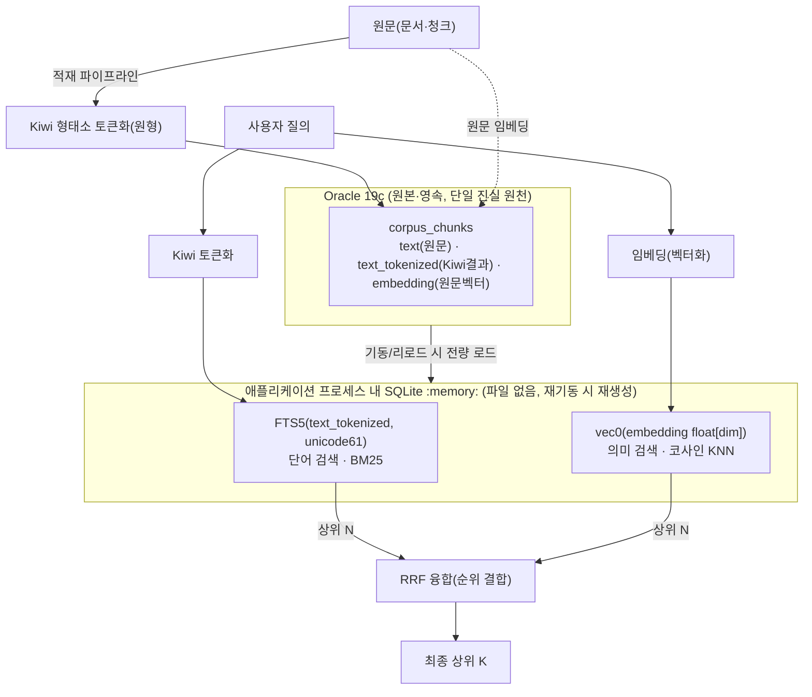
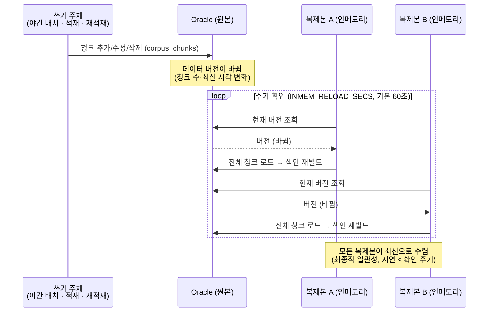

# 인메모리 하이브리드 검색 설계 (Oracle 원본 + SQLite FTS5 + sqlite-vec)

> 작성일: 2026-08-11 (2026-08-12 개요·설치·동기화 보강)
> 대상 독자: 개발자 및 비개발 이해관계자
> 요약: **원본 데이터는 Oracle에 그대로 두고, 검색은 애플리케이션 프로세스 메모리 안의
> SQLite 색인 두 개(단어용·의미용)로 수행한다. 디스크에 파일을 남기지 않으며, Oracle에
> 추가 권한이 필요하지 않다.**

---

## 0. 개요 (비전문가용 설명)

### 0.1 검색의 두 가지 방식 — 도서관 비유

검색은 도서관에서 원하는 책을 찾는 일에 비유할 수 있다. 찾는 방식은 두 가지다.

1. **단어로 찾기** — "환불"이라는 낱말이 들어간 자료를 찾는다. 정확한 단어가 있어야 한다.
2. **의미로 찾기** — "돈을 돌려받는 방법"으로 질의해도 "환불 규정" 자료를 찾아준다. 낱말이 달라도 *의미*가 비슷하면 검색된다.

두 방식은 서로 장단점이 다르므로, **함께 사용하면 검색 품질이 크게 향상된다.** 이를 **하이브리드 검색**이라 한다.

- 단어 기반 = **렉시컬(lexical) 검색** — 본 설계에서는 `FTS5` 사용
- 의미 기반 = **시맨틱(semantic)·임베딩 검색** — 문장을 숫자 목록(**벡터**)으로 바꿔, 숫자가 가까우면 의미가 유사한 것으로 판단한다. 본 설계에서는 `sqlite-vec` 사용

> **임베딩:** 문장을 컴퓨터가 비교할 수 있도록 **숫자 목록(벡터)** 으로 변환한 것. 의미가 유사한 문장은 벡터도 가까워진다. 이 변환은 별도의 임베딩 모델이 수행한다.

### 0.2 Oracle 단독 방식이 불가능한 이유 — 3가지 제약

사내 표준 저장소는 **Oracle 19c**이며, 초기에는 저장과 검색을 Oracle 하나로 처리하고자 했다. 그러나 다음 세 가지 제약에 막혔다.

| # | 제약 | 설명 |
|---|------|------|
| ① | **Oracle 19c는 임베딩(벡터) 검색을 지원하지 않는다** | 해당 버전에는 벡터 검색 기능이 없다. |
| ② | **한국어 형태소 기능 활성화에 필요한 권한을 확보할 수 없다** | Oracle의 한국어 형태소 검색을 켜려면 관리자 권한(CTXAPP 등)이 필요하나, 이를 활성화하면 **동일 Oracle 인스턴스를 공유하는 타 프로젝트에 부작용(side effect)** 이 발생할 수 있어 확보가 불가하다. |
| ③ | **서비스 컨테이너에 파일을 남길 수 없다** | 보안 정책상 컨테이너 내부에 검색 색인 등 파일을 저장할 수 없다. |

> **형태소·토크나이저:** 한국어는 "환불을"처럼 어절이 결합되어 나타나므로, 검색을 위해 먼저 **"환불 / 을"** 과 같이 분해해야 한다. 이 분해 도구를 **토크나이저(형태소 분석기)** 라 하며, 본 설계에서는 `Kiwi`를 사용한다.

### 0.3 해결 방식

**원본(Oracle)은 그대로 유지하고, 검색 계층만 분리했다.**

- **원본 저장 = Oracle** — 데이터의 단일 진실 원천(SoT). 항상 Oracle이 기준이다.
- **검색 = 애플리케이션 메모리 내 SQLite 색인 2종**
  - 단어용 색인(FTS5) — 한국어는 사전에 `Kiwi`로 분해하여 적재
  - 의미용 색인(sqlite-vec) — 임베딩(벡터) 적재
- 두 색인의 결과를 **RRF** 로 융합하여 최종 순위를 산출한다 → **하이브리드**

이 방식으로 세 가지 제약이 모두 해소된다.

- ① 의미 검색을 sqlite-vec가 담당한다(Oracle이 제공하지 못하던 기능).
- ② 형태소 분해를 앞단의 Kiwi가 수행하므로 Oracle의 해당 권한이 **불필요**하다.
- ③ SQLite를 **메모리(`:memory:`)** 에만 생성하므로 **디스크 파일이 발생하지 않는다.** 서비스 재기동 시 Oracle에서 다시 구성한다.

> **비유:** Oracle은 모든 자료를 보관하는 **창고**, SQLite 인메모리 색인은 필요할 때 만드는 **색인 카드**에 해당한다. 카드는 파일로 남기지 않고 메모리에만 두며, 창고 내용이 변경되면 카드를 다시 만든다. 창고(원본)는 변경하지 않는다.

### 0.4 직접 구현 대신 SQLite를 사용하는 이유 — 유지보수성

- **기존 방식:** numpy로 전체 벡터를 메모리에 적재하여 **직접 계산**했다. 그러나 문서의 **추가·수정·삭제**마다 해당 구조를 수작업으로 관리해야 하여 **복잡도가 높고 오류·메모리 누수 위험**이 있었다.
- **현재 방식:** SQLite(FTS5·sqlite-vec)가 **색인과 메모리를 자체 관리**한다. 데이터 변경 시 **재로드**만으로 반영되며, 검증된 라이브러리가 관리하므로 코드가 단순하고 안정적이다.

### 0.5 Chroma 대신 SQLite를 선택한 이유

후보는 ChromaDB와 SQLite였으며, **SQLite로 결정했다.**

- **Chroma**는 의미 검색에는 강하나 **단어 검색(한국어 형태소)이 약하다.** 본 설계는 **단어·의미를 한 계층에서** 처리하는 것이 목표이므로 부적합하다.
- **Chroma는 별도 서비스**로 운영 부담이 있다. 반면 **SQLite는 애플리케이션에 임베디드되는 라이브러리**로 경량이며, "Oracle=저장 / 메모리=검색" 구조에 부합한다.

---

## 1. 배경 / 결정 이유 (요약)

| 문제 / 제약 | 기존 방식 | 채택 방식 |
|------|------|--------------|
| Oracle 19c에 임베딩(벡터) 검색 부재 | numpy 인메모리 브루트포스 직접 계산 | **sqlite-vec** 위임 (코사인 KNN) |
| 형태소용 Oracle 권한(CTXAPP) — 활성화 시 **타 프로젝트 부작용** 우려로 확보 불가 | Oracle Text/형태소기 의존 | 앞단 **Kiwi** 분해 + 렉시컬 **FTS5(BM25)** |
| 컨테이너 파일 잔존 금지(보안) | - | SQLite **`:memory:`** (디스크 파일 없음) |
| 수작업 벡터 관리 → 추가/수정/삭제 유지보수난 | `corpus_search`의 numpy 행렬 직접 구현 | 검증된 라이브러리가 색인·메모리 관리(재로드) |

> **설계원칙 재검토:** CLAUDE.md 결정 #6("별도 검색엔진 금지, Oracle 단일")은 *Oracle Text 사용 가능*을 전제로 한다. 해당 전제(권한)가 성립하지 않으므로 재검토가 정당하다. SQLite는 서비스형 검색엔진이 아니라 **애플리케이션 임베디드 라이브러리**로서 "Oracle=저장 / 인메모리=계산" 구조에 부합하며, Chroma 등 별도 서비스보다 원칙 충돌이 적다.

---

## 2. 아키텍처



**핵심 분리 원칙:** 단어 검색용은 **Kiwi로 분해한 텍스트**, 의미 검색용은 **원문 임베딩**. 둘을 혼용하지 않는다.

---

## 3. Oracle 스키마 (원본 유지, 컬럼만 추가)

검색을 위해 Oracle에 **컬럼 두 개만** 추가한다. 새 테이블·추가 권한·Oracle Text 인덱스는 **모두 불필요**하며, 단순 문자열/숫자 저장에 해당한다.

```sql
-- corpus_chunks (문서를 분할한 검색 단위)
ALTER TABLE corpus_chunks ADD (text_tokenized CLOB);   -- Kiwi 원형 토큰(공백 조인)
-- embedding 컬럼은 기존 유지 (원문 임베딩 벡터)
```

- `text_tokenized` 예: 원문 `"환불 규정을 알려줘"` → `"환불 규정 을 알리 어 주"` (원형 기준)
- **사전 분해 저장 이유:** FTS5는 한국어 형태소를 인식하지 못한다. 따라서 **적재 시 Kiwi로 분해**하여 저장하고, 검색 시에도 **동일 Kiwi로 질의를 분해**하여 일치시킨다.

---

## 4. 데이터 흐름 (3단계)

| 단계 | 시점 | 처리 |
|------|------|------|
| **(a) 적재** | 야간 배치 / 청킹 시점 | 원문을 청크로 분할하여 Oracle에 저장한다. 각 청크에 대해 원문(`text`), Kiwi로 분해한 토큰(`text_tokenized`, 단어 검색용), 원문 임베딩(`embedding`, 의미 검색용)을 함께 기록한다. |
| **(b) 로드** | 앱 기동 시 및 원본 변경 시 | Oracle에서 청크를 전량 읽어 메모리에 SQLite `:memory:` 색인 두 개(FTS5·vec0)를 구성한다. 파일은 생성하지 않는다. |
| **(c) 질의** | 검색 요청 시 | 질의를 적재와 **동일한 Kiwi**로 분해하여 단어 검색을, 임베딩으로 변환하여 의미 검색을 각각 수행한 뒤, 두 결과를 **RRF**로 융합해 최종 순위를 낸다. |

> **RRF(Reciprocal Rank Fusion):** 두 검색이 매긴 **순위**만으로 결합하는 방식. 점수 스케일이 서로 달라도 공정하게 통합되며, 두 검색 모두 상위에 올린 문서일수록 높은 점수를 받는다.
>
> **적재·질의 일관성:** 적재와 질의는 반드시 동일한 토큰화 함수(`ko_tokenize.tokenize_for_search`)를 사용해야 결과가 일치한다. 실제 구현은 §10 참조.

---

## 5. ★ 데이터 변경 시 최신화 (다중 복제본 동기화)

**가장 중요한 부분.** 서비스는 동일한 애플리케이션이 **레플리카(복제본) 여러 개**로 떠 있고(수평 확장), 각 레플리카는 **자기 프로세스 메모리 안에 독립된 인메모리 색인 복사본**을 가진다. 공유 검색 서버가 없으므로 레플리카끼리 색인을 공유하지 않는다. 따라서 데이터가 추가·수정·삭제될 때 **모든 레플리카가 각자 최신 상태로 맞춰지는** 방식이 필요하다. (레플리카는 배포 형태에 따라 도커 파드일 수도, 프로세스일 수도 있으나 원리는 동일하다.)

### 5.1 기본 원칙

- **쓰기는 항상 Oracle에 먼저** — Oracle이 단일 진실 원천(SoT). 인메모리는 파생 복사본이다.
- **각 복제본은 독립적으로 갱신** — 복제본 간 직접 통신이 없다. 각자 Oracle을 보고 스스로 재구성한다.
- **버전 감지 → 통째 재빌드** — 원본이 바뀌면 해당 복제본이 자기 색인을 전체 재빌드한다(증분 아님).

### 5.2 최신화 흐름



### 5.3 버전은 어떻게 판단하나

Oracle 데이터의 **버전 스냅샷 = (청크 수, 최신 `created_at`)** 을 사용한다(`corpus_chunks` 중 `text_tokenized`가 있는 것 기준). 이 값이 로드 당시와 달라지면 재빌드한다.

| 데이터 변경 | 버전 스냅샷에 미치는 영향 | 감지 |
|-------------|--------------------------|------|
| **추가** | 청크 수 증가 | ✅ |
| **삭제** | 청크 수 감소 | ✅ |
| **수정** | 재청킹 시 기존 청크 삭제 후 새 `created_at`으로 재삽입 → 최신 시각 갱신 | ✅ |

> 즉 추가·삭제는 건수로, 수정은 최신 시각으로 감지된다. 세 경우 모두 다음 확인 주기에 재빌드가 트리거된다.

### 5.4 일관성 특성

- **최종적 일관성(eventual consistency):** 변경 후 각 복제본이 다음 확인 주기(`INMEM_RELOAD_SECS`, 기본 60초) 안에 최신으로 맞춰진다. 복제본마다 갱신 시점이 몇 초 다를 수 있으나 곧 수렴한다.
- **조율 불필요:** 로드밸런서·복제본 간 별도 협의가 없다. 각자 Oracle만 보면 된다 → 복제본을 늘려도 구조가 그대로다(수평 확장 용이).
- **재시작 안전:** 복제본이 죽거나 새로 떠도, 기동 시 Oracle에서 처음부터 색인을 만든다. 인메모리라 남는 잔여 상태가 없다.
- **즉시 반영이 필요한 경로:** 임베딩 모델 교체·관리자 수동 `/reload` 시에는 해당 복제본이 즉시 재빌드한다.

### 5.5 한계 / 향후

- 현재 버전 스냅샷은 (건수, 최신 시각) 휴리스틱이다. 드문 경계 사례(같은 초에 동수 교체 등)까지 정밀히 잡으려면 **전용 버전 카운터**(예: `app_settings`에 단조 증가값, 쓰기 시 +1)로 승격한다.
- 증분 동기화(바뀐 청크만 갱신)는 현 규모에서 불필요 — 전체 재빌드가 단순·안전. 데이터가 커져 재빌드 비용이 커지면 증분 도입을 검토한다.

---

## 6. 설치 및 의존성

특별한 서버·데몬을 설치할 필요가 없다. **Python 패키지 두 개**만 추가하면 되며, 나머지는 파이썬 표준 라이브러리 또는 기존 의존성이다.

### 6.1 필수 패키지

```bash
pip install kiwipiepy sqlite-vec
# 또는 프로젝트 일괄:
pip install -r requirements.txt
```

| 패키지 | 용도 | 특이사항 |
|--------|------|----------|
| `kiwipiepy` | 한국어 형태소 분석(Kiwi) — 단어 검색용 토큰화 | **Java·외부 사전 불필요.** 순수 설치(휠 제공), 컨테이너 친화적 |
| `sqlite-vec` | 인메모리 벡터 검색(vec0) — 의미 검색용 | SQLite **로더블 익스텐션**. 별도 서버 없음 |
| `sqlite3` | 인메모리 색인 컨테이너(FTS5 포함) | **파이썬 표준 라이브러리**(별도 설치 없음) |
| (기존) `oracledb` · `numpy` | Oracle 접속 · 벡터 처리 | 이미 사용 중 |

### 6.2 전제 조건

- **FTS5 및 익스텐션 로드 지원 SQLite** — FTS5는 대부분의 표준 파이썬 빌드에 포함된다. `sqlite-vec` 로드에는 `enable_load_extension`이 필요하며, 일반적인 CPython에서 기본 지원된다(초경량 배포판에서 비활성인 경우가 드물게 있으니 확인).
- **디스크 쓰기 불필요** — 색인은 `:memory:`에만 만든다.

### 6.3 컨테이너

- 위 패키지를 `requirements.txt`에 포함하므로, 이미지 빌드 시 자동 설치된다(현재 포함됨).
- 런타임에 파일을 생성하지 않으므로 별도 볼륨·영속 스토리지가 필요 없다.

### 6.4 설치 확인

```bash
python -c "from kiwipiepy import Kiwi; print(Kiwi().tokenize('환불 규정'))"
python -c "import sqlite3, sqlite_vec; c=sqlite3.connect(':memory:'); c.enable_load_extension(True); sqlite_vec.load(c); print('sqlite-vec OK')"
```

---

## 7. 준수 조건 (위반 시 검색 정합성 저하)

- 단어 색인(FTS5)과 임베딩(벡터)은 **분리** — 혼용 금지
- **적재 Kiwi = 질의 Kiwi** (동일 버전·동일 함수) — 불일치 시 분해 결과가 달라 매칭 실패
- FTS5 토크나이저는 `unicode61` 사용
- 표면형/원형 통일(**원형 권장**)

---

## 8. 도구 선택 근거

- **형태소 분석기 = Kiwi(`kiwipiepy`)**: `pip install` 한 줄로 설치, **Java·외부사전 불필요**(KoNLPy/Okt는 Java 필요, mecab-ko는 C 사전 설치 부담). 정확도·속도가 우수하며 컨테이너 친화적이다.
- **단어 검색 = SQLite FTS5**: BM25(관련도 점수) 내장. Oracle Text/CTXAPP 권한을 대체한다.
- **의미 검색 = sqlite-vec**: `:memory:`에서 코사인 KNN 수행(현 규모에서는 전수 비교로 충분). Chroma는 단어 검색이 약해 "단일 계층에서 단어+의미 처리" 목표에 부적합하다.
- **저장소 = Oracle 유지(원본·기준)**: 영속성·트랜잭션·기존 파이프라인 재사용. 검색 계층만 메모리로 분리한다.

---

## 9. 조건 / 열린 질문

- 임베딩 모델 미서빙 시 **단어 검색(FTS5) 단독 폴백** 동작(검색 중단 방지)
- 데이터가 **RAM 수용 범위** 이내여야 함(파드 메모리·로드 시간 모니터링)
- 검색 진입점(`search_docs`/`read_doc`) 인터페이스 유지 → 에이전트·앱 상위 코드 무변경
- 청크 best-hit → 문서 단위 집계 로직 유지
- 열린 질문: `nodes.embedding` dedup의 동일 벡터 경로 재사용 여부(별도 검토)

---

## 10. 구현 위치

| 역할 | 파일 |
|------|------|
| 한국어 토큰화(적재·질의 공용) | `src/search/ko_tokenize.py` (`tokenize_for_search`) |
| 인메모리 인덱스 빌드·검색·리로드·버전확인 | `src/search/inmemory_index.py` (`build_index`/`lexical`/`semantic`/`ensure_fresh`/`_current_version`) |
| 검색 진입점(하이브리드·RRF·문서 집계) | `src/search/corpus_search.py` (`reload_index`) |
| 청킹(원문→청크, Kiwi 토큰 저장) | `src/ingestion/chunk_corpus.py` |
| 임베딩 백필(청크→벡터) | `src/ingestion/embed_corpus.py` |

> 요약: **Oracle이 원본(기준), SQLite 인메모리가 검색을 담당한다.** 파일 미잔존(보안), Oracle 추가 권한 불요(부작용 회피), 단어·의미 단일 계층 처리(하이브리드), 라이브러리 기반 관리(추가·수정·삭제 용이) — 이 네 가지가 본 설계의 근거다. 데이터 변경 시에는 각 복제본이 버전 변화를 감지해 독립적으로 최신화한다(§5).
