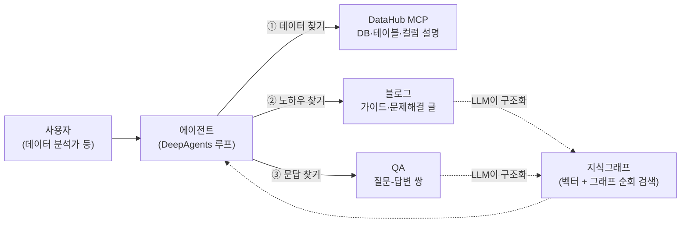
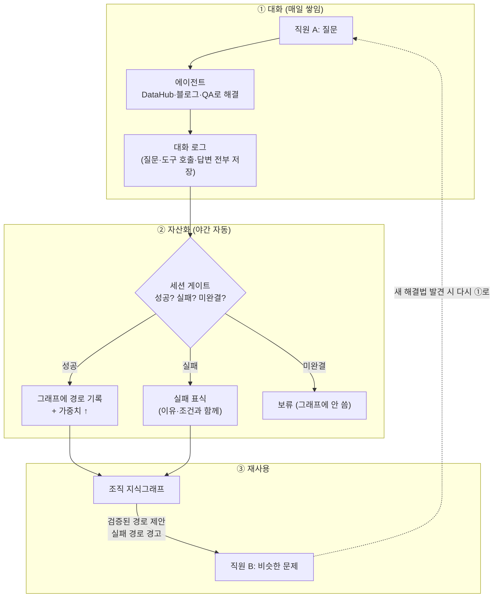

# 기획 보고 — 사내 에이전트와 "대화 자산화" 프로젝트

> 이 문서는 **앞으로 무엇을 만들려는지**를 처음 보는 사람(비전공자 포함)도 이해할 수 있게 쓴 기획 보고다.
> 기술 상세는 [design.md](design.md)(설계 결정)와 [implementation.md](implementation.md)(구현 지도)에 있다.

## 한 줄 요약

> **직원이 AI 비서(에이전트)와 나눈 "문제 해결 대화"를 회사의 지식 자산으로 바꾸는 시스템을 만든다.**
> 누군가 한 번 해결한 문제는, 다음 사람이 처음부터 헤매지 않고 그 검증된 길을 안내받는다.

---

## 1. 배경 — 왜 별도 프로젝트인가

기존 프로젝트(workbench-chatbot-poc)는 **워크플로우 방식(스탠다드 모드)**으로 동작한다.
사람이 "질문이 오면 A를 하고, 그다음 B를 하고…" 하는 절차를 미리 그림(그래프)으로 그려 넣는 방식이다.

| | 워크플로우 방식 (기존) | 에이전트 루프 방식 (이번에 시험) |
|---|---|---|
| 동작 원리 | 사람이 미리 그린 절차대로만 움직임 | AI가 도구 목록을 보고 **스스로 계획→실행→확인을 반복** |
| 장점 | 예측 가능, 통제 쉬움 | 새 상황·새 도구에 유연, 절차를 안 그려도 됨 |
| 단점 | 분기·기능을 **추가할 때마다 그래프 수정** — 관리 절차가 복잡해짐 | 통제·품질 관리 장치가 별도로 필요 |

처음 계획은 기존 프로젝트에 **옵션 스위치**를 달아 두 방식을 같은 UI에서 비교 테스트하는 것이었다.
그러나 **회의 결과, 모드 구분이 아니라 별도 프로젝트로 새로 만들기로 결정**했다 — 두 방식은 데이터 흐름과
관리 방식 자체가 달라, 한 코드에 섞으면 비교 실험의 결과 해석도 흐려지기 때문이다.

**이번 프로젝트의 목적은 "에이전트 방식이 우리 시스템에서 실제로 효과가 있는가"를 확인하는 것**이다.

## 2. 에이전트는 어떻게 만드나 — DeepAgents 채택

에이전트를 제대로 만들려면 시스템 프롬프트(행동 지침), MCP(도구 연결 표준), 스킬, 메모리 등
많은 부품이 필요하다. 이걸 **전부 자체 개발하기에는 시간이 부족**하고, 이번 단계의 목적은
부품 개발이 아니라 **"정의한 에이전트가 현재 시스템에 도입됐을 때 잘 처리하는가"의 검증**이다.

그래서 LangChain·LangGraph를 만든 회사(LangChain Inc.)가 공개한 **DeepAgents SDK**를 기반으로 개발한다.
계획·작업 목록·서브에이전트·파일 메모리 같은 에이전트 루프의 공통 부품이 이미 들어 있어,
우리는 **도구와 데이터, 그리고 자산화 파이프라인에만 집중**할 수 있다.
(참고: https://github.com/langchain-ai/deepagents )

## 3. 에이전트의 도구 3가지

에이전트는 혼자서는 아무것도 모른다. 회사 데이터를 다루는 **도구 3가지**를 쥐여 준다.

### ① DataHub MCP — 데이터 조회용

DataHub는 회사의 데이터베이스·테이블·컬럼에 **설명을 붙여 관리하는 오픈소스 카탈로그**다.
우리는 DataHub가 제공하는 공식 MCP(도구 연결 표준)로 에이전트가 "이런 데이터 어디 있어?"를
탐색하게 한다. (참고: https://datahubproject.io , MCP: https://github.com/acryldata/mcp-server-datahub )

- **지금 잘 되는 것**: 스키마(테이블·컬럼 구조)가 이미 구조화되어 있어서, 에이전트가 설명을
  읽으며 단계적으로 좁혀 가는 **단편적 탐색은 잘 동작**한다.
- **한계와 추후 과제**: DataHub가 아는 것은 "DB 안의 테이블 구조"까지다.
  **DB와 DB 사이의 관계**(예: 주문 DB와 정산 DB가 어떤 업무로 이어지는지)는 도메인 지식이라
  **사람이 정의해 줘야 한다**. 이것은 추후 단계에서 정의·탐색 가능하게 확장한다.

### ②③ 블로그·QA — 지식그래프로 구조화

블로그(가이드·문제해결 글)와 QA(질문-답변)는 상황이 다르다. **짧은 글, 결론 없이 끝나는 글이
많아** 그대로 검색만 해서는 품질이 들쭉날쭉하다. 그래서:

1. 사람이 **엔티티(대상)와 도메인(분야) 기준을 먼저 정의**한다 (예: "데이터 조회", "사내 노하우").
2. LLM이 글을 읽고 그 기준에 맞춰 **구조화(그래프의 점과 선으로 변환)**한다.
3. 만들어진 **지식그래프 위에서 벡터 검색(의미가 비슷한 것 찾기) + 그래프 순회 검색(연결을
   따라가며 찾기)**을 함께 쓴다.

**기준에서 벗어나는 글은 "미달"로 제외한다.** 아무거나 다 넣지 않는 이유는 검증된 근거가 있다:

- **추출 오류는 곱해져서 퍼진다** — 그래프에서 비슷한 항목을 잘못 합치면(중복 제거 오류),
  연결을 한 단계씩 따라갈 때마다 오류가 곱셈으로 전파된다. LLM 기반 자동 추출의 오류 유형과
  불안정성은 반복 보고되어 있다 (Zep 팀 자체 보고: https://blog.getzep.com/llm-rag-knowledge-graphs-faster-and-more-dynamic/ ,
  GraphEval: https://arxiv.org/abs/2407.10793 ).
- **그래프는 오염 공격에 취약하다** — 일반 사용자 권한의 대화만으로 공유 메모리를 오염시키는
  공격이 성공률 98.2%로 보고됐고(MINJA: https://arxiv.org/abs/2503.03704 ), 0.1% 미만의 오염으로
  80% 이상 공격이 성공한 사례도 있다(AgentPoison: https://arxiv.org/abs/2407.12784 ).
  **입구에서 기준 미달을 거르는 게 가장 싼 방어**다.
- **무제한 추출은 비용 폭탄이다** — 기준 없이 코퍼스 전체를 그래프화한 초기 GraphRAG는
  인덱싱에 3.3만 달러가 든 사례가 있다 ( https://github.com/microsoft/graphrag/discussions/440 ).
- 업계 선례도 같은 방향이다 — Graphiti는 **사람이 정의한 커스텀 온톨로지(엔티티 타입)** 기반
  추출을 기본으로 한다 ( https://github.com/getzep/graphiti ).

> 우리 설계 원칙으로는 "**위(도메인·목표)는 닫고, 아래(접근법·행동)는 연다**"로 정리되어 있다
> ([design.md](design.md) 결정 1). 기준(위층)은 사람이 통제하고, 그 안에서의 다양성(아래층)은
> LLM이 자동 확장한다.

## 4. 대화 기록은 자산이다

### 4-1. 밖에서 벌어진 일 — 대화 로그의 가치를 보여준 사례

Claude Code 같은 코딩 에이전트는 대화의 **모든 맥락(컨텍스트)을 로컬에 저장**한다
(`~/.claude/projects/` 아래 JSONL — 질문, 도구 호출, 결과, 답변 전부).

이런 "AI와의 대화 로그"를 다른 모델 학습에 쓰는 것이 **증류(distillation)** — 큰 모델의 답을
교재 삼아 다른 모델을 가르치는 방식이다. 2026년 실제로 이런 일이 있었다:

- 중국 Moonshot AI의 **Kimi K3**(2.8조 파라미터 공개 모델)가 프론트엔드 코딩 블라인드 평가
  (Frontend Code Arena)에서 Anthropic의 최신 모델(Claude Fable 5)을 제치고 1위에 올랐다
  ( https://www.tomshardware.com/tech-industry/artificial-intelligence/moonshot-releases-2-8-trillion-parameter-kimi-k3 ).
- Anthropic은 2026년 2월, Moonshot·DeepSeek·MiniMax가 **약 340만 건의 Claude 대화**를 이용한
  "산업적 규모의 증류"를 했다고 공개 비난했다. K3가 대화 중 자신을 "Claude"라고 소개한 사례가
  증거로 제시되기도 했다 ( https://wccftech.com/chinas-kimi-k3-identifies-itself-as-anthropics-claude-in-at-least-one-conversation-betraying-its-distilled-origins/ ,
  https://www.mindstudio.ai/blog/kimi-k3-distillation-controversy ).
- 단, **증류 여부 자체는 아직 "의혹"이고 반론도 있다**(출시 시점상 불가능하다는 지적 등).
  확정 사실은 "벤치마크 성과"까지고, 증류는 논쟁 중이다.

사실관계와 무관하게 이 사건이 말해주는 것은 하나다:
**에이전트 대화 로그는 경쟁사가 소송 리스크를 감수하며 가져가려 할 만큼 가치 있는 자산**이라는 것.
우리 사내 에이전트의 대화 로그도 같은 종류의 자산이다.

### 4-2. 실패한 대화도 자산이다 (근거)

직관적으로는 "성공한 대화만 모으면 되지 않나" 싶지만, 연구 결과는 반대다.
**실패 기록을 함께 활용하면 성능이 유의미하게 오른다**:

- **NAT** (NAACL 2025): 성공 사례만으로 학습한 모델 대비, 실패 사례를 구분 표기해 함께 학습하면
  수학 추론 **+31.7%**(GSM8K, 상대 향상), 전략형 QA **+18.8%** 등 전 태스크에서 향상.
  **데이터가 적을수록 실패 데이터의 효과가 더 컸다** ( https://arxiv.org/abs/2402.11651 ).
- **ETO** (ACL 2024): 에이전트가 자기 실패 궤적과 성공 궤적을 **쌍으로 대조 학습**하면
  쇼핑 에이전트 과제 +8%, 처음 보는 과학 실험 과제에서 **+20%** — GPT-4를 능가하는 구간도 보고
  ( https://arxiv.org/abs/2403.02502 ).
- **ExpeL** (AAAI 2024): 학습 없이도, 성공-실패 궤적을 **비교해서 교훈을 추출·축적**하는 것만으로
  에이전트 성능이 향상 ( https://arxiv.org/abs/2308.10144 ).

> 그래서 우리 설계는 실패 세션을 버리지 않는다 — 성공 경로에는 가중치를, **실패 경로에는
> "이 길은 이런 조건에서 막혔다"는 경고 표식**을 남긴다 ([design.md](design.md) 결정 2·4).

### 4-3. 그러나 "로그로 모델을 학습"만으로는 부족하다 (근거)

로그를 모아 사내 모델을 파인튜닝(증류)하면 도메인 특화 에이전트가 바로 나올까? 한계가 검증되어 있다:

- **모방 학습의 허상** (UC Berkeley, 2023): 강한 모델의 출력으로 약한 모델을 파인튜닝하면
  **말투·형식은 비슷해지지만 실제 능력·사실성 격차는 거의 좁혀지지 않았다**. 격차를 좁히려면
  감당하기 어려운 양의 데이터 또는 더 강한 베이스 모델이 필요하다는 결론
  ( https://arxiv.org/abs/2305.15717 ).
- 에이전트는 단답이 아니라 **기본 지식을 바탕으로 여러 턴에 걸쳐 응용하며 목표에 도달**한다.
  사내 로그는 이 "응용 과정"의 기록이라 분포가 좁고, 그것만 학습하면 로그에 없는 상황에서
  무너진다 — 위 논문이 보여준 "모방 데이터에 없는 과제에서는 개선 없음"과 같은 구조다.
- 학습 방식은 **갱신도 느리다**. 새 해결법이 나올 때마다 재학습할 수는 없다.

**그래서 우리의 선택은 "학습"이 아니라 "검색·제안"이다.** 로그를 모델 안에 굽는 대신,
구조화해서 그래프에 쌓고 **필요할 때 컨텍스트로 꺼내 주는** 방식이다. 이 방향은 선행 연구로
효과가 확인되어 있다:

- **AWM** (Agent Workflow Memory, 2024): 과거 궤적에서 재사용 가능한 작업 절차를 뽑아
  에이전트에게 제공하는 것만으로(재학습 없이) 웹 과제 성공률 **상대 24.6~51.1% 향상**
  ( https://arxiv.org/abs/2409.07429 ).
- **Agent KB** (2025): 에이전트 간 경험 공유 지식 베이스 + 남의 경험이 방해가 될 때를 거르는
  게이트 ( https://arxiv.org/abs/2507.06229 ).
- **Synapse** (ICLR 2024) — 궤적 저장소 + 유사도 검색 재활용 ( https://arxiv.org/abs/2306.07863 ),
  **AutoGuide** (2024) — 로그에서 상태별 가이드라인 추출 ( https://arxiv.org/abs/2403.08978 ).

**탐색 결론**: 이 조각들을 전부 합친 완성품 — "여러 사용자의 대화를 조직 그래프로 병합하고,
성공 횟수로 가중치를 매겨, 신규 사용자에게 검증된 경로를 제안"하는 시스템 — 은 오픈소스에도
논문에도 없다 ([research.md](research.md) 조사 결과). **그 공백이 이 프로젝트가 만드는 것이다.**

## 5. 그래서, 전체 그림

- **①**: 직원들이 평소처럼 에이전트에게 질문하고 문제를 푼다. 그 자체로 대화 로그가 쌓인다.
- **②**: 밤마다 자동으로 — 세션이 성공했는지 판정하고(게이트), 기준에 맞는 것만 구조화해
  그래프에 병합한다. 실패도 "경고 표식"으로 자산이 된다.
- **③**: 다음 사람이 비슷한 문제를 만나면, 에이전트가 **"먼저 이 길로 가보세요, 3명이 이걸로
  해결했습니다 / 이 길은 이런 조건에서 막혔었습니다"**를 안내한다.

## 6. 어떻게 관리하나 (품질·안전 장치)

대화는 곧 그래프에 대한 "쓰기 권한"이므로, 관리 장치가 본질이다:

| 장치 | 무엇을 막나 |
|---|---|
| **세션 게이트** (성공/실패/미완결 3갈래 판정) | 미완결·오염 대화가 그래프에 들어가는 것 |
| **엔티티·도메인 기준 미달 제외** (§3) | 저품질 글·기준 밖 내용의 유입 |
| **출처(provenance) 기록** | 문제가 생겼을 때 어느 대화에서 왔는지 추적·롤백 |
| **노출 대비 채택률 보정** | "많이 보여준 길이 좋아 보이는" 인기 왜곡(피드백 루프) |
| **실패 표식 + 재시도 성공 시 무효화** | 낡은 경고가 영구 낙인이 되는 것 |
| **시간 감쇠** | 낡은 해결법이 최신처럼 계속 추천되는 것 |
| **닫힌 시드는 사람 전용** (도메인·원천 등록) | LLM이 분류 기준 자체를 바꾸는 것 |

## 7. 단계 계획

| 단계 | 내용 | 상태 |
|---|---|---|
| 1 | DeepAgents 기반 에이전트 + 도구 3종(DataHub MCP·블로그·QA) 연결 | 진행 |
| 2 | 블로그·QA 구조화 파이프라인 (엔티티·도메인 게이트 포함) + 지식그래프 | 진행 |
| 3 | 대화 로그 → 세션 게이트 → 그래프 병합 → 경로 제안 순환 | 진행 |
| 4 | 사내 환경 통합 (SSO 사용자 식별, 원천 테이블 등록 — [integration.md](integration.md)) | 진행 |
| 5 | DB 간 도메인 관계 정의·탐색 (DataHub 한계 보완) | 추후 |
| 6 | 축적 로그의 2차 활용 검토 (도메인 특화 학습 등 — §4-3 한계 고려하에) | 추후 |

## 참고 자료

- DeepAgents SDK — https://github.com/langchain-ai/deepagents
- DataHub / 공식 MCP — https://datahubproject.io , https://github.com/acryldata/mcp-server-datahub
- 기준 미달 제외의 근거: Zep dedup 보고 https://blog.getzep.com/llm-rag-knowledge-graphs-faster-and-more-dynamic/ · GraphEval https://arxiv.org/abs/2407.10793 · MINJA https://arxiv.org/abs/2503.03704 · AgentPoison https://arxiv.org/abs/2407.12784 · GraphRAG 비용 사례 https://github.com/microsoft/graphrag/discussions/440
- 실패 데이터의 가치: NAT https://arxiv.org/abs/2402.11651 · ETO https://arxiv.org/abs/2403.02502 · ExpeL https://arxiv.org/abs/2308.10144
- 모방 학습의 한계: The False Promise of Imitating Proprietary LLMs https://arxiv.org/abs/2305.15717
- 경험 재사용(학습 없이): AWM https://arxiv.org/abs/2409.07429 · Agent KB https://arxiv.org/abs/2507.06229 · Synapse https://arxiv.org/abs/2306.07863 · AutoGuide https://arxiv.org/abs/2403.08978
- Kimi K3 사례(벤치마크는 사실, 증류는 의혹): Tom's Hardware https://www.tomshardware.com/tech-industry/artificial-intelligence/moonshot-releases-2-8-trillion-parameter-kimi-k3 · wccftech https://wccftech.com/chinas-kimi-k3-identifies-itself-as-anthropics-claude-in-at-least-one-conversation-betraying-its-distilled-origins/ · MindStudio https://www.mindstudio.ai/blog/kimi-k3-distillation-controversy
- 심화 조사·설계: [research.md](research.md) · [design.md](design.md) · [integration.md](integration.md)
