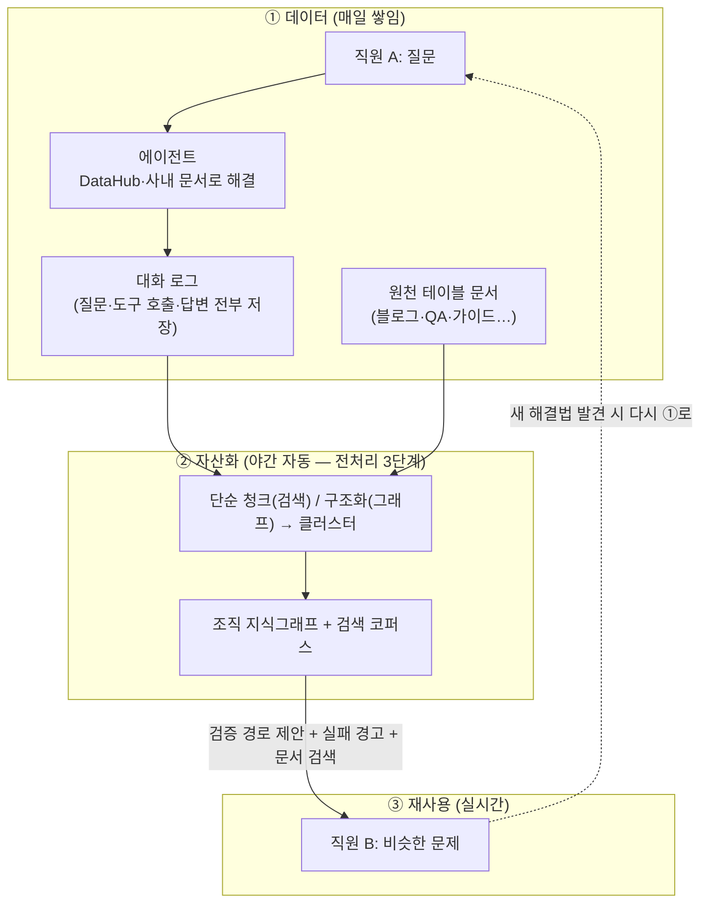
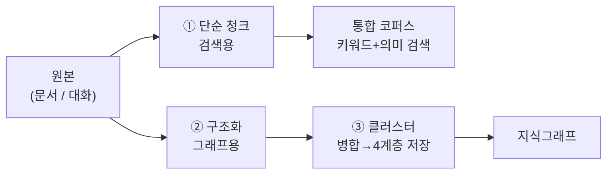
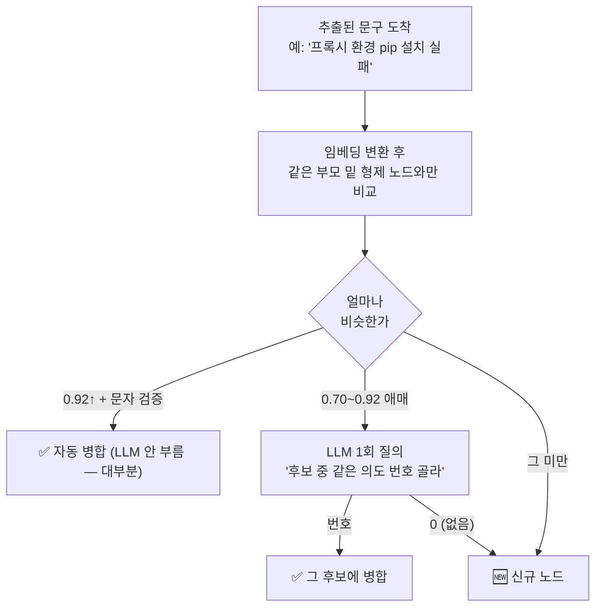
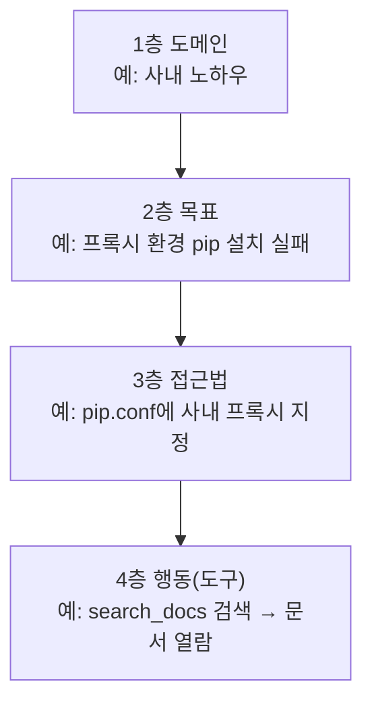
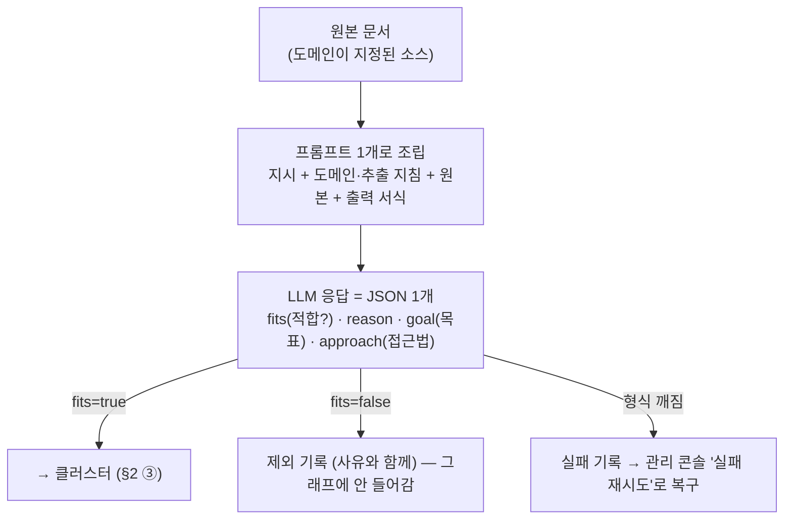
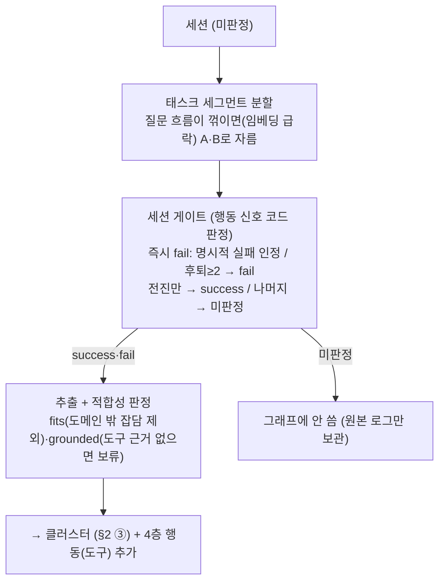

# 기획 보고 v2 — 사내 에이전트와 "대화 자산화" 프로젝트

> **작성 2026-08-07 (개정 2026-08-10) · v2.** 초기 기획(2026-08-05)은 [plan-v1.md](plan-v1.md)에 아카이브.
> v1이 "무엇을 만들려는지"였다면, v2는 **PoC 실증을 마치고 사내 전환을 준비하는 시점**의 기획이다.
> 기술 상세는 [design.md](design.md)(설계 결정)·[implementation.md](implementation.md)(구현 지도)·
> [integration.md](integration.md)(사내 전환 접점).

> **한 줄 요약** — 직원이 AI 비서와 나눈 "문제 해결 대화"와 사내 문서를 회사의 지식 자산으로
> 바꾸는 시스템. 누군가 한 번 해결한 문제는, 다음 사람이 그 검증된 길을 안내받는다.
> **핵심 순환(데이터 → 야간 자산화 → 경로 제안)은 PoC로 실증 완료.**

---

## 1. 전체 구성

데이터가 매일 쌓이고(①), 밤마다 자산화되고(②), 다음 사람이 재사용한다(③):



**에이전트는 한 질문에 조회 경로 2개를 쓴다:**
1. **지식그래프 경로 제안** — "나랑 같은 문제를 겪은 사람들이 실제로 어떤 경로로 해결했나."
   접근법별 성공/실패 횟수와 실패 조건 경고까지. 문서 검색으로는 알 수 없는 "검증됐는가"에 답한다.
2. **사내 문서 하이브리드 검색** — 키워드(한국어 형태소)+의미(임베딩) 융합. 답변에 **[1] 각주**로
   참고 문서를 표시하고, 클릭하면 사내 뷰에서 원문을 본다(원본 링크는 소스별 on/off).

사용자는 **에이전트 궤적 타임라인**으로 "무엇을 판단했고(🧠) 어떤 도구로 확인했고 그래서 이렇게
답했다"를 단계별로 본다 — 신뢰는 결과가 아니라 과정의 투명성에서 나온다.

**v1 이후 달라진 것**: 지식 원천에 **문서 구조화**가 추가(대화만이 아님) · 청크 단위 하이브리드
검색 + 출처 각주 · **관리 콘솔에서 등록**(원천 테이블·모델·도구 서버, 코드 수정 없이) ·
**자체 계정 체계** · 궤적 타임라인 · 전처리 시간당 ~15,000건(실측).

## 2. 전처리 3단계 — 원본 → 단순 청크 / 구조화 → 클러스터

문서든 대화든 원천이 자산이 되는 과정은 **같은 3단계**다. 원천이 몇 개든 저장소는
통합 코퍼스 2개(문서·청크) + 지식그래프 하나뿐이라, 소스가 늘어도 구조는 늘지 않는다.



- **① 단순 청크 (검색용)** — 원본을 그대로 조립해 청크로 자르고 임베딩한다. 판정·해석 없이
   "찾을 수 있게"만 만든다. **모든 원천이 이 경로를 탄다.**
- **② 구조화 (그래프용)** — LLM이 원본에서 목표·접근법을 추출한다. 단, **입구 게이트**를 먼저
   통과해야 한다(도메인 적합성 등 — 원천 종류별로 다름, §3·§4). **선택된 원천만** 이 경로를 탄다.
- **③ 클러스터 (병합·저장)** — 추출된 문구를 그래프에 넣는 순간마다 기존 노드와 대조해 병합하거나
   신규 생성하고, 4계층에 저장한다. **문서·대화 공통**이다.

### 클러스터(③)는 어떻게 병합하나 — 노드 1개 단위, 넣는 순간마다

"전부 만든 뒤 한 번에 묶는" 별도 단계가 아니다. 넣는 순간마다 **같은 부모 밑 형제**와만 비교한다:



- **판정은 16차선(동시), 병합은 1차선(직렬)** — 동시에 고치면 중복이 생기므로 병합은 한 줄로.
  병합 1건(수십 ms)이 판정 1건(수백 ms~수 초)보다 훨씬 싸고 통과분(~3할)만 대상이라 병목 아님.
- **문자 검증 AND 조건** — 임베딩 점수 단독 병합은 업계 관행에 없다(Graphiti·Neo4j). 짧은 문구는
  임베딩이 과신하므로 "둘 다 12자↑ + 문자열 유사도 통과"를 더 걸고, 걸리면 LLM 판정으로 넘긴다.
- 삽입 시점에 못 잡은 중복은 **야간 유지보수**가 2차 청소(저빈도 형제 통합·잎 흡수·시간 감쇠).

### 저장(③)의 결과 — 4계층: 틀은 고정, 내용물은 자란다



**어디에 붙는지는 LLM 소관이 아니다** — "목표는 2층, 접근법은 3층, 부모는 지정된 도메인"이 코드
상수다. LLM은 '층' 개념을 모르고 문구만 채운다. 그래서 LLM이 프롬프트를 무시해도 최악은 "그
데이터 제외"까지이며, 그래프 모양이 무너지는 경로는 없다.

| 층 | 값이 고정인가 | 누가 정하나 |
|---|---|---|
| 층의 종류 자체 (4개) | **완전 고정** | 코드 — 5번째 층이나 다른 종류 노드는 생길 수 없음 |
| 1층 도메인의 값 | **고정 (닫힌 목록)** | 사람 — 관리 콘솔에서만 추가 |
| 2층 목표 · 3층 접근법의 값 | **열림 (자동 확장)** | LLM — 추출. 병합·추출 지침이 발산을 수렴시킴 |
| 4층 행동(도구)의 값 | 결정적 | 실제 사용된 도구명 그대로 — LLM 창작 없음 |

화면 범례의 **"실패 우세"는 5번째 층이 아니라 상태 표시**(실패>성공 노드에 붙는 빨간 마커)다.

### 반영 시점

대화·검색·경로 제안·화제 확인은 **실시간**, "데이터 → 그래프 자산화"만 **야간 배치**(매일
03:00 KST — 세션이 끝나야 성공/실패를 알 수 있고, 진행 중 데이터가 공유 자산을 오염시키지 않게).
오늘 쌓인 것은 내일 아침 경로 제안·"내 기여"에 나타난다.

## 3. 문서

이미 사내에 쌓여 있는 원천 테이블(블로그·QA·가이드)을 자산화한다. 관리자가 소스를 등록하면
(테이블·id·시간·필드 역할 매핑) 야간 배치가 자동으로 처리한다.

### 3.1 문서: 단순 청크 / 구조화 → 클러스터

**① 단순 청크 (검색용 — 모든 등록 소스)**
```
03:10 적재    시간 컬럼 기준 신규분만 원천에서 읽어(SELECT만) 역할 매핑으로 조립
              (본문형은 그대로, 질문/답변형은 "질문: … 답변: …"으로 합침)
03:15 청킹    긴 본문을 1,200자 단위(150자 겹침)로 분할
03:30 임베딩  청크를 64건씩 묶어 벡터로 변환 (embed_model 기록 — 모델 교체 시 자동 재변환)
```
검색 시 질문 하나가 키워드(SQLite FTS5, Kiwi 형태소)+의미(sqlite-vec)를 동시에 타고 RRF로 융합.
검색 인덱스는 기동 시 Oracle에서 SQLite `:memory:`로 빌드(진실 소스는 Oracle, 인덱스는 파생물 —
별도 검색 서버·Oracle Text 권한 불필요). 검색당 외부 호출은 질문 임베딩 1건뿐, 임베딩 없으면 키워드 단독 폴백.

**② 구조화 (그래프용 — 도메인을 지정한 소스만)** — 문서 1건 = LLM 요청 1회, 16건 동시:

- **한 번에 처리** — "적합한가"와 "추출"을 나눠 묻지 않고 요청 1회로 JSON 하나. 나누면 문서 읽기가
  2배가 된다. LLM 권한은 빈칸(fits/reason/goal/approach) 채우기까지 — 형식 위반은 그 문서만 재시도.
- **입구 게이트 = 도메인 적합성(fits)** — 잡담·기준 미달 문서는 excluded. 도메인 미지정 소스는
  ①(검색)만 타고 여기 안 온다.

**③ 클러스터** — §2의 공통 병합·저장. 문서 유래는 2·3층까지(행동/도구 4층은 대화만). 출처는
`kind='doc'`로 기록돼 성공/실패 카운트(대화 전용)에 안 섞인다.

## 4. 대화

에이전트와의 대화 세션을 자산화한다. 문서와 **같은 3단계**를 쓰되 **입구 판정이 다르다** — 문서는
"내용이 도메인에 맞나"를 LLM이 보지만, 대화는 "사용자가 실제로 해결했나"를 **행동 신호(코드)**로 본다.

### 4.1 대화: 단순 청크 / 구조화 → 클러스터

**① 단순 청크** — 대화 로그도 통합 코퍼스에 넣어 검색 대상이 될 수 있으나, 주 가치는 ②·③이다.

**② 구조화 (세그먼트 분할 → 게이트 → 추출)**:

- **세그먼트 분할** — 한 대화에서 문제 A를 풀고 B로 넘어가면 따로 판정·추출한다. 성공·실패가 섞인
  세션은 무리해서 정하지 않고 보류. UI도 "다른 문제는 새 대화로"를 안내해 세션=문제 정렬을 돕는다.
- **입구 게이트 = 행동 신호** — 말이 아니라 행동으로 판정한다(재질문·정정·문서 재방문·조급함=후퇴 /
  구체화·화제 전진·조용한 종료=전진). "감사합니다" 하고 떠나도 같은 질문을 반복했으면 실패.
- **적합성(fits·grounded)** — 문서와 대칭. 잡담·일반 상식은 기여 제외, 도구 기여 없이 모델 일반
  지식으로만 답한 세션은 "검색으로 해결"이라는 거짓 경로를 안 만들게 기여 보류.
- **대화만의 산출**: 4층 행동 노드(사용 도구명 그대로), 실패 표식(경고용 이유·조건), **재발 소급
  취소**(같은 사용자가 7일 내 같은 증상 재방문 시 성공 판정을 'retracted'로 회수).

**③ 클러스터** — §2 공통. 출처는 `kind='session'`. 이 카운트가 경로 제안의 "성공 N회"가 된다.

## 5. 개인 대화 — 내 기억·내 기여

공유 그래프(§2~4)와 별개로, 각 사용자에게는 **본인만의 대화 맥락과 기여 관리**가 있다.

- **멀티턴 기억** — 대화 맥락이 이어진다(Oracle 체크포인터, thread=세션id). 무상태 외부화라 복제본
  공유·재시작에도 생존. 세션·목록·이어하기는 **본인 것만** 보이고 소유 검사로 남의 세션 접근 차단.
- **내 기여 (/contrib)** — 내 대화가 그래프에 만든 지식을 **질문→목표→접근법 트리**로 본다
  (분기점 ⑂·기존 지식에 병합된 지점 표시). 각 세션의 판정 근거(왜 성공/실패/취소인지)와
  "이후 N회 제안됨" 카운트가 붙고, 세션을 클릭하면 **그 대화가 재생**된다(무엇을 묻고 어떤 도구로
  어떻게 답했는지). 검색·필터·정렬·페이지네이션 지원.
  - **직접 제어**: 잘못 요약된 문구 수정(나 혼자 기여한 노드만), 철회(기여 회수), 실패 표식 해제.
    여기서의 교정이 다른 사람이 받을 경로 제안 품질이 된다 — "사용자가 잘할수록 좋아진다"의 실행점.
- **재발 판정은 사용자 단위** — 남이 같은 문제를 푼 것은 재발이 아니라 "경로가 유효하다"는 신호.

## 6. 설계 철학 — 자동화는 안전망, 사용자 제어는 증폭기

> LLM에게 전권을 주지 않는 이유는 편의가 아까워서가 아니라, **잘못이 걷잡을 수 없이 번지고
> 제어할 수 없기 때문**이다. 이 서비스는 사용자의 도메인 경험에 최대한 의존해 그것을 지식화하고,
> 사용자가 직접 수정·정제하게 함으로써 도메인을 더 깊이 녹여낸다.
> 목표: **사용자가 잘하면 잘할수록 에이전트가 좋아지는 시스템.**

이 철학은 선례 조사로 검증했다 ([사용자 제어 설계의 선례 조사](references/2026-08-10-user-control-precedents.md)) —
전자동 추출(Google Knowledge Vault 미출시, NELL 오류 자기증폭, Tay 16시간 셧다운)과 전수 수작업
(CYC $2억 실패) 양극단이 모두 실패했고, 살아남은 설계는 "사람이 기준을 정의하고 애매한 것만
사람에게 보내는 선택적 게이트"(Wikidata·Palantir·2025 학술 실증)였다. 사람 개입은 사람이 우위인
판정에만(그 외는 마이너스라는 메타분석), 행동 신호는 숙련과 함께 좋아지고(Copilot), 기여가 본인
이득으로 돌아와야 지속된다(Stack Overflow).

| 실행 장치 | 무엇 | 원칙 |
|---|---|---|
| **화제 분기 물어보기** | 새 질문이 다른 문제로 보이면 전송 전 "새 대화로?" 확인 바 (강제 아님) | 사람만 아는 결정(문제 경계)만 물음 |
| **내 기여 페이지** | 트리·수정·철회·표식 해제 + "N회 제안됨" | 부분 편집 + 관철 신뢰 + 기여→이득 고리 |
| **출처 증거** | 노드가 어느 세션(✅/❌)·문서에서 왔는지 | 제어권과 책임이 같이 감 |
| **탐색 제안 라벨** | 유사도 컷 바깥 경로 1개를 "🔍 탐색"으로 명시 노출 | 몰래 안 섞음 — 피드백 루프 퇴행 완화 |
| **적합성 게이트(fits·grounded)** | 잡담·일반지식 답변은 기여 제외/보류 | 입구에서 거르는 게 가장 싼 방어 |
| **증거만, 설득 없음** | 경로 제안은 성공/실패 횟수 + 근거 링크만 | 원증거 노출이 과의존을 막음 |

아무것도 안 해도 시스템은 안전하게 동작한다(게이트·분할·유지보수 = 자동 안전망). 위 장치는 그
위에 얹는 증폭기다.

## 7. 관리 콘솔 — 코드 수정 없이 운영

전용 관리 페이지(/admin):

| 기능 | 하는 일 |
|---|---|
| **계정 관리** | 가입 승인·관리자 권한 부여/해제·삭제 |
| **도메인 시드** | 그래프 1층 닫힌 목록 — 용도(대화/문서/양쪽)·추출 지침 |
| **원천 테이블 등록** | 테이블·컬럼 역할 등록 → 야간 적재·검색·전용 검색 도구 자동. 화이트리스트 제한 가능 |
| **문서 구조화 운영** | 드라이런·실패 재시도·초기화 재처리(소스/도메인/전체)·처리 진행도 |
| **전처리 설정** | 배치 건수·동시성·전용 모델 — 저장 즉시 다음 배치부터 |
| **모델 레지스트리** | LLM·임베딩·리랭커 등록·역할별 기본 — 임베딩 교체 시 자동 재임베딩 |
| **도구 서버(MCP) 등록** | 주소만 등록하면 도구 자동 조립 — 사내 REST 방식 전용 어댑터 포함 |
| **에이전트 설정** | 시스템 프롬프트·도구 on/off — 저장 즉시 다음 질문부터 |
| **활동 로그** | 정상·비정상 전부(요청·도구·배치·오류) 조회 — kind/level 필터·검색·상세(스택트레이스). 180일 보관 |

## 8. 사용자·보안 — 자체 계정 체계

외부 SSO 의존 제거, 앱이 사용자를 자체 관리:
- **관리자**: 환경 설정 계정 1개(분실 시 서버 설정 수정으로 복구)
- **일반 사용자**: 가입(아이디+비밀번호) → **관리자 승인 후 사용**
- **권한 2단계**: 일반/관리자 — 관리자가 다른 계정에 권한 부여/해제
- **대화 분리**: §5(개인 대화) — 세션·재발 판정 모두 사용자 단위

## 9. 사내 전환 — 맞출 접점은 사실상 1개

외부 협의 접점이 **원천 테이블 하나로** 줄었다 ([integration.md](integration.md)):
1. **원천 테이블** — 관리자가 콘솔에서 등록 (읽기 전용)
2. ~~인증~~ — 자체 계정이라 협의 불필요
3. ~~DataHub 도구 서버~~ — 사내 제공, 주소 등록만

**사내 DB 준비물** (첫 기동 전 1회, DBA 협조):
- 검색이 SQLite 인메모리(FTS5+sqlite-vec)라 **Oracle Text 권한(CTXAPP) 불필요** — 일반 개발 계정 권한으로 기동.
- 그 외 테이블·인덱스는 앱이 기동하며 스스로 생성(ORM `init_schema`, 일반 개발 계정 권한으로 충분)

## 10. 단계 계획

| 단계 | 내용 | 상태 |
|---|---|---|
| 1 | DeepAgents 에이전트 + 도구(DataHub·사내 문서 검색) | **완료** |
| 2 | 문서 구조화 파이프라인 (도메인 게이트) + 지식그래프 | **완료** |
| 3 | 대화 → 세션 게이트 → 그래프 병합 → 경로 제안 순환 | **완료 (PoC 실증)** |
| 4 | 운영 기능 — 관리 콘솔·자체 계정·출처 표기·레지스트리·궤적 UI·내 기여 | **완료** |
| 5 | 사내 전환 — 사내 DB/모델/도구 서버 연결, 실사용자 검증 | **진행 중** |
| 6 | DB 간 도메인 관계 정의·탐색 (DataHub 한계 보완) | 추후 |
| 7 | 축적 로그의 2차 활용 검토 (도메인 특화 학습 등) | 추후 |
| 8 | 규모 확장 — 임베딩 검색을 메모리에서 Oracle 23ai VECTOR로 ([schema.md](schema.md) §5.5) | 추후 |

## 참고 자료

- 초기 기획·연구 근거(출처 링크 전체): [plan-v1.md](plan-v1.md)
- 사용자 제어 설계 선례 조사(§6 근거, 출처 60여 건): [references/2026-08-10-user-control-precedents.md](references/2026-08-10-user-control-precedents.md)
- PoC 실증: [poc-results.md](poc-results.md) · 설계: [design.md](design.md) ·
  구현 지도: [implementation.md](implementation.md) · 사내 전환: [integration.md](integration.md) ·
  스키마: [schema.md](schema.md)
