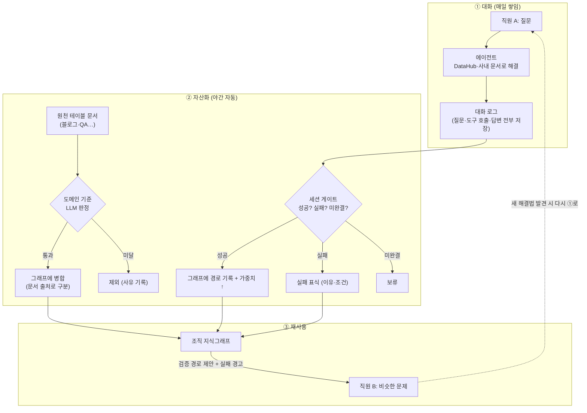

# 기획 보고 v2 — 사내 에이전트와 "대화 자산화" 프로젝트

> **작성 2026-08-07 · v2.** 초기 기획(2026-08-05)은 [plan-v1.md](plan-v1.md)에 아카이브.
> v1이 "무엇을 만들려는지"였다면, v2는 **PoC 실증을 마치고 사내 전환을 준비하는 시점**의 기획이다 —
> 무엇이 검증됐고, 어떤 기능이 갖춰졌고, 사내에 붙이려면 무엇이 남았는지.
> 기술 상세는 [design.md](design.md)(설계 결정)·[implementation.md](implementation.md)(구현 지도)·
> [integration.md](integration.md)(사내 전환 접점).

## 한 줄 요약

> **직원이 AI 비서(에이전트)와 나눈 "문제 해결 대화"를 회사의 지식 자산으로 바꾸는 시스템.**
> 누군가 한 번 해결한 문제는, 다음 사람이 처음부터 헤매지 않고 그 검증된 길을 안내받는다.
> **핵심 순환(대화 → 야간 자산화 → 경로 제안)은 PoC로 실증 완료** — 지금은 사내 데이터·인프라에
> 그대로 붙일 수 있게 운영 기능을 갖추는 단계다.

---

## 1. v1 이후 달라진 것 (요약)

| 영역 | v1 시점 (8/5) | v2 시점 (8/7) |
|---|---|---|
| 핵심 순환 | 파이프라인 구축 중 | **실증 완료** — self-play 47세션으로 추출→병합→가중치→실패 표식→경로 제안 전 순환 동작 확인 ([poc-results.md](poc-results.md)) |
| 지식의 원천 | 대화 로그 중심 | 대화 + **문서(블로그·QA 등 원천 테이블) 구조화**까지 — 같은 그래프에 출처를 구분해 병합 |
| 검색 | 하이브리드 검색 | 청크 단위 하이브리드 검색 + **답변에 출처 각주([1])와 참고 문서·원문 뷰** |
| 데이터 연결 | 코드에 고정 | **관리 콘솔에서 등록** — 원천 테이블·AI 모델·도구 서버를 화면에서 등록하면 코드 수정 없이 반영 |
| 사용자·보안 | 없음 (PoC) | **자체 계정 체계** — 관리자 승인 가입, 일반/관리자 2권한, 사용자별 대화 분리 |
| 투명성 | 답변만 표시 | **에이전트 궤적 타임라인** — AI가 무엇을 판단하고 어떤 도구로 무엇을 확인했는지 단계별 표시 |
| 처리 성능 | 미측정 | 전처리 **시간당 ~15,000건**(추론 생략 모드 실측) — 야간 배치로 충분한 속도 |

배경·연구 근거(실패 데이터의 가치, 모방 학습의 한계, 그래프 오염 방어 등)는 v1과 동일하며
[plan-v1.md](plan-v1.md) §3~4에 출처와 함께 정리되어 있다.

## 2. 전체 그림 (변함없는 뼈대)

v1과 달라진 점은 **②에 문서 경로가 추가**된 것이다. 대화에서만 배우는 게 아니라, 이미 쌓여 있는
사내 문서(블로그·QA·가이드)도 같은 기준으로 판정해 그래프에 넣는다. 그래프에서는 "이 지식이
문서에서 왔는지, 실제 대화에서 왔는지"가 구분되어, 성공/실패 카운트(대화에서만 생김)와 섞이지 않는다.

## 3. 에이전트가 답을 만드는 방식 — 조회 경로 2개

같은 질문 하나에 에이전트는 성격이 다른 두 조회를 쓴다:

1. **지식그래프 경로 제안** — "나랑 같은 문제를 겪은 사람들이 실제로 어떤 경로로 해결했나"를
   먼저 조회한다. 접근법별 성공/실패 횟수, 실패했던 조건의 경고까지 함께 나온다.
   문서 검색으로는 알 수 없는 "검증됐는가"에 답하는 경로다.
2. **사내 문서 하이브리드 검색** — 키워드 검색(한국어 형태소 처리)과 의미 검색(임베딩)을
   융합해 근거 문서를 찾는다. 답변에는 **[1] 각주로 어떤 문서를 참고했는지** 표시되고,
   클릭하면 사내 뷰에서 원문을 확인할 수 있다 (원본 링크 노출은 소스별로 켜고 끌 수 있음).

그리고 사용자는 **에이전트 궤적 타임라인**으로 이 과정을 그대로 본다 — "무엇을 판단했고(🧠),
어떤 도구로 무엇을 확인했고, 그래서 이렇게 답했다"가 단계별로 표시된다. AI 답변의
신뢰는 결과가 아니라 과정의 투명성에서 나온다는 게 이 UI의 취지다.

## 4. 관리 콘솔 — 코드 수정 없이 운영하는 장치들

사내 운영의 핵심 요구는 "담당자가 화면에서 관리"다. 전용 관리 페이지(/admin)에 다음이 갖춰졌다:

| 기능 | 하는 일 |
|---|---|
| **계정 관리** | 가입 승인, 관리자 권한 부여/해제, 삭제 — 가입은 자유, 사용은 승인 후 |
| **도메인 시드 관리** | 그래프 1층(분야) 닫힌 목록 관리 — 용도(대화/문서/양쪽)와 추출 지침까지 |
| **원천 테이블 등록** | 사내 DB의 어느 테이블·어느 컬럼을 어떤 역할(제목/본문/질문/답변…)로 구조화할지 등록 — 등록만 하면 야간 적재·검색·전용 검색 도구까지 자동. 접근 가능 테이블은 화이트리스트로 제한 가능 |
| **문서 구조화 운영** | 드라이런(그래프 반영 없이 판정만 미리보기), 실패 재시도, 초기화 재처리(소스/도메인/전체), 처리 진행도 실시간 표시 |
| **전처리 설정** | 배치 건수·동시성·전용 모델 등 — 저장 즉시 다음 배치부터, 재배포 불필요 |
| **모델 레지스트리** | LLM·임베딩·리랭커를 서빙 주소와 함께 등록, 역할별 기본 지정 — 임베딩 모델을 바꾸면 야간 배치가 자동 재임베딩 |
| **도구 서버(MCP) 등록** | 주소만 등록하면 그 서버의 도구들이 에이전트에 자동 조립 — 사내 DataHub 도구 서버(REST 방식) 전용 어댑터 포함 |
| **에이전트 설정** | 시스템 프롬프트 덮어쓰기, 도구별 사용/차단 — 저장 즉시 다음 질문부터 |

품질·안전 장치(세션 게이트, 기준 미달 제외, 출처 추적·롤백, 노출 대비 채택률 보정, 실패 표식
무효화, 시간 감쇠, 닫힌 시드 사람 전용)는 v1 §6 그대로 유지되며 전부 구현되어 있다.

## 5. 사용자·보안 — 자체 계정 체계

기획 변경으로 사용자를 앱이 자체 관리한다 (외부 SSO 의존 제거):

- **관리자**: 환경 설정 계정 1개 (분실 시 서버 설정 수정으로 복구 가능)
- **일반 사용자**: 로그인 페이지에서 가입(아이디+비밀번호) → **관리자가 승인해야 사용 가능**
- **권한 2단계**: 일반/관리자 — 관리자는 다른 계정에 관리자 권한을 부여/해제할 수 있다
- **대화 분리**: 대화 세션은 사용자에 묶인다. 목록·이어하기 모두 본인 것만 보인다.
  같은 문제의 "재발" 판정도 사용자 단위라, 남이 같은 문제를 푼 것은 재발이 아니라
  "경로가 유효하다"는 신호로 집계된다.

## 6. 사내 전환 — 맞출 접점은 사실상 1개

외부와 협의가 필요한 접점이 **원천 테이블 하나로 줄었다** ([integration.md](integration.md)):

1. **원천 테이블** — 관리자가 콘솔에서 테이블·컬럼 역할을 등록 (읽기 전용, 원천에 쓰기 없음)
2. ~~인증~~ — 자체 계정이라 협의 불필요
3. ~~DataHub 도구 서버~~ — 사내에 이미 제공 중, 주소 등록만 하면 됨

**사내 DB 준비물** (첫 기동 전 1회, DBA 협조):
- 앱 계정에 Oracle Text(한국어 전문 검색) 권한: `GRANT CTXAPP TO 앱계정;` +
  `GRANT EXECUTE ON CTXSYS.CTX_DDL TO 앱계정;` — 없으면 기동 시 이 안내가 그대로 출력되며 멈춘다
- 그 외 테이블·인덱스는 앱이 기동하면서 스스로 만든다 (일반 개발 계정 권한으로 충분)

## 7. 단계 계획 (갱신)

| 단계 | 내용 | 상태 |
|---|---|---|
| 1 | DeepAgents 기반 에이전트 + 도구(DataHub·사내 문서 검색) 연결 | **완료** |
| 2 | 문서 구조화 파이프라인 (도메인 게이트 포함) + 지식그래프 | **완료** |
| 3 | 대화 로그 → 세션 게이트 → 그래프 병합 → 경로 제안 순환 | **완료 (PoC 실증)** |
| 4 | 운영 기능 — 관리 콘솔·자체 계정·출처 표기·레지스트리·궤적 UI | **완료** |
| 5 | 사내 전환 — 사내 DB/모델/도구 서버 연결, 실사용자 검증 | **진행 중** |
| 6 | DB 간 도메인 관계 정의·탐색 (DataHub 한계 보완) | 추후 |
| 7 | 축적 로그의 2차 활용 검토 (도메인 특화 학습 등 — v1 §4-3 한계 고려하에) | 추후 |
| 8 | 규모 확장 — 임베딩 검색을 메모리 방식에서 Oracle 23ai VECTOR로 (내년, [schema.md](schema.md) §5.5) | 추후 |

## 참고 자료

- 초기 기획과 연구 근거(출처 링크 전체): [plan-v1.md](plan-v1.md)
- PoC 실증 결과: [poc-results.md](poc-results.md) · 설계 결정: [design.md](design.md) ·
  구현 지도: [implementation.md](implementation.md) · 사내 전환: [integration.md](integration.md) ·
  스키마: [schema.md](schema.md)
