# 기획서 v3 — 우리가 만든 것 (팩트 기준)

> **작성 2026-08-12 · v3.** 이 문서는 실제 코드에 구현된 것만 적는다 — 전부 코드 기반으로
> 확인한 사실이다.

**한 줄 요약** — 사내에 이미 있는 **문서 데이터**와, 직원이 에이전트와 나눈 **대화**를
자동으로 정리해서, ① 검색할 수 있게 만들고 ② 지식그래프로 쌓아서, 다음 사람이
"검증된 해결 방법"을 안내받게 하는 시스템.

---

## 1. 도입 배경 — 분기 라우팅에서 에이전트로

### 기존: 데이터레이크 어시스턴트, 분기점마다 라우터

우리가 운영해 온 것은 **데이터레이크 어시스턴트**다 — DataHub 뒤에 연결된 여러
데이터베이스의 스키마를 탐색하고, 어떤 테이블을 어떻게 조인하고 어떤 쿼리를 쓸지
도와주는 챗 서비스. 이것을 LangGraph로 만들면서, 사용자 질문의 유형마다
**분기점(라우터)** 을 두고 처리했다. 라우터는 LLM 분류기다 — "이건 일상 대화인가,
데이터 질문인가, 스키마 질문인가"를 먼저 분류하고, 유형별로 미리 그려둔 경로를 태웠다.

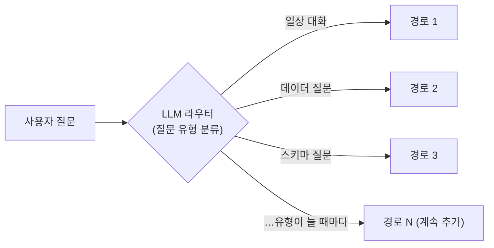

이 방식의 문제는 구조 자체에 있다: **질문 유형이 늘어날 때마다 분기와 라우터를 추가**해야
한다. 새 기능 = 새 분기 = 새 분류 규칙 = 기존 분기와의 충돌 검토. 코드 비용이 계속 커지고,
흐름이 얽혀서 전체를 파악하기 어려워진다.

### 전환: 모델이 좋아졌으니, 경로를 미리 그리지 않는다

그 사이 모델 성능이 좋아지면서 **에이전트 능력이 강해졌다** — 이제는 사람이 경로를 미리
그려주지 않아도, AI가 시스템 프롬프트(행동 규칙)와 도구 목록을 부여받으면 **스스로 계획하고
도구를 골라** 작업할 수 있다. 그래서 새 시스템은 분기도를 버리고 에이전트를 위에 올렸다:

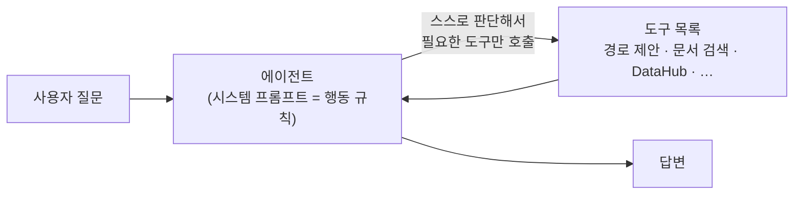

- **확장 방법이 달라진다** — 기능을 늘릴 때 분기를 추가하는 게 아니라 **도구를 등록**한다.
  관리 콘솔에서 도구 서버 주소만 등록하면 에이전트가 그 도구를 알아서 쓴다.
- **분류기가 사라진다** — 일상 대화는 에이전트가 도구 없이 바로 답하고, 데이터 질문은
  DataHub 도구를, 노하우 질문은 문서 검색을 알아서 고른다. 라우터를 유지보수할 일이 없다.

## 2. 에이전트 — 직접 만들지 않고 DeepAgents로 조립

에이전트 뼈대도 바닥부터 만들지 않았다. **LangChain**의 에이전트 실행 엔진
**LangGraph** 위에 올라간 **DeepAgents** 프레임워크로 조립했다:

```
LangChain (LLM 애플리케이션 라이브러리)
  └─ LangGraph (상태·흐름을 그래프로 관리하는 에이전트 엔진 — 멀티턴 기억도 여기 규격)
      └─ DeepAgents (에이전트 루프·계획·도구 호출이 미리 구현된 프레임워크)
          └─ 우리가 한 일: 모델 연결 + 도구 등록 + 시스템 프롬프트 작성
```

기존 방식에서는 직접 만들어야 했던 것들 — 에이전트 루프, 도구 호출 규격, 시스템 프롬프트
주입, MCP 연결 — 이 전부 프레임워크·라이브러리에 이미 있어서, 우리는 붙이기만 했다:

- **에이전트 루프 내장** — 질문을 받으면 [생각 → 필요하면 도구 호출 → 결과 보고 다시 생각]을
  답이 나올 때까지 반복하는 구조가 프레임워크에 들어 있다.
- **시스템 프롬프트로 행동 규칙 지정** — "새 문제면 경로 제안을 가장 먼저 호출",
  "근거 문서는 각주로 표기", "실패 이력이 있으면 사용자에게 먼저 알리기",
  "근거를 못 찾으면 그 사실을 밝히기" 같은 규칙이 프롬프트로 들어간다
  (관리 콘솔에서 재배포 없이 수정 가능).
- **도구가 필요 없는 질문은 도구를 안 부른다** — 자기소개·일상 대화·이미 대화에 나온
  내용의 확인 같은 것은 LLM이 바로 답한다. 검색·DB·외부 도구 자원을 낭비하지 않는다.
  기존 구조에서 라우터(분류기)가 하던 일이 에이전트의 자체 판단으로 흡수된 것이다.
- **등록된 도구** — 경로 제안(suggest_paths) · 문서 검색/열람(search_docs·read_doc) ·
  소스별 전용 검색(소스를 등록하면 `search_소스명` 도구가 자동 생성) ·
  관리 콘솔에 등록한 외부 도구 서버(MCP/REST — §3).
- **멀티턴 기억** — LangGraph의 체크포인터 규격을 Oracle에 저장하도록 직접 구현했다.
  서버 여러 대·재시작에도 대화 맥락이 유지된다.

에이전트가 "잘하게" 만드는 것은 모델 그 자체가 아니라 **에이전트에게 쥐여주는 것들**이다 —
어떤 도구를 주고, 어떤 지식을 검색하게 하고, 조직의 경험을 어떻게 쌓아서 되돌려주는가.
이 문서의 나머지(§3~)가 그 내용이다.

---

## 3. 주 도구 — DataHub MCP

이 서비스는 본질적으로 **데이터 어시스턴트**다. 사내 모든 데이터 — 카프카 스트림부터
각 데이터베이스까지 — 가 클러스터되어 메타데이터로 모여 있는 곳이 **DataHub**이고,
질문의 본업(테이블 찾기·스키마 확인·조인 키·리니지 추적)은 **DataHub의 공식 오픈소스
MCP 도구**를 붙여서 답한다. 이것이 에이전트의 **주 도구**이며, 뒤에서 설명할 문서 검색·
지식그래프·개인화 기억은 이를 보조하는 사이드다.

중요한 사실 관계:

- **이 도구는 우리가 만들거나 운영하지 않는다.** DataHub 쪽에서 관리·제공하는 것을
  우리가 소비만 한다. DataHub 내부의 저장·인덱싱·스케일링은 제공 측의 관리 영역이라
  우리가 관여하지 않는다 — 책임 경계를 명확히 하기 위한 구분이다.
- 사내 제공 형태는 표준 MCP 프로토콜이 아니라 **REST 두 개로 감싼 것**이다:
  - `GET /tools` — 사용할 수 있는 도구 목록
  - `POST /call` — `{"name": 도구명, "args": {...}}` 로 실행
- 우리 쪽에는 이 형태 전용 어댑터가 이미 구현되어 있다. 2026-08-06에 공식 MCP와 필드
  단위로 비교 실측한 결과 **손실 없는 1:1 대응**임을 확인했다(차이는 전송 방식과 필드명
  래핑뿐). 관리 콘솔에서 주소만 등록하면 도구가 자동으로 에이전트에 조립된다.
- 도구 서버가 하나 죽어도 나머지 도구는 동작한다(서버별 격리). 도구 실행 오류는 대화를
  죽이지 않고 에이전트가 우회를 판단한다.
- **사내 실서버와의 연동 테스트는 아직 남아 있다** — 어댑터·매핑은 준비 완료, 실제 사내
  엔드포인트를 붙여보는 검증이 다음 단계다.

---

## 4. 사이드 지식 — 에이전트에게 주는 데이터는 두 가지다

DataHub가 본업(데이터 질문)을 담당한다면, 다음 두 데이터는 에이전트를 더 잘하게 만드는
보조 지식이다:

| 종류 | 무엇 | 어디서 오나 |
|---|---|---|
| **문서** | 블로그 글·QA·가이드 같은 텍스트 | 파일이 아니라 **DB에 이미 있는 테이블**. 관리자가 테이블을 등록하면 시스템이 읽어온다 |
| **대화** | 직원이 에이전트와 나눈 문제 해결 대화 | 우리 채팅 화면. 질문·도구 호출·답변이 전부 자동 저장된다 |

두 데이터 모두 최종적으로 두 곳에 쌓인다: **검색 코퍼스**(찾을 수 있게)와
**지식그래프**(검증된 해결 경로로 안내할 수 있게).

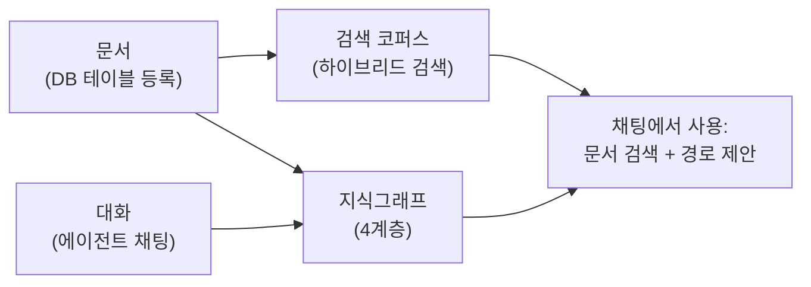

---

## 5. 문서 데이터 — 테이블 등록에서 검색 가능까지

### 5.1 등록: 테이블의 어떤 칸을 어떤 용도로 쓸지 지정

문서는 어딘가의 파일이 아니라 **데이터베이스 테이블**이다. 관리자가 관리 콘솔에서
그 테이블을 등록하면서 "어느 칸(컬럼)이 무엇인지"를 지정한다 (`source_registry` 테이블):

| 지정하는 것 | 예 |
|---|---|
| 테이블 이름 | `LEGACY_KNOWHOW` |
| 고유 번호(id) 칸 | `DOC_ID` |
| 시간 칸 (새 글만 골라 읽는 기준) | `CREATED_AT` |
| 텍스트 칸들의 **역할** | 제목=`SUBJECT`, 본문=`BODY` — 질문/답변형이면 question+answer 조합 |
| 원본 주소(URL) 칸 (선택) | 검색 결과에서 원문 링크로 노출 |
| 그래프 도메인 (선택) | 지정하면 §7 구조화까지, 안 하면 검색 전용 |

역할 어휘는 6개로 고정되어 있다: `title / body / question / answer / meta / url`.
**원천 테이블은 읽기만 한다(SELECT만)** — 절대 고치지 않는다.

### 5.2 적재와 청크: 긴 글을 검색하기 좋은 조각으로

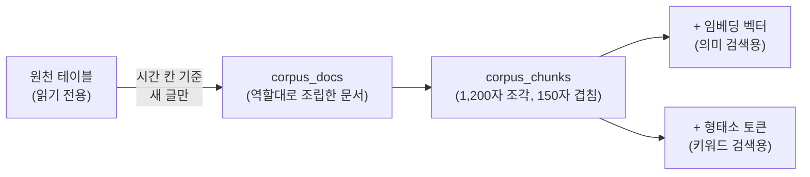

1. **적재** — 시간 칸 기준으로 새 글만 읽어와, 역할대로 문서를 조립한다
   (질문/답변형은 "질문: … 답변: …" 형태로 합침). 매일 밤 03:10 자동 + 콘솔 "지금 적재" 버튼.
2. **청크** — 긴 본문을 1,200자 조각으로 자른다(앞뒤 150자씩 겹치게 — 문장이 조각 경계에서
   잘려도 검색에 걸리도록). 03:15 자동.
3. **임베딩** — 각 조각을 숫자 벡터로 바꾼다(의미가 비슷한 문장끼리 가까워지는 좌표).
   벡터는 Oracle에 저장하고, **어느 모델로 만들었는지도 함께 기록**한다 — 모델을 바꾸면
   옛 벡터를 자동으로 다시 만든다. 03:30 자동.
4. **형태소 토큰화** — 한국어 검색을 위해 각 조각의 단어 원형을 뽑아 Oracle에 저장한다
   (예: "설치했는데" → "설치하다"). 파이썬 형태소 분석기 **Kiwi**를 쓴다.

### 5.3 하이브리드 검색 — 왜 이렇게 만들었나

검색은 두 방식을 **동시에** 쓴다:

- **키워드 검색** — 정확한 용어가 들어간 문서를 찾는다 (형태소 기반이라 "설치했는데"로
  검색해도 "설치하다"가 든 글이 나옴)
- **의미 검색** — 표현이 달라도 뜻이 비슷한 문서를 찾는다 (임베딩 벡터 거리 비교 —
  실측 예: 한국어 질문 "프록시 때문에 파이썬 패키지 설치가 안 됨"으로 영어 문서
  "Failed to parse: proxy:port"를 찾아냄)

두 결과를 순위 융합(RRF)해서 최종 순위를 만든다.

**처음엔 Oracle 안에서 검색하려 했으나 제약이 있었다**: 사내 표준인 Oracle 19c에는
벡터(의미) 검색 기능이 없고(23ai 버전부터 생김), 키워드 검색(Oracle Text)은 별도 DB 권한이
필요하다. 그래서 지금은:

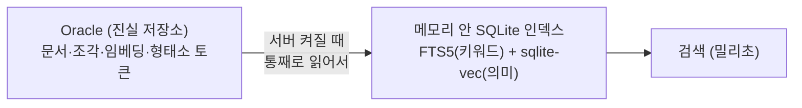

- **원본 데이터는 전부 Oracle에**(임베딩·토큰 포함), **검색 인덱스는 서버가 켜질 때
  메모리 안에 SQLite로 다시 만든다.** 인덱스는 언제든 다시 만들 수 있는 사본이라
  별도 검색 서버를 운영·관리할 필요가 없고, Oracle 특수 권한도 필요 없다.
- 서버를 여러 대 띄우면 각자 자기 인덱스를 만들고, 데이터가 바뀌면 주기적으로 감지해
  다시 만든다.
- 검색 한 번에 외부 호출은 질문 임베딩 1건뿐. 임베딩 서버가 죽어 있어도 키워드 검색만으로
  계속 동작한다.

---

## 6. 도메인 — 그래프의 대분류 (사람이 정한다)

**도메인**은 지식그래프의 1층(최상위 분류)이다. 예: "데이터 분석", "사내 노하우".

- **사람(관리자)만 추가할 수 있는 닫힌 목록**이다 — LLM이 마음대로 분류를 만들 수 없다.
- 도메인마다 **간단한 정의문과 추출 지침**을 적어두는데, 이것이 구조화 때 LLM 프롬프트에
  **한 번(단발)** 주입된다. 별도 학습·튜닝이 아니라 프롬프트 문구가 전부다.
- 도메인마다 **용도(scope)** 를 고른다: 대화 전용 / 문서 전용 / 양쪽.
  두 데이터 타입 중 하나만 받을 수도, 둘 다 받을 수도 있다.
- 문서 소스에 도메인을 지정하면 그 소스가 구조화 대상이 된다(§7). 지정 안 하면 검색 전용.

## 7. 구조화 — 문서에서 "목표와 해결법"을 뽑아 그래프에 넣기

도메인이 지정된 소스의 문서는 밤 03:40(또는 콘솔 "지금 구조화" 버튼)에 LLM이 한 건씩 판정한다.
**문서 1건 = LLM 요청 1회**로 판정과 추출을 동시에 한다:

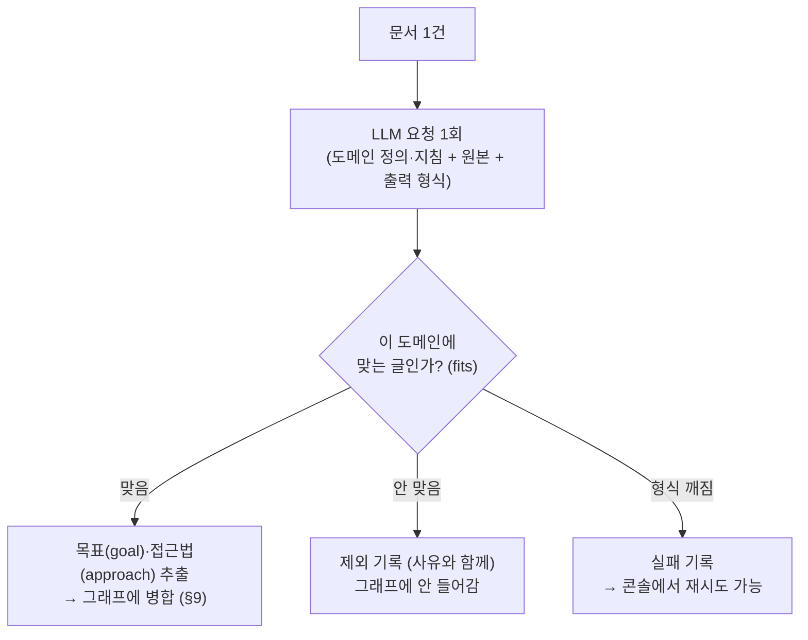

문서에서 온 지식은 출처가 `doc`으로 따로 표시된다 — 문서는 "이런 방법이 있다"는 근거이지
"실제로 통했다"는 검증이 아니므로, 대화의 성공/실패 횟수와 섞이지 않는다.

## 8. 지식그래프의 틀 — 4계층, 엔티티 종류는 고정

그래프에 들어갈 수 있는 엔티티(노드) 종류는 **4가지로 코드에 고정**되어 있다.
5번째 종류는 생길 수 없다:

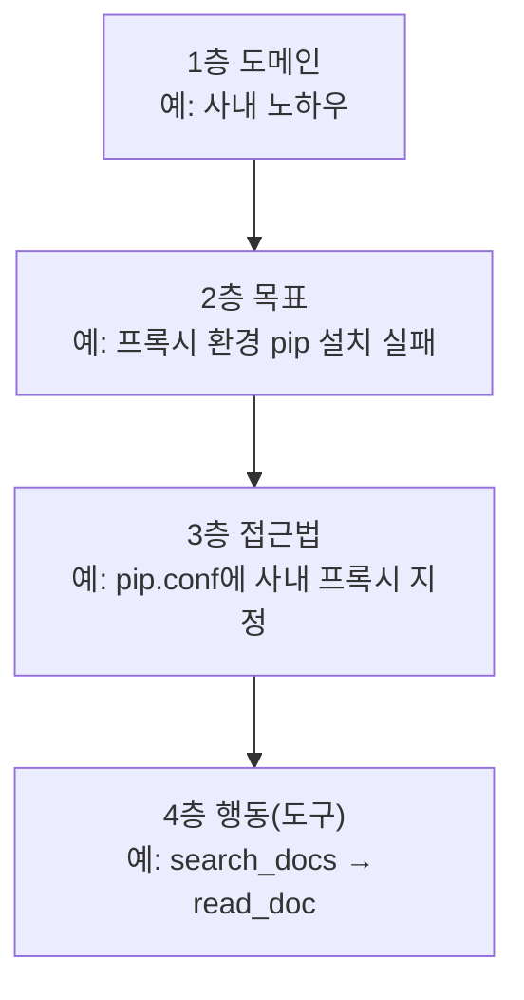

| 층 | 값을 누가 정하나 | 고정/자동 |
|---|---|---|
| 1층 도메인 | 사람 (관리 콘솔) | 닫힌 목록 |
| 2층 목표 | LLM이 추출 | 자동 확장 (병합으로 수렴) |
| 3층 접근법 | LLM이 추출 | 자동 확장 (병합으로 수렴) |
| 4층 행동 | **실제 사용된 도구명 그대로** | LLM 창작 없음 — 대화에서만 생김 |

"어느 층에 붙는가"는 LLM이 정하지 않는다 — 목표는 2층, 접근법은 3층, 부모는 지정된
도메인이라고 **코드에 정해져 있다**. LLM은 문구(이름)만 채운다. 그래서 LLM이 지시를
무시해도 최악은 "그 데이터 1건 제외"이고, 그래프 모양이 무너지는 일은 없다.

## 9. 클러스터(병합) — 같은 지식을 하나의 노드로 모으기

> 자주 오해되는 부분이라 정확히 적는다. **"노드들을 주기적으로 모아 상위 몇 %를 묶고
> LLM이 주제를 정하는" 방식이 아니다.** 별도의 묶기 단계 없이, **노드를 그래프에 넣는
> 순간마다 1건씩** 판정한다. LLM이 새 주제명을 짓는 일도 없다 — 기존 노드에 붙일지
> 말지만 고른다.

새 문구(예: "사내망에서 pip 설치 안 됨")가 도착하면:

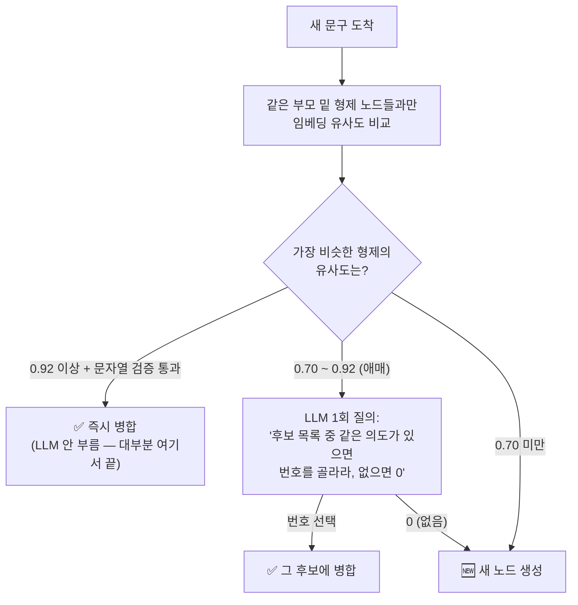

정확한 동작 (코드 확인 사항):

- **비교 범위는 전체가 아니라 "같은 부모 밑 형제"뿐** — 예: 같은 목표 아래 접근법끼리만.
  그래서 그래프가 커져도 비교량이 늘지 않는다.
- 이름이 완전히 같으면 비교 없이 바로 같은 노드.
- **0.92 이상이어도 문자열 검증을 추가로 통과해야** 자동 병합된다(둘 다 12자 이상 +
  문자 유사도 통과). 짧은 문구는 임베딩이 "비슷하다"고 과신하는 경향이 있어서다.
  검증에 걸리면 자동 병합하지 않고 LLM 판정으로 넘긴다.
- 임베딩 서버가 죽어 있으면 벡터 없이 이름/LLM만으로 진행한다 — 병합 정확도는 낮아지지만
  멈추지는 않는다.
- 병합되면 새 노드를 만들지 않고 기존 노드의 연결 횟수(가중치)가 올라간다.
  출처(어느 세션/문서에서 왔는지)는 증거 테이블에 전부 남는다.
- 넣는 순간에 못 잡은 중복은 **야간 유지보수 배치**가 2차로 정리한다
  (저빈도 형제 통합·오래된 잎 흡수·오래 안 쓰인 가중치 감쇠).

---

## 10. 대화 데이터 — 채팅이 그래프가 되기까지

### 10.1 언제 처리되나: 실시간이 아니라 **야간 배치**

대화 저장은 실시간이지만(질문·도구 호출·답변이 턴마다 저장), **그래프 반영은 매일 밤
03:00 배치**다. 이유: 세션이 끝나야 "해결됐는지"를 알 수 있고, 진행 중인 대화가
공유 자산을 오염시키지 않게 하기 위해서다. 오늘의 대화는 내일 아침 경로 제안에 나타난다.

### 10.2 단계별로 룰(코드)인가, LLM인가

헷갈리기 쉬운 부분이라 표로 정확히 구분한다 (코드 확인 사항):

| 단계 | 무엇을 하나 | 룰? LLM? |
|---|---|---|
| ① 세그먼트 분할 | 한 세션에서 문제 A→B로 넘어갔으면 잘라서 따로 처리 | **룰** — 인접 질문의 임베딩 유사도가 기준(0.35) 아래로 떨어지면 경계 |
| ② 세션 게이트 (성공/실패 판정) | "실제로 해결했는가"를 행동으로 판정 | **룰(코드)** — 아래 신호표 참조. LLM 안 씀 |
| ③ 적합성 판정 + 목표·접근법 추출 | 도메인에 맞는 대화인지(fits) + 도구 근거가 있는지(grounded) + 목표/접근법 문구 추출 | **LLM** — 게이트 통과분만 |
| ④ 4층 행동 기록 | 어떤 도구를 썼는지 | **결정적** — 저장된 도구 호출 기록 그대로, LLM 창작 없음 |
| ⑤ 병합 | §9 클러스터와 동일 | 룰 + 애매할 때만 LLM |
| ⑥ 재발 소급 취소 | 성공 판정 후 같은 사용자가 기간 내 같은 증상으로 돌아오면 그 성공을 취소 | **룰** — 질문 임베딩 유사도 + 기간 |

### 10.3 게이트의 행동 신호 — 말이 아니라 행동을 본다

"감사합니다"라고 말해도 같은 질문을 반복했으면 해결이 아니다. 신호는 전부 코드로 센다:

| 후퇴 신호 (문제가 안 풀리고 있음) | 전진 신호 (풀려가고 있음) |
|---|---|
| 정정 언어 ("아니", "그게 아니라"…) | 질문이 점점 구체화됨 (증상 서술 → 컴포넌트·식별자) |
| 같은 문서를 다른 턴에 다시 읽음 | 화제가 앞으로 이동 (되돌아오지 않음) |
| 같은 질문 반복 (임베딩 유사도로 감지) | 조용한 종료 (정정 없이, 도구 근거 있는 답으로 끝) |
| 조급함 (답변 간격이 갑자기 급감) | |
| 에이전트가 최종 답에서 "불가"를 인정 → 즉시 실패 | |

판정 규칙: **후퇴 2개 이상 = 실패 / 전진만 있음 = 성공 / 그 외 = 미판정(그래프에 안 씀,
원본 로그만 보관)**. 애매하면 버리는 것이 원칙 — 오염 방지가 수집량보다 우선이다.

## 11. 가중치 — 어떤 경로를 먼저 추천할지 정하는 법

그래프의 연결선(엣지)마다 숫자 두 개를 둔다:

| 값 | 의미 | 언제 변하나 |
|---|---|---|
| `raw_count` (원시 통행 수) | 이 경로를 지나간 횟수 | 성공 세션·문서가 이 경로로 병합될 때마다 +1 |
| `weight` (보정 가중치) | **추천 순위에 실제로 쓰는 값** | 아래 보정 3가지가 반영된 값 |

원시 횟수를 그대로 쓰지 않고 보정하는 이유: 그대로 쓰면 "많이 보여준 길"이
"좋은 길"처럼 굳는 왜곡(피드백 루프)이 생기기 때문이다. 보정은 3가지:

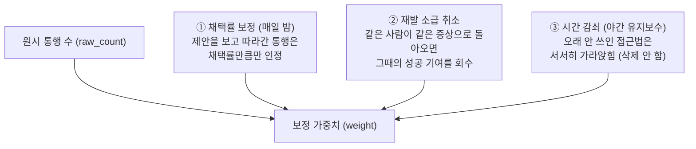

1. **노출 대비 채택률 보정** — 경로를 제안할 때마다 노출 기록을 남기고(`suggestions` 테이블),
   그 세션이 실제로 그 경로를 썼는지(채택)를 판정한다. 매일 밤
   `weight = 자발적 통행 + 제안 유도 통행 × 채택률` 로 재계산한다 — 시스템이 보여줘서 간
   통행은 채택률만큼만 인정된다.
2. **재발 소급 취소** — 성공 판정 뒤 같은 사용자가 정해진 기간 안에 같은 증상으로 돌아오면,
   그때의 해결은 사실이 아니었으므로 성공 판정을 취소하고 가중치 기여를 회수한다.
   기록 자체는 "그때는 해결된 줄 알았음" 이력으로 남는다.
3. **시간 감쇠** — 30일(유예) 넘게 통행이 없는 접근법은 반감기 90일 곡선으로 가중치를
   내린다. 하한 10% 밑으로는 안 내려간다 — **삭제하지 않고 가라앉히기만** 한다.
   문제는 안 변하는데 해법은 낡기 때문에, 신선도는 문제(목표)가 아니라 해법(접근법)에 붙인다.

**성공/실패 횟수는 가중치와 별개다.** "성공 7회 / 실패 1회"는 세션 판정을 세는
카운트이고(불리언 아님 — 한 번의 실패가 7번의 성공을 뒤집지 못한다), 실패는 가중치를
깎는 게 아니라 경고문에 쓰인다. 문서에서 온 근거는 이 카운트에 아예 섞이지 않는다.

마지막으로, 상위 경로만 계속 노출되면 새 경로는 채택률을 쌓을 기회 자체가 없다.
그래서 유사도 컷 바깥의 경로 1개를 **"🔍 탐색 제안" 라벨을 달고** 함께 노출한다 —
몰래 섞지 않고 탐색임을 명시한다.

## 12. 채팅에서 어떻게 쓰이나

사용자가 질문하면 에이전트는 두 경로를 쓴다:

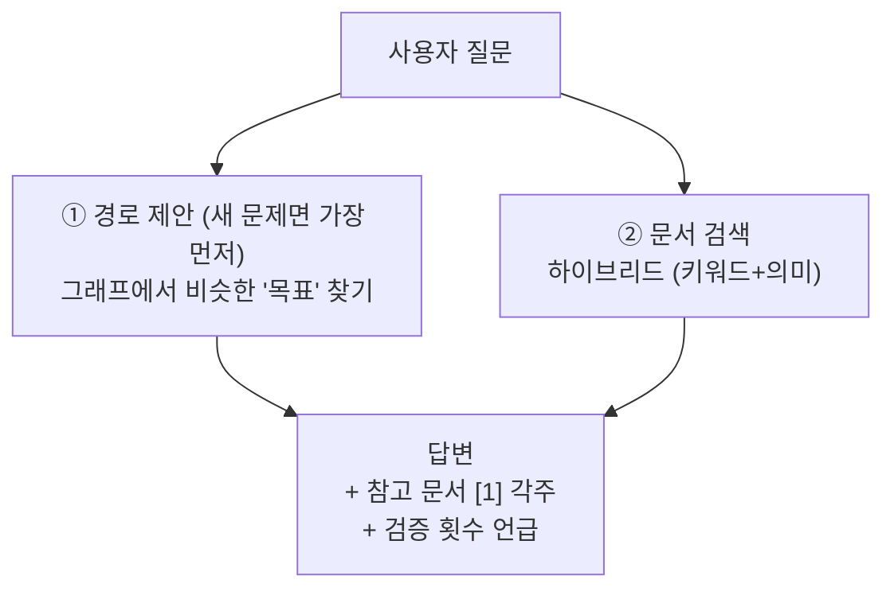

- **경로 제안** — 그래프에서 비슷한 목표를 찾는다. 진입 검색도 문서 검색과 **같은
  하이브리드 방식**(키워드+의미 융합)을 목표 노드에 적용한 것이다. 찾으면 그 아래 접근법들을
  서열대로 제시한다: ✅ 검증된 경로(실전 성공 N회) → 📄 미검증(문서 근거만) →
  ⚠ 실패 우세(이유와 함께 경고 — **차단은 하지 않는다**, 상황이 다르면 시도 가능).
- **문서 검색** — 답변 문장에 근거 문서가 [1] 각주로 붙고, 클릭하면 원문을 볼 수 있다
  (원본 링크는 소스 등록 때 지정한 URL 칸 — 소스별로 켜고 끌 수 있음).
- 멀티턴 기억: 같은 세션에서는 이전 대화 맥락이 이어진다(Oracle에 저장 — 서버를 여러 대
  띄워도, 재시작해도 유지).

## 13. 전체 흐름 한 장 정리

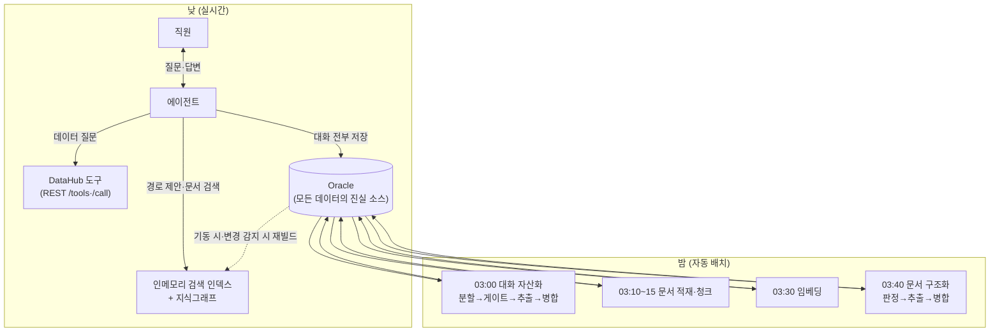
