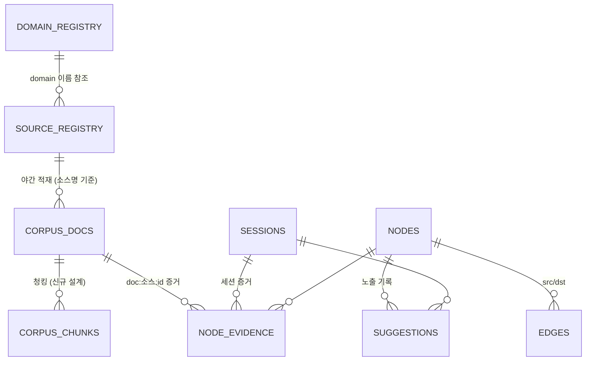

# 테이블 스키마 설계 — Oracle 단일 DB

> 실스키마 기준(클러스터 덤프, 2026-08-06) + 확장 설계(청크 임베딩·모델 버저닝).
> 저장소 원칙은 design.md §5 (Oracle 19c 단독, 별도 검색 엔진 금지).

## 0. 설계 경계 (전제)

- **적재는 별도 로직** — 원본 테이블은 같은 DB에 있지만 우리 소관이 아니다. 우리는 **SELECT만** 한다.
- 전처리(검색 준비·구조화) 대상은 **등록된 테이블만** — `.env SOURCE_TABLE_ALLOWLIST`가 접근 가능 테이블을 제한하고, `source_registry` 등록이 대상·필드 매핑을 정의한다.
- 구분 키는 원본 테이블 이름이 아니라 **소스명(source_name, 등록 시 짓는 별칭)** — 같은 테이블을 다른 매핑으로 중복 등록 가능. 문서 id = `소스명:원천id` 단일 형식.
- 원본과 독립 동작: 등록분을 야간에 우리 테이블(corpus_docs)로 조립한 뒤에는 원본을 다시 보지 않는다 (다음 증분 적재 전까지).

## 1. 전체 지도 (ERD)



원본 테이블들(BLOG_POSTS, 사내 테이블 …)은 이 다이어그램 밖 — SELECT로만 만나는 외부 존재.

### 키·타입 설계 결정 (리뷰 반영)

- **레지스트리 PK는 자연키(문자)** — source_name·domain name. 수십 행짜리 설정 테이블이라 성능 무관하고, 이름이 그대로 문서 id 접두·참조 키·UI 표시가 되어 조인이 없다. 계약: **이름은 불변 식별자 — 변경 대신 새로 등록** (삭제 API 없음과 같은 철학). 이름 rename이 실요구가 되면 그때 surrogate key 도입.
- **`src_id`** = 등록 시 `id_column`으로 지정한 원천 컬럼의 값(문자열화). 복합 PK `(source_name, src_id)`인 이유: 원천 테이블끼리 id가 충돌할 수 있어 소스명이 네임스페이스 역할. 원천 id 타입이 제각각이라 문자로 통일.
- **VARCHAR2 길이는 바이트** (NLS 기본) — 한글 실효 길이는 표기의 1/3 (예: title 1000 = 한글 ~333자). 적재가 잘라 넣지만 컬럼 설계 시 항상 3배 여유로 잡을 것.
- 폭 통일 과제(경미): suggestions.session_id(64) vs sessions.id(36). node_evidence는 규모 증가 시 `(node_id)` 인덱스 필요.

## 2. 설정·제어 테이블

### source_registry — 전처리 대상 등록 ("테이블 A")

| 컬럼 | 타입 | 필수 | 의미 |
|---|---|---|---|
| `source_name` | VARCHAR2(100) | **PK** | 소스명(별칭) — 시스템 전체의 구분 키 |
| `table_name` | VARCHAR2(128) | ✔ | 데이터 원본 테이블 이름 (allowlist 검증) |
| `id_column` | VARCHAR2(128) | ✔ | 원천 고유 id 필드 |
| `ts_column` | VARCHAR2(128) | | 시간 필드 — 있으면 증분 적재, 없으면 전량 1회 |
| `field_map` | VARCHAR2(4000) | ✔ | JSON `{역할: 컬럼}` — 역할 어휘 닫힘: title/body/question/answer/meta/url. **본문 역할(body/question/answer) 최소 1개 필수** |
| `content_kind` | VARCHAR2(100) | | 유형 (문제해결/가이드 …) — 프롬프트·표시 힌트 |
| `domain` | VARCHAR2(100) | | 전처리(구조화) 도메인 — domain_registry 이름 참조. NULL=검색 전용 |
| `enabled` | CHAR(1) | | Y/N |
| `last_ingest_ts` | TIMESTAMP | | 증분 적재 워터마크 (배치가 갱신) |
| `created_at` | TIMESTAMP | | |

### domain_registry — 1층 도메인 닫힌 목록 (사람 전용)

| 컬럼 | 의미 |
|---|---|
| `name` PK | 도메인 이름 |
| `tools` | 대화 분류용 도구 목록 (쉼표구분) |
| `priority` | 분류 우선순위 (낮을수록 먼저, 최하순위=폴백) |
| `extract_hint` | 추출 지침 — 세션/문서 구조화 프롬프트에 주입 |
| `scope` | both/chat/doc — doc은 대화 분류·폴백에서 제외 |

### app_settings — 운영 설정 KV (재배포 없이 변경)

`key`(PK) / `value` / `updated`. 전처리 건수·동시성·본문 길이·전용 모델 등. 신규 설계의 청킹 파라미터도 여기에 (아래 §5).

### model_registry — 모델 등록·기본값

`kind`(llm/embedding/reranker) + `name` 복합 PK, `enabled`, `is_default`. 임베딩 기본 모델이 여기서 결정 — 청크 임베딩의 `embed_model` 값과 연결 (아래 §5).

## 3. 코퍼스 테이블 (우리 소유)

### corpus_docs — 조립본 (검색·구조화의 원본, "테이블 B")

| 컬럼 | 타입 | 의미 |
|---|---|---|
| `source_name` + `src_id` | VARCHAR2(100/200) | **복합 PK** — 문서 id `소스명:원천id`의 실체 |
| `title` | VARCHAR2(1000) | 역할 매핑 title (없으면 본문 첫 줄) |
| `body` | CLOB | 역할 조립 본문 (질문:/답변:/태그: 라벨 포함) |
| `kind` | VARCHAR2(100) | content_kind 복사 |
| `url` | VARCHAR2(1000) | 원문 링크 (출처 표기·문서 뷰에서 노출, http/https만 유효) |
| `embedding` | BLOB | 문서 대표 벡터 (float32[]) — **청크 전환 후 폐기 예정 (§5)** |
| `src_ts` / `created_at` | TIMESTAMP | 원천 시간 / 적재 시간 |
| `graph_status` | VARCHAR2(20) | 구조화 상태: NULL(미처리)/done/excluded/error |
| `graph_note` | VARCHAR2(1000) | 판정 사유·오류 메시지 |

### corpus_chunks — 청크 임베딩 (2026-08-06 구현 완료)

긴 문서의 뒷부분이 임베딩 검색에 잡히지 않던 구조(문서 1건=벡터 1개, 제목+본문 앞 300자)의 해소. 문서 1:N — 실측 2,192문서 → 3,402청크.

```sql
CREATE TABLE corpus_chunks (
  source_name VARCHAR2(100) NOT NULL,
  src_id      VARCHAR2(200) NOT NULL,
  chunk_no    NUMBER        NOT NULL,   -- 0부터, 문서 내 순서
  text        CLOB          NOT NULL,   -- title 접두 + 본문 슬라이스 (오버랩 포함)
  char_start  NUMBER,                   -- 본문 내 시작 위치 (문서 뷰 하이라이트용)
  char_end    NUMBER,
  embedding   BLOB,                     -- float32[] (03:30 백필이 채움 — NULL=미임베딩)
  embed_model VARCHAR2(200),            -- 이 벡터를 만든 모델명 (모델 버저닝 — §5)
  created_at  TIMESTAMP DEFAULT SYSTIMESTAMP,
  CONSTRAINT corpus_chunks_pk PRIMARY KEY (source_name, src_id, chunk_no),
  CONSTRAINT corpus_chunks_doc_fk FOREIGN KEY (source_name, src_id)
    REFERENCES corpus_docs(source_name, src_id) ON DELETE CASCADE
);
-- 설계 때는 FK 보류였으나 구현 시 걸었다 (v2 무결성 모델과 일관): corpus_docs는
-- MERGE만 하고 삭제하지 않아 배치 순서 충돌이 없고, 청킹 배치가 항상 부모를 읽고 쓴다.
-- 재청킹 신호: corpus_docs.updated_at(적재 MERGE가 갱신) vs 청크 created_at 비교 — 멱등.
```

- **텍스트는 참조가 아니라 사본** (조립본 corpus_docs의 슬라이스): ① 원본은 통제 밖(SELECT만, 언제든 변경)이라 검색 시 조인 부적합, ② 임베딩은 그 시점 텍스트의 함수 — 사본이어야 벡터-근거 일관, ③ 조립본·청크 텍스트(역할 라벨·title 접두)는 원본에 존재하지 않아 오프셋 참조로 표현 불가. 표준 RAG 패턴(파생 사본, 원본에서 재생성 가능, 단방향).
- 청크 텍스트에 **title을 접두**로 넣는다(청크만 봐도 무슨 문서인지 임베딩에 반영).
- 청킹 파라미터는 app_settings: `chunk_chars`(기본 1200자), `chunk_overlap`(기본 150자). 본문이 chunk_chars 이하면 청크 1개(=현행과 동일 비용).
- lexical(Oracle Text)은 **문서(corpus_docs.body) 인덱스 유지** — 청크는 시맨틱 전용. 이유: CONTAINS는 문서 전체에서 이미 잘 동작하고, 청크에 중복 인덱스를 만들면 저장·동기화만 는다.

## 4. 그래프·세션 테이블

| 테이블 | PK/키 | 핵심 컬럼 |
|---|---|---|
| `nodes` | id (uuid32) | layer(1~4), name, embedding(dedup·진입점용), fail_flag/fail_reason, valid_from/valid_to (bi-temporal) |
| `edges` | (src, dst) + **FK→nodes 캐스케이드** | weight(보정 가중치), raw_count(원시 통행). dst 인덱스 |
| `node_evidence` | **(node_id, kind, ref) PK + FK→nodes 캐스케이드** | kind='session'(ref=세션 id) / 'doc'(ref=`소스명:원천id`) — v2에서 다형 참조 제거 (성공/실패 카운트는 kind='session' 조인만) |
| `sessions` | (id, turn) | question/tool_calls/answer(CLOB), verdict(게이트 판정), user_id(SSO — (user_id,ts) 인덱스) |
| `suggestions` | **id (identity)** + FK→nodes 캐스케이드 | 경로 제안 노출 기록: problem, node_id, weight, session_id(36), adopted (채택률 보정). session/node 인덱스 |
| `lg_checkpoints` / `lg_writes` | (thread_id, ckpt_ns, ckpt_id …) | LangGraph 체크포인터 외부화 (멀티턴 기억) |

### 무결성 모델 (v2 — 2026-08-06 정리)

- **노드 참조는 물리 FK로 강제** — edges·node_evidence·suggestions → nodes, 전부 ON DELETE CASCADE (유지보수의 노드 삭제가 자동으로 파생 행 정리). 설정 체인도 FK: corpus_docs→source_registry, source_registry.domain→domain_registry.
- **테이블 경계를 넘는 참조(세션·문서·도메인 이름)는 FK 불가/부적합** — 대신 야간 유지보수 **패스4 무결성 점검**이 고아를 리포트한다 (자동 삭제 없음 — 위반은 버그 신호).
- 다형 참조였던 node_evidence.session_id(세션 id와 `doc:` 접두 문자열 혼용)는 **kind/ref 컬럼으로 정규화** — 접두어 파싱 제거, PK로 중복 증거 차단.
- 실증: FK 도입 직후 형제 통합 배치의 스냅샷 버그(삭제된 형제로의 증거 이관 = 이전엔 조용한 고아 삽입)를 ORA-2291이 즉시 적발 — 무결성을 침묵에서 오류로 바꾼 효과.

## 5. 신규 설계 결정 — 청크 검색 + 임베딩 모델 버저닝

### 검색 흐름 변경 (semantic만)

```
현행: 질의 임베딩 → corpus_docs.embedding 행렬 코사인 → 문서 top-30 → RRF
설계: 질의 임베딩 → corpus_chunks 행렬 코사인 → 청크 top-N
      → 문서 단위로 집계(문서별 최고 청크 점수, best-chunk) → 문서 top-30 → RRF
```

- RRF 융합·결과 포맷·문서 id는 그대로 — **검색의 대외 인터페이스 불변** (에이전트·출처 표기 코드 수정 없음).
- 메모리 행렬은 청크 단위로 로드(`(source:id:chunk_no)` 키). 2,192문서×평균 2~3청크 규모에선 현행과 같은 브루트포스로 충분. 수십만 청크가 되면 design.md §5의 23ai VECTOR 이관 검토 지점.
- 검색 결과 스니펫은 **매칭된 청크 텍스트**로 교체(현행: 본문 앞 200자) — 긴 문서 중간이 맞았을 때 근거가 보이게.

### 임베딩 모델 버저닝 (embed_model 컬럼)

- 백필 배치는 `embedding IS NULL OR embed_model != 활성모델` 인 청크를 처리하고, 벡터와 함께 `embed_model=활성모델`을 기록.
- 검색 행렬은 **활성 모델 벡터만** 로드 — 모델 교체 시 재백필이 진행되는 동안 커버리지가 점증하고, lexical이 나머지를 받친다(현행 "임베딩 없으면 lexical 단독" 동작의 자연 확장).
- 교체 절차: model_registry에서 임베딩 기본값 변경 → 배치가 점진 재백필 → 완료 후 dedup 임계값 재캘리브레이션(CLAUDE.md 명시 사항). 구모델 벡터는 덮어써서 이중 저장 없음.
- 무중단 이중 모델 공존(두 벡터 동시 보관)이 필요해지면 embedding/embed_model을 별도 테이블 `chunk_embeddings(…, embed_model, PK에 모델 포함)`로 분리하는 게 업그레이드 경로 — 지금은 과설계라 보류.

### 그래프 dedup과의 관계

nodes.embedding(노드 이름 벡터)은 청킹과 무관 — 그대로. 단 **임베딩 모델 교체 시 nodes.embedding도 재백필 대상**이라는 점을 교체 절차에 포함해야 한다 (dedup·경로 진입점이 이 벡터를 씀).

## 5.5 규모 확장 경로 (데이터 증가 가정 시 정석)

벡터 1개 = 1024차원 float32 = 4KB. 브루트포스 행렬은 1만 청크 40MB(<1ms) → 10만 400MB(~10ms) → 100만 4GB(~150ms) — **지연보다 파드 메모리(복제본×행렬)와 기동 로드가 먼저 한계**.

| 규모 | 정석 대응 |
|---|---|
| 수천~수만 청크 (현재) | 인메모리 브루트포스 유지 — 이 규모에선 ANN보다 정확·단순 |
| 수십만 청크 | ① 도메인/소스 **사전 필터로 행렬 분할** (질의가 해당 파티션만), ② corpus 테이블 **파티셔닝**(소스 LIST 또는 적재일 RANGE — 소스 초기화가 파티션 작업이 되는 부수 이득), ③ node_evidence(node_id) 인덱스 |
| 수십만~수백만 | **Oracle 23ai VECTOR + HNSW 인덱스**로 검색을 DB 안으로 — 외부 벡터DB 금지 원칙(design §5·6) 아래의 종착지. 스키마는 그대로, VECTOR 컬럼 추가 + 검색 함수 교체만. 메모리 행렬·기동 로드 소멸 |

그래프는 구조적으로 성장에 강함 — dedup은 전체가 아니라 **부모당 형제 수**에 비례. 경로 진입점(2층 전수 코사인)만 2층 수만 개 시점에 위와 같은 처방(사전 필터 → 23ai). 배치는 증분 워터마크·멱등 설계라 동시성 설정 조절이 전부.

## 6. 마이그레이션 계획 (무중단, 단계별 되돌림 가능)

| 단계 | 작업 | 되돌림 |
|---|---|---|
| 1 | ~~`corpus_chunks` DDL + 청킹 배치~~ **완료** (ingestion/chunk_corpus.py, cron 03:15) | — |
| 2 | ~~임베딩 백필 청크 전환~~ **완료** (embed_model 기록, 모델 불일치 자동 재백필) | — |
| 3 | ~~검색 청크 전환~~ **완료** (best-chunk 집계, 매칭 청크가 스니펫) | — |
| 4 | ~~doc 임베딩 백필 중단~~ **완료** (corpus_docs.embedding은 잔존 컬럼 — 추후 정리) | — |

야간 배치: 03:10 적재 → 03:15 청킹(신규 CronJob) → 03:30 임베딩 백필 → 03:40 구조화. 소스 초기화(reset)는 구조화 상태만 건드리므로 청크와 무관 — 재적재(MERGE)로 본문이 바뀐 문서만 재청킹 대상(`created_at` 비교, 멱등).
