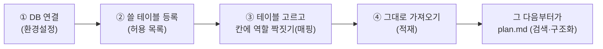
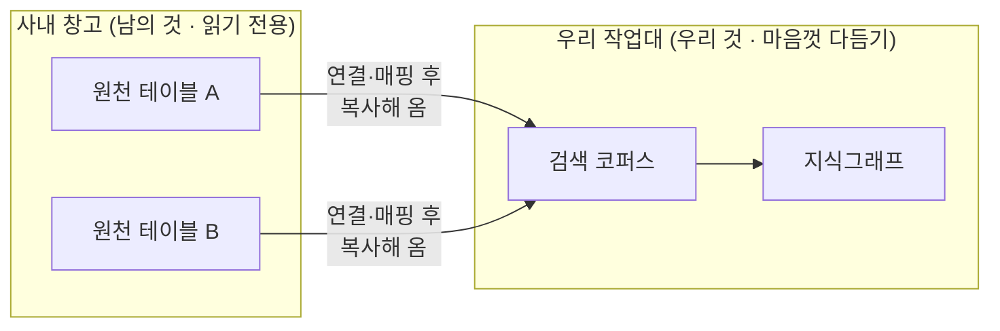
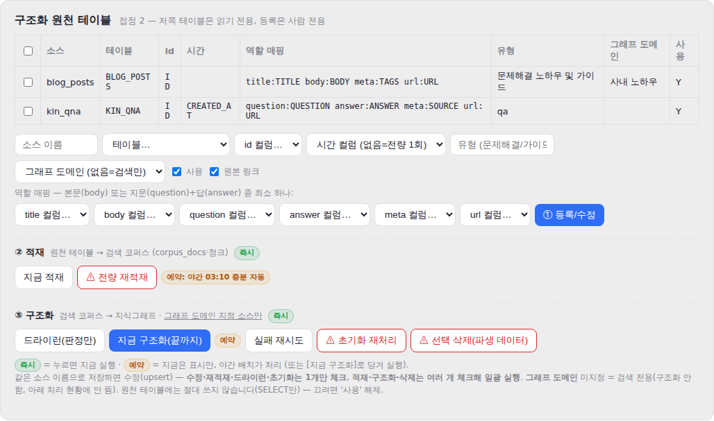
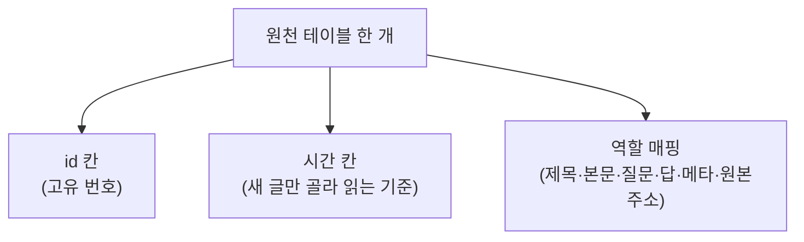
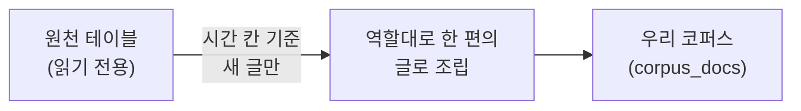
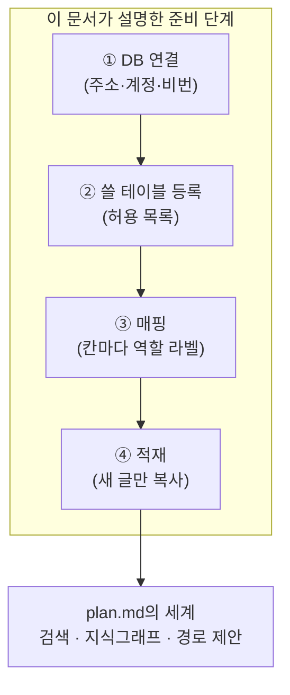

# 데이터를 연결하고 매핑하는 법 — 구조화 이전의 준비 단계

> **작성 2026-08-19 · 보고용.** 이 문서는 다른 기획서(`plan.md`)가 다루지 않은 **맨 앞 단계**를
> 따로 설명합니다. `plan.md`는 데이터가 시스템 안에 들어온 *다음*(검색·구조화)을 설명하는데,
> 그 앞에 반드시 있어야 하는 **"데이터를 연결하고 짝지어주는 준비 과정"** 이 빠져 있어
> 새 문서로 정리했습니다. 중학생도 이해할 수 있게, 되도록 쉬운 말로 적었습니다.

---

## 0. 한눈에 — 이 문서가 설명하는 것

우리 시스템이 사내 데이터를 쓰려면, 먼저 **"어떤 데이터를 어떻게 가져올지"** 를 사람이 한 번
정해 줘야 합니다. 그 준비는 크게 네 걸음입니다.

이 네 걸음이 끝나야 비로소 검색이나 지식그래프 만들기가 시작됩니다.

---

## 1. 먼저 알아둘 관점 — "담아두는 곳"과 "다듬는 곳"은 다릅니다

가장 중요한 생각의 틀이 하나 있습니다. 우리는 **데이터가 실제로 쌓여 있는 곳**과,
그것을 **다듬어서 쓰는 곳**을 일부러 나눠서 봅니다.

쉽게 말하면 이렇습니다.

- **원천 테이블 = 남의 창고**입니다. 사내 어딘가에 이미 데이터가 잔뜩 쌓여 있는
  데이터베이스 표(테이블)예요. 이건 우리 것이 아니므로 **꺼내 보기만 하고, 절대 손대지
  않습니다**(읽기 전용).
- **우리 저장소 = 우리 작업대**입니다. 창고에서 필요한 것만 **복사해 와서**, 검색하기 좋게·
  지식그래프로 쌓기 좋게 다듬습니다. 원본은 창고에 그대로 있고, 우리는 사본을 가지고 일합니다.

**왜 굳이 나눌까요?** 세 가지 좋은 점이 있어서입니다.

1. **안전합니다** — 원본은 절대 안 건드리니, 우리가 무엇을 하든 사내 원본 데이터가 상할 일이
   없습니다.
2. **유연합니다** — 창고마다 표 생김새가 다 다릅니다(어떤 건 본문 한 칸, 어떤 건 질문·답 두 칸).
   그래도 **매핑(③번)** 으로 맞춰주기 때문에, 형태가 달라도 다 받아들일 수 있습니다.
3. **깔끔합니다** — "가져오는 일"과 "다듬는 일"이 분리돼 있어, 문제가 생겨도 어디를 봐야 할지
   금방 알 수 있습니다.

---

## 2. ① 환경설정에서 Oracle DB에 연결하기

첫 걸음은 **"어느 데이터베이스에 접속할지"** 를 알려주는 것입니다. 이건 화면이 아니라
프로그램의 **환경설정 파일(`.env`)** 에 딱 세 줄로 적어 줍니다.

| 설정 | 뜻 | 쉽게 말하면 |
|---|---|---|
| `ORACLE_DSN` | 접속할 DB의 주소 | 창고가 어디 있는지 (주소) |
| `ORACLE_USER` | 접속 계정(아이디) | 창고 문을 여는 열쇠 (누구로 들어가나) |
| `ORACLE_PASSWORD` | 접속 비밀번호 | 그 열쇠의 비밀번호 |

여기서 중요한 점 하나. **접속한 계정이 볼 수 있는 만큼만 보입니다.** 즉 어떤 아이디로
접속하느냐에 따라, 그 계정에게 열려 있는 표들만 우리 시스템이 읽을 수 있습니다. 그래서
"이 계정으로 접근 가능한 테이블"이 곧 우리가 고를 수 있는 후보 목록이 됩니다.

---

## 3. ② 쓸 테이블을 등록하기 (허용 목록)

계정이 볼 수 있는 표가 100개라고 해서 100개를 다 쓰는 건 아닙니다. 그중 **우리가 실제로
쓸 표만** 따로 골라 등록해 둘 수 있습니다. 이걸 **허용 목록**(환경설정의
`SOURCE_TABLE_ALLOWLIST`)이라고 부릅니다.

- 허용 목록을 비워 두면 계정이 보는 모든 표를 후보로 쓸 수 있고,
- 목록에 몇 개만 적어 두면 **딱 그 표들만** 등록·조회·가져오기가 됩니다.

이건 일종의 **안전 울타리**입니다. "실수로 엉뚱한 표를 건드리지 않게" 미리 쓸 것만 정해두는
장치예요. (비워둬도 원천은 어차피 읽기 전용이라 안전하지만, 사내에서는 쓸 표만 명시하는
편이 더 안심됩니다.)

---

## 4. ③ 테이블을 고르고, 칸마다 역할을 짝지어주기 (매핑)

여기가 이 준비 과정의 **핵심**입니다. 표를 하나 고른 뒤, **"이 표의 어느 칸이 무슨 역할인지"**
를 사람이 짝지어 줍니다. 이 짝짓기를 **매핑**이라고 부릅니다.

왜 필요할까요? 표마다 칸 이름이 제각각이기 때문입니다. 어떤 표는 제목 칸을 `SUBJECT`라
부르고, 어떤 표는 `TITLE`이라 부릅니다. 컴퓨터는 이름만 봐선 그게 "제목"인지 모릅니다.
그래서 사람이 **"`SUBJECT` = 제목이야"** 라고 한 번 알려주는 것이죠. 이사할 때 상자마다
"주방", "옷"이라고 **라벨을 붙여 두는 일**과 똑같습니다.

아래는 관리 화면에서 실제로 등록·매핑하는 모습입니다.

*위쪽 표는 이미 등록된 소스 목록입니다. 예를 들어 `blog_posts`는 `TITLE`→제목, `BODY`→본문으로
짝지었고, `kin_qna`는 `QUESTION`→질문, `ANSWER`→답으로 짝지었습니다. 아래쪽 폼에서 표를 고르고
각 칸의 역할을 골라 등록합니다.*

### 무엇을 짝지어 주나

| 짝지어 주는 것 | 무슨 뜻인가 | 예시 |
|---|---|---|
| **id 칸** | 글 하나하나를 구분하는 고유 번호 | `DOC_ID` |
| **시간 칸** | 언제 만들어졌는지 — *새로 생긴 글만 골라 읽는* 기준이 됩니다 | `CREATED_AT` |
| **제목(title)** | 글의 제목 칸 | `SUBJECT` |
| **본문(body)** | 글의 내용 칸 | `CONTENT` |
| **질문(question)·답(answer)** | 질문/답변형(FAQ) 데이터일 때 | `BODY_Q` / `BODY_A` |
| **메타(meta)** | 태그·분류 같은 부가 정보 | `TAGS` |
| **원본주소(url)** | 원문 링크 — 검색 결과에서 "원문 보기"로 이어집니다 | `LINK` |

역할 이름은 **여섯 가지로 딱 정해져 있습니다**: `제목 · 본문 · 질문 · 답 · 메타 · 원본주소`.
표 생김새가 아무리 달라도, 이 여섯 개의 **조합**으로 다 표현할 수 있습니다.

- 본문 한 칸짜리 블로그형 → **본문** 하나만 짝지음
- 질문·답 두 칸짜리 FAQ형 → **질문 + 답** 을 짝지음
- 칸이 여러 개인 복잡한 표 → 필요한 역할끼리 골라 조합

> 다시 강조: **원천 테이블은 읽기만 합니다(SELECT만).** 매핑은 "이 칸을 이렇게 읽겠다"는
> 약속일 뿐, 원본 표에는 아무것도 쓰지 않습니다.

---

## 5. ④ 짝지은 대로 데이터를 가져오기 (적재)

매핑까지 끝내면, 이제 시스템이 그 약속대로 데이터를 **복사해 옵니다**. 이 과정을 **적재**라고
부릅니다.

- **새 글만 골라 옵니다** — 매번 전부 다시 읽지 않고, ②에서 정한 *시간 칸*을 보고 지난번
  이후에 새로 생긴 글만 가져옵니다. (시간 칸이 없으면 처음 한 번 전체를 가져옵니다.)
- **역할대로 한 편의 글로 조립합니다** — 예를 들어 질문·답형이면
  "질문: …  답: …" 형태로 자연스럽게 합쳐 한 편의 문서로 만듭니다.
- **자동이자 수동입니다** — 매일 밤 자동으로 새 글을 가져오고, 급하면 관리 화면의
  **[지금 적재]** 버튼으로 바로 당겨올 수도 있습니다.

여기까지 오면 데이터가 우리 작업대(코퍼스)에 얹힌 상태가 됩니다. **그 다음부터**가 바로
`plan.md`에서 설명하는 검색(찾기)과 구조화(지식그래프 쌓기)입니다.

---

## 6. 전체를 한 장으로

**핵심 한 줄** — 사내 원본은 창고에 그대로 두고, 사람이 **"어느 창고의(①·②) 어느 칸을 무슨
용도로(③)"** 한 번 짝지어 주면, 시스템이 알아서 **필요한 것만 복사해(④)** 검색과 지식그래프에
쓸 수 있게 준비됩니다. 이 준비가 튼튼해야 그 뒤의 모든 기능이 제대로 동작합니다.
