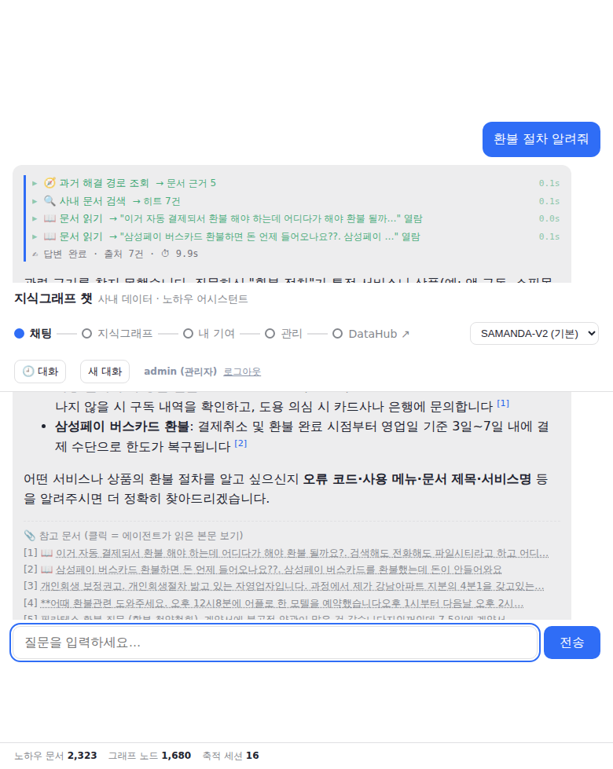

# 피드백 처리 — 이전 ↔ 현재 챗봇 비교 피드백 대응

> 주신 **피드백(신규 문제점·좋은 점·의문사항·개선 방안 9가지)** 을 항목별로 처리한 문서입니다.
> "지침 강화"처럼 두루뭉술하게 적지 않고, **실제로 시스템 프롬프트에 넣은 문구**와
> **바꾼 코드**를 그대로 실었습니다. (피드백과 무관하게 새로 추가한 기능은 → `2-추가-기능.md`)
>
> 관련 파일: 답변 규칙 = `src/agent/agent.py`(시스템 프롬프트) · 입력 분류 = `src/agent/triage.py`(라우터) ·
> 화면 렌더 = `src/web/index.html`.

---

## 한눈에 보기 — 개선 방안 9가지 처리 현황

| # | 피드백 | 실제로 바꾼 것 (요지) | 상태 |
|---|---|---|---|
| 1 | 언어 필터링 | 시스템 프롬프트에 "답변은 반드시 한국어로만" 문장 + [금지]에 "한국어 외 언어로 답하기" 추가 | ✅ 완료(프롬프트 수준) |
| 2 | 마크다운 `**` 파싱 | 렌더 라이브러리를 `marked` + **`marked-cjk-friendly`** 로 교체 + 스트리밍 중엔 평문·최종에 1회만 파싱 | ✅ 완료 |
| 3 | 지원 밖에 되묻기 | 프롬프트 3번 규칙에 "거부가 되묻기보다 **우선**" 명문화 + 라우터 `out_of_scope` 분기 | ✅ 완료 |
| 4 | 답변 불가 시 공백 | 프롬프트 9번에 "빈 응답 금지 + 사유 명시" 문장 추가 | ✅ 완료 |
| 5 | 문법·오타 정정 | 라우터가 `normalized_query`로 **검색 전 1회 교정**(의미 불변) | ✅ 완료 |
| 6 | 되묻기 전용 흐름 | 라우터 `intent=clarify`(막연할 때만) → 되묻기 문구, 화면에 "💬 되묻기" 카드 | ✅ 완료(보수적) |
| 7 | 위험 조작 전 1회 확인 | **보류** — 현재 도구가 전부 읽기 전용이라 막을 위험 실행이 없음 | ⏸ 보류 |
| 8 | 증적 없음 → 2단계 | 프롬프트 8번에 "①없음 명시 → ②그 다음에만 유사 제안" 순서 강제 | ✅ 완료 |
| 9 | gpms 실패 원인 | 진행 중 "gpms는 무시" 지시로 **제외** | ⏸ 제외 |

---

## 항목별 — 실제로 무엇을 어떻게 바꿨나

### 1. 언어 필터링 — 시스템 프롬프트에 강제 문구 추가

**문제:** 영어·혼용으로 물으면 답이 영어로 새어 나옴. 원래 프롬프트엔 "항상 한국어로 답한다" 한 줄뿐.

**바꾼 것 —** `agent.py`의 시스템 프롬프트 맨 앞에 이 문장을 넣었습니다:

> 질문이 영어·혼용이든 상관없이 답변은 반드시 한국어로만 쓴다(고유명사·코드·식별자·urn·표 안의 값은 원문 유지).

그리고 프롬프트 맨 끝 **[금지]** 목록에 `한국어 외 언어로 답하기`를 명시적으로 추가했습니다. 입력 라우터(`triage.py`)의 즉시 응답(`reply`)도 전부 한국어로만 쓰도록 규칙화했습니다.

> *한계:* 이건 **프롬프트 수준**입니다. 완전판(생성된 답을 언어감지해 한국어가 아니면 재생성하는 출력 가드)은 아직 넣지 않았습니다.

### 2. 마크다운 `**` — 렌더 라이브러리 교체 + 파싱 시점 변경

**문제:** `**항목:**설명`처럼 닫는 `**` 뒤에 공백 없이 한글이 붙으면 굵게 안 됨. (marked가 CommonMark 규격을 엄격히 따라 *일부러* 굵게 처리하지 않는 것 + 스트리밍 중 토큰마다 부분 재파싱이 겹친 문제.)

**바꾼 것 —** "한글 친화 확장"의 실체는 `index.html`의 두 가지 코드 변경입니다:

1. **렌더 라이브러리 교체** — 기존 `marked.min.js`(CDN)를 → `marked@18` + **`marked-cjk-friendly`** 플러그인으로 바꾸고 `marked.use(cjkFriendly())`로 등록. 이 플러그인이 닫는 `**` 뒤에 한글이 붙어도 굵게 인식하게 해 줍니다. (플러그인이 marked 내부 토크나이저에 결합돼 있어 버전을 18로 고정.)
2. **파싱 시점 변경** — 스트리밍 중에는 마크다운을 파싱하지 않고 **평문(textContent)** 으로만 흘리다가, 답변이 끝나는 최종 이벤트에서 **딱 한 번** `marked.parse`를 호출. 토큰마다 부분 재파싱하던 것을 없앴습니다.

**결과:** `**중요:**내용` → **중요:** 처럼 굵게 나오는 것을 실제 화면에서 확인.

### 3. 지원 불가 영역에 되묻기 — 거부를 되묻기보다 "우선"으로 명문화

**문제:** 프롬프트에 "지원 밖이면 거부"(규칙 3)와 "근거 못 찾으면 되묻기"(규칙 8)가 같이 있는데 **우선순위가 없어**, 지원 밖 질문에도 되묻기가 나감.

**바꾼 것 —** `agent.py` 시스템 프롬프트의 3번 규칙에 우선순위 문장을 박았습니다:

> 지원 범위 밖이면 도구를 호출하지도 되묻지도 말고, 즉시 "죄송하지만 그 주제는 지원하지 않습니다"라고 명시한 뒤 사유와 지원 가능한 주제를 안내한다. **이 판단은 아래 8·9의 되묻기·유사 제안보다 우선한다.**

또 입력 라우터에 `intent="out_of_scope"` 분기를 두어, 지원 밖이면 에이전트로 넘기기 전에 라우터가 `reply`를 "죄송하지만 그 주제는 지원하지 않습니다."로 시작하도록 했습니다.

### 4. 답변 불가 시 공백 — "빈 응답 금지" 문장 추가

**문제:** 근거를 못 찾으면 빈 응답이 나가는 경우가 있었음.

**바꾼 것 —** 시스템 프롬프트 9번에 이 문장을 넣었습니다:

> 어떤 경우에도 빈 응답을 내지 않는다. 도저히 답할 수 없으면 "답변할 수 없습니다"와 그 사유(근거 없음·데이터 미적재·지원 범위 밖)를 명시하고 가능한 다음 행동을 제안한다.

### 5. 문법·오타 1회 정정 — 라우터의 질의 재작성(normalized_query)

**문제:** 오타("게좌")가 있으면 검색이 헛돎.

**바꾼 것 —** 입력 라우터(`triage.py`)가 매 질문을 분류하면서 `normalized_query` 필드를 함께 뽑습니다. 규칙:

> normalized_query: intent가 normal일 때만 채운다. 명백한 오타·띄어쓰기·문법 오류가 있으면 1회 교정한 문장을, 없으면 원문 그대로 둔다. **의미는 절대 바꾸지 않는다.**

정상 질문이면 이 교정된 문장으로 검색·답변을 진행합니다(예: "게좌"→"계좌"). 이건 RAG의 표준 기법인 **query rewriting**을 라우터 출력 한 필드로 흡수한 것이라 노드를 따로 늘리지 않았습니다.

### 6. 되묻기 전용 프로세스 — 라우터 intent=clarify + 화면 카드

**문제:** 막연한 질문("에러 났어")에 대한 처리 흐름이 없었음.

**바꾼 것 —** 라우터에 `intent="clarify"` 분기를 두되, **검색할 대상이 하나도 없을 만큼 막연할 때만** 발동하도록 보수적으로 규정했습니다:

> "clarify": 지원 범위 안이지만 검색할 대상이 하나도 없을 만큼 막연할 때만("에러 났어"처럼 무엇에 대한 건지 전혀 없음). reply = 무엇을 알려주면 되는지 1문장 되묻기.

clarify면 에이전트를 거치지 않고 되묻기 문구를 즉시 응답하고, 화면에 "💬 되묻기" 카드로 일반 답변과 구분해 표시합니다. (조금이라도 애매하면 `normal`로 두어 검색을 막지 않도록 안전장치를 뒀습니다.)

### 7. 위험 조작 안내 전 1회 확인 — 보류(이유)

원래 "위험한 실행 전 사람이 승인"하는 안전장치(approval gate)입니다. 그런데 **현재 도우미의 도구가 전부 읽기 전용**(검색·문서 읽기·DataHub 조회)이라, 막아야 할 위험한 실행 자체가 없습니다. 그래서 지금은 보류하고, 나중에 쓰기 기능이 생기면 그때 승인 단계를 붙이는 것이 맞습니다.

### 8. 증적 없음 → 2단계 분리 — 프롬프트에 순서 강제

**바꾼 것 —** 시스템 프롬프트 8번에 두 단계를 순서로 못박았습니다:

> ① 먼저 "관련 근거를 찾지 못했습니다"라고 분명히 밝힌다.
> ② 그 다음에만, 비슷한 후보 문서가 있으면 제목을 제안하거나 … 되묻는다.
> **①을 건너뛰고 곧장 되묻거나 유사 제안만 내지 않는다.**

### 9. gpms 질문 실패 — 제외

코드·문서 어디에도 gpms 흔적이 없어 **적재되지 않은 외부 시스템**으로 추정됩니다. 진행 중 "gpms는 무시" 지시를 주셔서 분석은 제외했습니다. (원인 분석이 필요하면 실패한 세션 정보만 주시면 활동 로그에서 그 턴의 도구 호출·결과를 추적할 수 있습니다.)

---

## 좋은 점 — 유지/개선

| 좋은 점 | 처리 |
|---|---|
| 1. 증적(근거) 남기는 처리 우수 | 그대로 유지 (변경 없음) |
| 2. 증적 없으면 "없다" 명시 | 위 8번처럼 **2단계로 분리** |
| 3. 행동 순서 설명 | 위험 안내엔 1회 확인 필요 → 7번(현재 보류) |
| 4. 사용자 질문 포함 예시 제공 | 그대로 유지 (변경 없음) |
| 5. 고유명사 강제 변환 안 함 | 그대로 유지 — 위 1번 문구에도 "고유명사·코드·urn은 원문 유지" 명시 |

---

## 의문사항 — 확인 결과

- **되묻기 프로세스 미정의** → 라우터 `intent=clarify` 전용 흐름으로 처리(6번).
- **답변 불가 질문의 공백** → 프롬프트 9번 "빈 응답 금지"로 처리(4번).
- **gpms 실패 원인** → 코드·문서에 흔적 0건 → 미적재 외부 시스템 추정, 지시로 분석 제외(9번).

---

## 실제 동작 모습

아래는 개선 후 채팅에서 사내 문서를 검색해 **한국어로, 근거와 함께** 답하는 모습입니다.

---

## 정리

- **7개(1·2·3·4·5·6·8) 완료**, 2개는 보류/제외(7 = 쓰기 기능 생길 때, 9 = 지시로 제외).
- 대부분은 **시스템 프롬프트 문구**(1·3·4·8)와 **라우터 규칙**(1·3·5·6)으로, 마크다운(2)만 **프론트 라이브러리·파싱 방식** 변경으로 처리했습니다.
- 각 처리의 바탕이 된 **입력 라우터** 등 새 부품과 피드백 외 추가 기능은 → `2-추가-기능.md`.

*작성: 2026-08-19*
