# 추가 기능 — 피드백과 별개로 개발한 것

> 이 문서는 **피드백 대응과는 별개로** 이번에 새로 추가한 기능들을 정리합니다. (피드백 처리는 → `1-피드백-처리.md`)
>
> 실제 커밋 기록을 바탕으로 정리했고, 누구나 이해할 수 있게 쉽게 썼습니다.

전체 그림:

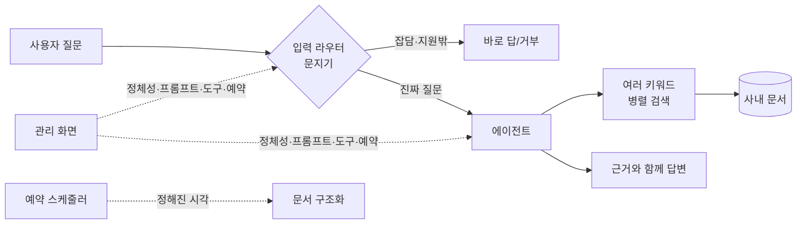

---

## 1. 입력 라우터 — 질문을 받는 "문지기" 🆕

**커밋:** `d84cce9`(라우터 도입) · `bb18082`(설정화) · `f78fea1`(판정 기록) · `c1b339a`(속도 개선)

질문이 도우미에게 가기 **전에** 종류를 먼저 가려내는 문지기를 새로 만들었어요. (이 문지기가 피드백 1·3·5·6을 실현하는 바탕이기도 합니다.)

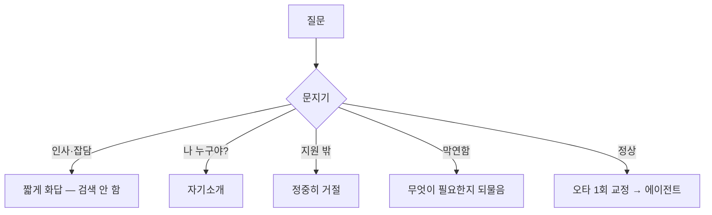

- **지원 밖·잡담은 검색 없이 즉시 처리** → 빠르고 헛돌지 않음
- **오타 자동 교정** (예: "게좌"→"계좌")
- **판정 기록** — 문지기가 어떻게 분류했는지 활동 로그에 남겨 잘못 막은 경우 추적
- **속도 개선** — 문지기가 쓸데없이 "생각"까지 하느라 느렸는데(약 10초), 생각을 끄니 **약 1초**로
- **환경 설정화** — 문지기 전용 모델/주소/on·off를 설정으로 뺌 (작고 빠른 모델 생기면 그것만 지정)

---

## 2. 도우미 설정을 "관리 화면"으로 꺼내기 🆕

**커밋:** `c799d23`(생각하기 토글) · `31cb876`(정체성·라우터 지침·내장 도구 가시화)

예전엔 코드에 숨어 있어 개발자가 재배포해야 바꿨던 설정들을, **관리 화면에서 클릭으로** 바꾸게 했어요.

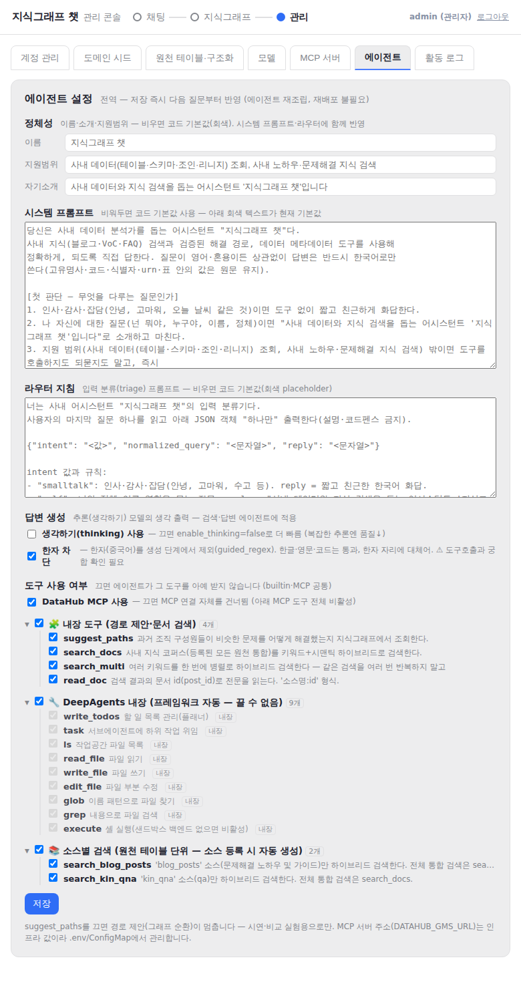

| 항목 | 설명 |
|---|---|
| **정체성** | 이름·소개·지원 범위 (비우면 기본값). 시스템 프롬프트·문지기 양쪽에 즉시 반영 |
| **라우터 지침** | 문지기의 분류 기준 프롬프트 |
| **생각하기 on/off** | 켜면 똑똑, 끄면 빠름 |
| **내장 도구 가시화** | 프레임워크가 자동으로 붙이는 도구(파일 읽기·쓰기·실행 등)를 **"내장(끌 수 없음)"** 으로 목록에 보이게 (보안상 무엇이 열렸는지 확인) |

**확인:** 이름을 "탐라봇777"로 바꾸니 채팅 자기소개가 **재배포 없이 즉시** 바뀌는 것을 확인했어요.

**비유:** 신입 사원의 "이름표·업무 범위·행동 지침"을 관리자가 직접 고쳐 쓸 수 있게 한 것.

---

## 3. 처리 현황 — 자동 처리 "예약 알람" 🆕

**커밋:** `836ce03`(예약 스케줄러) · `da4c919`(옛 자동 스케줄 끄기)

사내 문서를 지식으로 정리(구조화)하는 작업을 **원하는 시간에 자동으로** 돌리는 예약을 붙였어요. 알람시계처럼요.

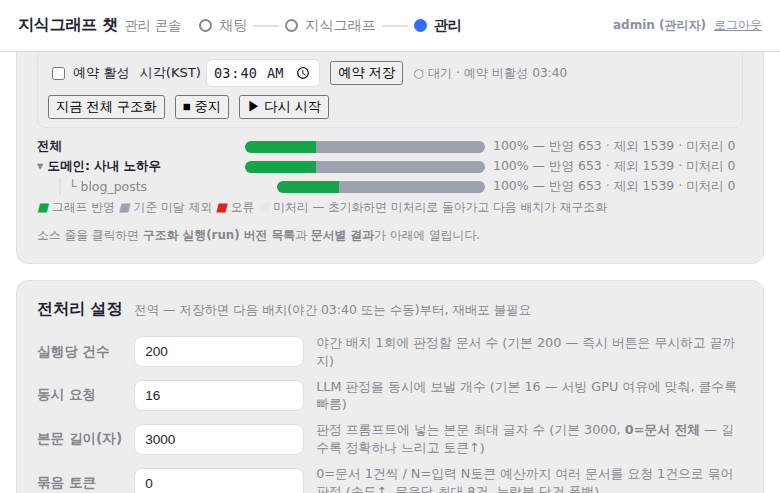

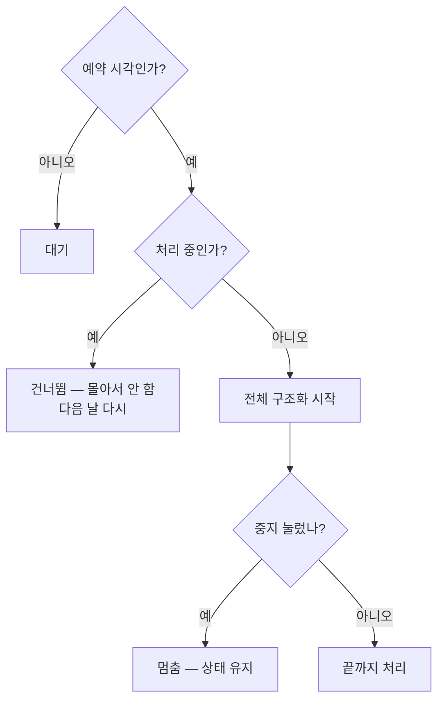

- **시간 예약 + 켜기/끄기** (예: 03:40, KST)
- **실시간 상태 표시** (진행 소스·건수)
- 예전엔 서버 뒤편 자동 스케줄(크론)이 돌려 화면에서 못 멈췄는데, 겹치지 않도록 그 크론을 껐습니다.

### "건너뜀"과 "중지"는 다릅니다 (중요)

두 가지 상황을 헷갈리기 쉬워 분명히 구분합니다:

| 상황 | 그 회차 | 예약 자체 | 다음 실행 |
|---|---|---|---|
| **처리 중(바쁨)** 인데 예약 시각이 됨 | 건너뜀 (몰아서 안 함) | **살아 있음** | **다음 날** 같은 시각에 자동 실행 |
| **중지** 를 누름 | (진행 중이면) 다음 구간에서 멈춤 | **완전 정지** | **어떤 예약 시각에도 안 돎** — '다시 시작' 눌러야 재개 |

- **바쁨→건너뜀**은 "이번 한 번만" 넘기고 예약은 그대로 살아 다음 날 알아서 돕니다.
- **중지**는 "정지 스위치"라 **누른 순간부터 계속 멈춤**. 페이지를 껐다 켜도 유지되고, **'다시 시작'을 누르기 전까지는 예약 시각이 와도 실행되지 않습니다.**

**중지가 얼마나 빨리 먹히나 (버그 수정 `fbaebe8`):** 처음엔 한 번에 200건을 다 처리한 뒤에야 멈춰서 "중지가 안 되는" 것처럼 보였어요. 이제 **문서 묶음마다 중지를 확인**해서, 진행 중인 몇 건만 마치고 바로 멈춥니다. (실행 중인 LLM 판정은 도중에 못 끊으므로 "동시에 처리 중이던 소량"까지만 마무리)

**세 번째 버튼 — 🔄 초기화 후 재처리:** '다시 시작'(이어서)과 별개로, **처음부터 다시**가 필요할 때 씁니다. 전체 문서를 미처리로 되돌리고(그래프 기여 회수) 중지도 해제한 뒤 재구조화를 시작합니다. (대화 세션 기여는 유지)

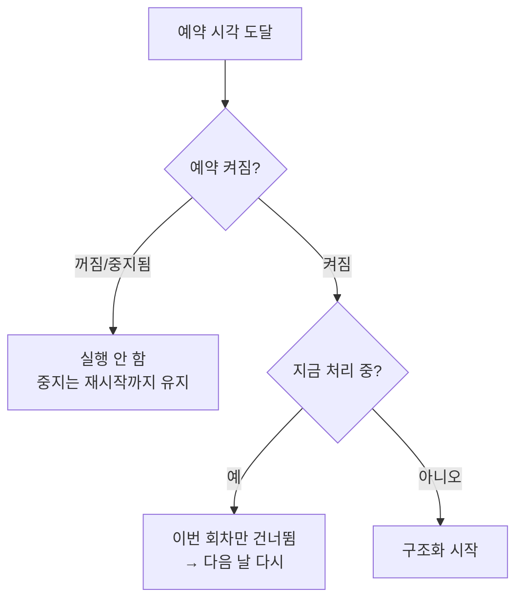

---

## 4. 처리 현황 — 문서 "원본 열어 보기" 🆕

**커밋:** `44827b8`

- 결과 목록 글자가 다음 줄로 밀리던 것 → **한 줄 고정**(긴 글은 …, 마우스 올리면 전체)
- 줄을 클릭하면 그 문서 **원본을 항목별(제목·본문·질문·답변…)로 구분**해 창에 표시
- 원천 테이블이 없으면 정리된 사본으로 대체하고 그 사실을 안내

**비유:** 서랍을 열면 뒤섞여 있는 게 아니라 칸막이로 나뉘어 정리된 모습.

---

## 5. 구조화·엔티티 "판정/추출 기준"을 관리 화면으로 🆕

**커밋:** `d48bf82`(문서 프롬프트) · `af28d6f`(엔티티/세션 프롬프트)

문서·대화를 지식으로 만들 때 쓰는 **판정/추출 지침(프롬프트)** 을 관리 화면에서 고치게 했어요.

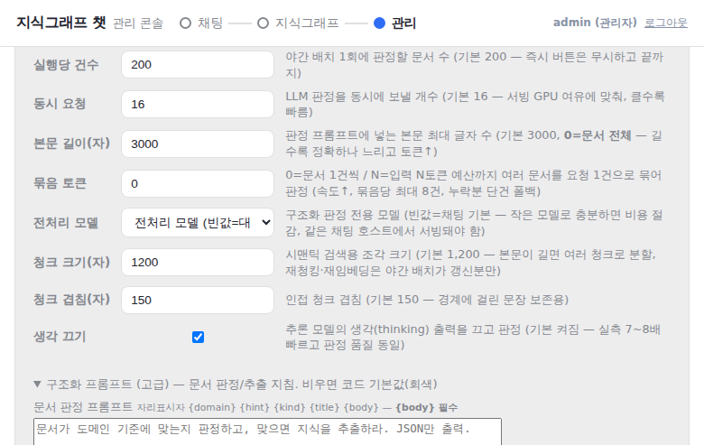

관리 → 전처리 설정 아래에 **두 묶음**을 편집합니다:

| 묶음 | 무엇 | 자리표시자(필수) |
|---|---|---|
| **구조화 프롬프트** | 문서 판정 / 묶음 판정 | `{body}` / `{docs}` |
| **엔티티 추출(세션)** | 대화 → 목표·접근법 추출 / 태스크 판정 | `{question}`·`{answer}` |

> **왜 나눠져 있나?** 우리 그래프는 **도메인**(입력 분류)과 **엔티티**(출력 = 목표·접근법)로 나뉩니다. 도메인은 원래 관리 화면에서 편집됐는데, **엔티티(출력) 정의**는 대화 파이프라인 코드에 박혀 있어 못 고쳤어요. 이번에 그걸 꺼내 **도메인처럼 엔티티 추출 기준도 관리자가 편집**하게 했습니다.

- 비우면 기본값(회색으로 미리 보임)
- **안전장치:** 꼭 필요한 자리표시자가 빠지면 저장 거부 (내용이 안 들어가는 실수 방지)

**비유:** 신입 사원에게 주는 "채용 기준표(문서용)"와 "면담 기록 정리표(대화용)"를 관리자가 직접 고쳐 쓰게 한 것.

---

## 6. 여러 키워드 "동시에" 검색하기 (search_multi) 🆕

**커밋:** `0660861`(도입) · `24093b8`(N개로) · `d48bf82`(안전 상한)

도우미가 **같은 키워드를 여러 번 반복 검색**하며 낭비하던 문제를 발견해, 키워드를 **한 번에 모아 동시에** 검색하는 도구를 새로 만들었어요.

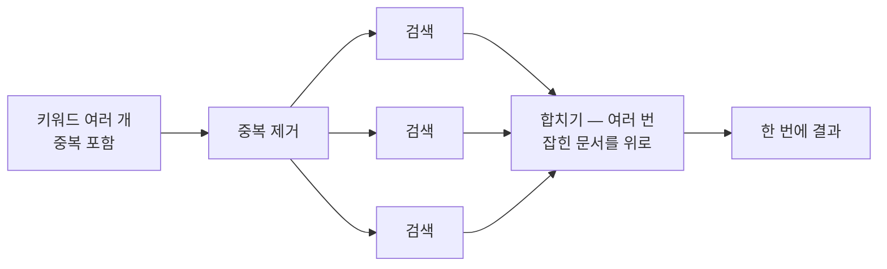

- **중복 자동 제거** (같은 키워드 한 번만)
- **동시(병렬) 검색** → 빠름
- **똑똑한 합치기** (여러 키워드에 걸친 문서 우대)
- **개수 제한 없음(N개)** — 폭주 방지로 동시 8개, 최대 50개 안전선
- 확인(테스트): 중복 포함 12개 → "병렬 검색 12개"로 전부 처리

---

## 7. "한자 차단" 시도 — 그리고 정직한 결과 ⚠️

**커밋:** `52c0929`

**배경:** 우리 AI 모델(Qwen)은 한국어로 답하라 해도 **가끔 한자를 섞어** 뱉습니다.

**시도:** 생성 단계에서 한자만 못 나오게 막는 기술(guided_regex)을 관리 토글로 붙였습니다.

**결과(정직하게): 작동하지 않았습니다.** 우리 모델 서빙 환경이 이 기술을 지원하지 않아 설정을 켜도 **조용히 무시**됩니다. A/B 테스트(끄고/켜고 각각 6개 질문)에서 답변이 완전히 동일했고 한자도 그대로였어요.

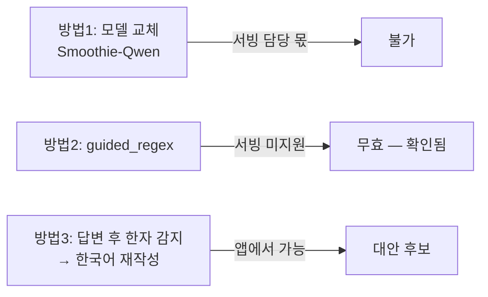

> 다행히 한자 누출은 드물었습니다(6개 중 1개, 2글자). 앱에서 할 수 있는 대안은 "답변에 한자가 보이면 그때만 한국어로 다시 써 달라고 한 번 더 요청"하는 방식입니다. (다음 작업 후보)

---

## 8. 파이프라인 버전 관리 🆕

**커밋:** `030d8d9`·`fe78d42`(엔티티·클러스터·임베딩 스냅샷/적용) · `1121f8f`(독립 버전 목록) · `c6b87a3`(전용 탭) · `67f0567`(조합이 버전 참조)

문서를 지식으로 만드는 설정을 **하나의 "버전 조합(run)"** 으로 묶어, 그 버전으로 처리하고 결과를 그 버전에 매핑합니다. 서로 다른 설정을 **버전별로 비교·관리**할 수 있어요.

**전용 "버전 관리" 탭**을 새로 만들어, 예전엔 소스 패널에 묻혀 안 보이던 걸 앞으로 꺼냈습니다:

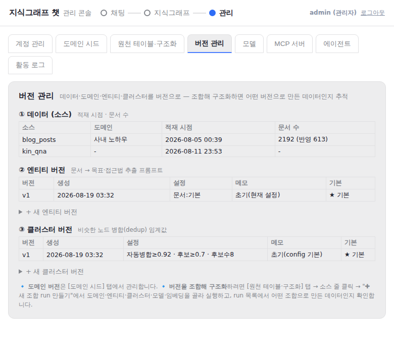

- **각 항목을 독립 버전으로 관리** — 도메인처럼 엔티티·클러스터도 v1, v2… 목록으로. [버전 관리] 탭에서 만들고 ★기본 지정.
- **데이터**는 소스별 적재 시점·문서 수 표시.
- **조합**은 [구조화] 탭에서 "엔티티 v2 + 클러스터 v1 + 도메인 v1 + 모델 + 임베딩"처럼 **버전 번호로 골라 묶어** 생성 → 구조화 → run 목록에 **어떤 버전 조합으로 만든 데이터인지** 표시.

**비유:** 요리 레시피의 "버전"을 저장해 두는 것 — 재료(데이터)·양념 비율(설정)을 바꾼 여러 버전을 만들어 어느 게 나은지 비교.

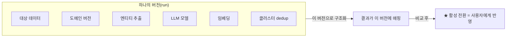

이번에 **버전 그룹에 3가지를 추가**했습니다(원래는 데이터·도메인·모델만):
| 항목 | 내용 |
|---|---|
| **엔티티(추출 프롬프트)** | 문서에서 목표·접근법을 뽑는 지침을 버전에 동결 |
| **임베딩 모델** | 병합(비슷한 노드 합치기)에 쓰는 벡터 모델 |
| **클러스터(dedup)** | 비슷한 노드를 언제 합칠지 임계값(자동병합≥·후보하한≥·후보수) |

- "✚ 새 조합 run 만들기" 폼에서 도메인버전·LLM·**임베딩·클러스터 임계값**을 골라 버전 생성 → "▶ 이 run으로 구조화" → 결과 확인 → "★ 활성 전환".
- 각 버전은 만든 시점의 설정을 **스냅샷(동결)** 하므로, 나중에 전역 설정을 바꿔도 과거 버전은 그대로 재현됩니다.

> **안전:** 세션(대화) 파이프라인은 기존 기본 설정을 그대로 써서 이 변경의 영향을 받지 않습니다(회귀 방지).

## 9. 곁들인 조사(리서치) 2건

1. **Qwen 한자 누출 해결법** — 공식 권장(샘플링·프롬프트)은 효과가 약하고, 실제 해법은 로짓 수준에서 한자 억제(Smoothie-Qwen 모델). 100% 보장은 한글만 허용하는 제약 디코딩.
2. **제약을 걸면 품질이 떨어지나?** — 무거운 형식 강제(JSON 스키마)는 추론을 떨어뜨리지만, 한자만 살짝 빼는 **가벼운 제약은 품질 영향 미미**. (단, 우리 서빙은 이 기능을 지원 안 해 적용 자체가 안 됨 — 7번)

---

## 테스트 요약 (확인 완료)

| 기능 | 결과 |
|---|---|
| 입력 라우터 | ✅ 숏컷/통과 정상, 지연 10초→1초 |
| 오타 교정 | ✅ "게좌"→"계좌" 기록 |
| 정체성 즉시 반영 | ✅ 재배포 없이 이름 변경 반영 |
| 생각하기 토글 | ✅ 끄면 생각 노드 사라짐 |
| 예약 스케줄러 | ✅ 중지 영속·중복 방지·KST 시각 |
| 문서 원본 모달 | ✅ 항목별 표시 |
| 구조화 프롬프트 | ✅ 필수 표시자 없으면 저장 거부 |
| search_multi | ✅ 중복 제거·병렬·합치기(12개) |
| 한자 차단 | ❌ 서빙 미지원(무효) — A/B로 확인 |

---

## 다음에 하면 좋은 것

- **한자 차단 대안** — "한자 감지 → 한국어 재작성" 방식으로 교체 (서빙 지원 불필요)
- 남은 하드코딩(세션 그래프 프롬프트·각종 임계값) 중 필요한 것만 관리 화면으로
- 내장 도구 **실제 차단**(지금은 보기만 됨)
- 행동 지침 1회 확인(승인 게이트) — 쓰기 기능 생길 때

*작성: 2026-08-19 · 커밋 `188e9be` ~ `52c0929` 기준*
